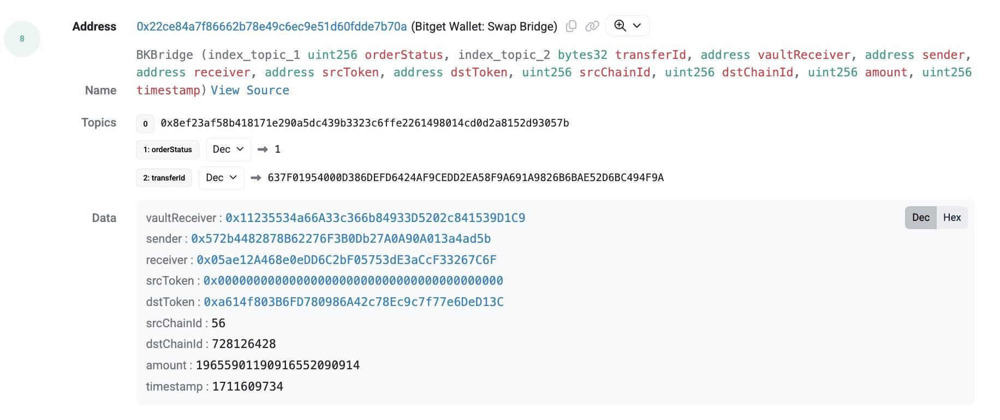
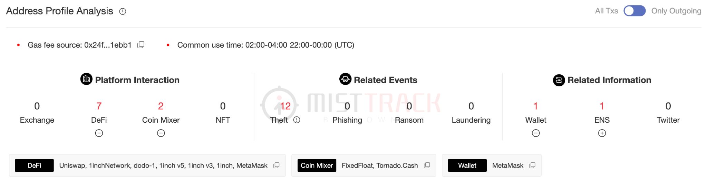
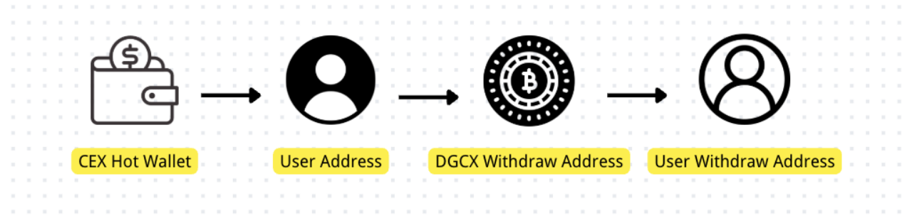

**目录**

- [引子](#引子)
- [链上追踪](#链上追踪)
  - [基础概念](#基础概念)
    - [主流公链和币种](#主流公链和币种)
    - [追踪的核心概念](#追踪的核心概念)
    - [区块链浏览器](#区块链浏览器)
  - [追踪工具](#追踪工具)
    - [MistTrack 介绍](#misttrack-介绍)
    - [MistTrack 使用](#misttrack-使用)
    - [社区工具](#社区工具)
  - [常见的资金流动模式](#常见的资金流动模式)
    - [剥离链（Peel Chain）](#剥离链（peel-chain）)
    - [一对多分发](#一对多分发)
    - [多跳转移](#多跳转移)
    - [混币器使用](#混币器使用)
    - [跨链桥跳转](#跨链桥跳转)
    - [多对一归集](#多对一归集)
    - [P2P / OTC](#p2p-/-otc)
  - [被盗了怎么办](#被盗了怎么办)
    - [止损优先](#止损优先)
    - [保护现场](#保护现场)
    - [进行初步分析](#进行初步分析)
    - [联系专业机构](#联系专业机构)
    - [尽早报案与法律协助](#尽早报案与法律协助)
    - [持续跟进与画像构建](#持续跟进与画像构建)
    - [可申请冻结的 Token](#可申请冻结的-token)
  - [跨链桥追踪分析](#跨链桥追踪分析)
    - [Bridge 介绍](#bridge-介绍)
    - [Bridge 分析](#bridge-分析)
      - [方式一 跨链桥浏览器](#方式一-跨链桥浏览器)
      - [方式二 区块链浏览器查看解析](#方式二-区块链浏览器查看解析)
      - [方式三 MistTrack 跨链解析](#方式三-misttrack-跨链解析)
  - [隐私工具追踪分析](#隐私工具追踪分析)
    - [Mixer 介绍](#mixer-介绍)
    - [Mixer 分析](#mixer-分析)
      - [案例一 Tornado Cash 分析](#案例一-tornado-cash-分析)
      - [案例二 Wasabi Coinjoin 分析](#案例二-wasabi-coinjoin-分析)
  - [NFT 追踪分析](#nft-追踪分析)
  - [地址行为分析](#地址行为分析)
    - [活跃行为特征识别](#活跃行为特征识别)
    - [地址聚类判断](#地址聚类判断)
    - [风险行为画像](#风险行为画像)
    - [地址标签与链下身份](#地址标签与链下身份)
    - [AI 工具与分析](#ai-工具与分析)
  - [案例](#案例)
  - [资产冻结与追回的建议](#资产冻结与追回的建议)
- [结语](#结语)
- [免责声明](#免责声明)

# 引子

在过去几年里，加密行业在技术层面取得了长足发展，但与此同时，与加密资产相关的犯罪行为也呈现出愈演愈烈的趋势。从资金盘、钓鱼网站、假冒项目等层出不穷的诈骗手法，到针对 DeFi 协议的漏洞攻击、交易所未经授权访问攻击、用户私钥泄露后的资产劫持，链上犯罪的数量与损失金额不断攀升。仅 2024 年与 2025 年上半年：根据慢雾区块链被黑事件档案库（[SlowMist Hacked](https://hacked.slowmist.io/)）统计，区块链生态共发生安全事件 531 件，损失高达 43.86 亿美元；Web3 反欺诈平台 [ScamSniffer](https://www.scamsniffer.io/) 也指出，仅 Wallet Drainer 钓鱼攻击就已造成约 5.34 亿美元的损失，受害地址高达 37.56 万个。这一数字仍在上升，背后真实的受害人数远比数据呈现的更为庞大。

匿名性是加密货币的一把双刃剑。它赋予用户隐私保护权的同时，也让一些恶意行为更难被精准识别。加上区块链天然的“全球化属性”，跨境协查、司法互助、资产冻结的流程往往十分缓慢，导致部分案件即便链上路径清晰明确，也很难在现实中取得实质性进展。这种“看得到但摸不着”的落差，是很多加密资产受害者的最大痛点。

很多人一开始会以为：“加密资产在链上，所有转账都公开透明，那追回资金应该很容易吧？”但实际并非如此。链上的“可视化”只是第一步，真正的“可追回”需要克服一系列复杂的挑战。攻击者可以利用数十个钱包跳转、匿名交易所提现、混币器资产混淆、代理合约等技术手段进行资金清洗；另一方面，普通用户缺乏基本的链上知识，在面对风险时往往束手无策。这意味着，哪怕能清晰看到资金路径，也未必有手段将其冻结或追回。

正因如此，链上追踪的基本知识，不应只是安全研究员或黑客组织的“专业技能”，而应该是所有加密生态参与者的必修课。无论你是普通投资者，还是从事加密项目、媒体分析、法律援助、执法调查等相关工作，理解资金的链上流动逻辑、掌握初步的追踪工具和手法、判断资金路径是否异常，这些能力都将成为你面对风险时的第一道防线。在关键时刻，一次及时的路径识别，可能意味着为冻结资金赢得宝贵的几小时窗口；而一次基础工具的正确使用，也许就能帮助受害人重建完整的案情线索。

这本《区块链加密资产追踪手册》，正是出于这样的初衷写成的。它不是一本专业研究报告，也不以深奥的技术论述为目标，而是希望以清晰实用的方式，帮助更多人理解链上追踪的基本框架、掌握工具使用的方法，提升面对链上风险时的判断力和应对能力。无论你是研究人员、投资者、媒体人、法律从业者、执法人员还是普通受害者，都可以从中找到适合自己的部分。

我们深知，一本手册无法解决所有链上安全问题，但如果它能让你在面对一起转账异常时多留几秒判断、在遭遇项目跑路时能立刻保存线索、在媒体或社群讨论中更精准地描述资产流向的可疑之处，那么它就已达成了我们的初衷。

接下来，我们将从最基础的概念出发，逐步走进链上世界的“蛛丝马迹”。

# 链上追踪

## 基础概念

区块链并不神秘，但它确实有一套不同于传统金融体系的语言和结构。因此，在开始任何一次链上追踪之前，我们需要先理解区块链系统中最基础的概念。很多时候，判断资金路径、识别可疑操作的关键，就藏在这些看似简单的术语背后。

### 主流公链和币种

* Bitcoin（BTC）

比特币由 Satoshi Nakamoto（中本聪，网名）于 2008 年提出，2009 年诞生比特币创世区块。比特币基于 UTXO 模型（未花费交易输出），每一笔交易都像是“找零”的过程，链上路径相对清晰、透明。比特币网络不支持复杂的智能合约，链上行为有限，追踪路径较为直观，但仍需使用特定分析策略。

* Ethereum（ETH）

以太坊由 Vitalik Buterin 于 2013 年提出，2014 年开启众筹，2015 年上线主网并挖出第一个区块。以太坊是目前最常用的智能合约平台，拥有最庞大的 DEX 和 DeFi 生态系统，是当前攻击事件中最常涉及的网络。以太币（ETH）是以太坊网络的原生代币，用于支付交易手续费（Gas）及参与生态治理。与比特币不同，以太坊是一个图灵完备的智能合约平台，支持在链上编写并部署“去中心化应用（dApp）”，形成 DeFi（去中心化金融）、NFT（非同质化代币）、DAO 等生态体系。以太坊采用账户模型（Account Model），每个地址记录当前余额，追踪路径需分析复杂的合约交互与资产兑换过程。2022 年，以太坊完成“合并”（The Merge），从 PoW 过渡至 PoS，能耗大幅下降。

* TRON（TRX）

波场由孙宇晨于 2017 年推出，主网于 2018 年上线，其原生代币为 TRX。TRON 兼容以太坊的账户模型，并对链上转账操作进行了高度优化，使得转账手续费几乎为零、确认速度快。TRON 网络上流通最广的资产为 USDT（TRC20），这也导致诈骗团伙频繁使用 TRON 网络进行资产汇集和拆分清洗，因此在追踪中需重点关注。

* BNB Chain（BNB）

BNB Chain 由币安（Binance）于 2020 年推出，前称为 Binance Smart Chain（BSC），是一条兼容 EVM 的高性能区块链。其原生代币为 BNB。BNB Chain 交易速度快、手续费低、生态成熟，链上 DEX 活跃，合约数量庞大。BNB Chain 与以太坊高度兼容，但缺乏严格审计机制，钓鱼代币泛滥，成为资金盘与仿盘项目聚集地。

* Polygon（MATIC）

Polygon 是以太坊的扩容方案之一，原名 Matic Network。它提供侧链与 Layer 2 技术，如 ZK Rollup、Optimistic Rollup 等，实现低成本、高性能的交易体验。Polygon 兼容以太坊智能合约，因此在追踪方法上差异不大，但由于低费用优势，常被用作洗钱中转。

* Solana（SOL）

Solana 于 2020 年上线，以高吞吐量、低延迟为核心卖点，是一条采用“PoH（历史证明）+ PoS（权益证明）”混合共识机制的高性能公链。Solana 不兼容 EVM，采用独特的账户模型和 Rust 开发语言，其浏览器、工具链也独立于以太坊生态。近年来成为黑客攻击事件频发的目标链之一，例如多起钱包私钥泄露事件导致大规模资金损失。

* Avalanche（AVAX）

Avalanche 于 2020 年推出，是一条支持多子网（Subnet）的区块链平台。其核心是提供高度定制化的区块链运行环境，允许项目根据自身需求部署独立子链。Avalanche 的主链 C-Chain 兼容 EVM，是进行合约交互与代币交易的主要平台。Avalanche 的子网机制虽灵活，但在资产追踪分析中会造成数据分散和跨链路径复杂性提升。

* Optimism（OP）

Optimism 是基于 Optimistic Rollup 技术的以太坊 Layer 2 网络，兼容所有以太坊合约，交易成本和确认速度大幅优化。Optimism 支持所有以太坊智能合约，开发者可无缝部署原有的 Solidity 项目。在链上追踪中，Optimism 的挑战在于：交易入口通常来自以太坊主网跨链，需分析跨链交易，常见洗钱手法包括从主网桥入资金 → DEX 兑换 → 再跨链桥出。

* Arbitrum（ARB）

Arbitrum 是另一条基于 Optimistic Rollup 的以太坊 Layer 2 网络，是当前用户量与锁仓量（TVL）最高的 Layer 2 网络之一。其特点包括：链上地址格式与以太坊一致，但链 ID 不同，需明确区分；链上混币工具（如 Tornado Cash）仍需通过主网进行，可结合主链行为回溯；跨链行为显著，攻击者常在攻击后通过 Arbitrum 提高转移效率或躲避主网监控。

* USDT

USDT 是 Tether 公司发行的稳定币，锚定美元，流通量极大，1 USDT \= 1 美元，发行在多条链上。攻击者偏爱使用 USDT，因其价值稳定、可快速交易。Tether 可配合执法机构进行冻结，但必须通过正式司法流程提交申请。

* USDC

USDC 由 Circle 与 Coinbase 联合推出，强调合规与透明性，背后有真实美元储备支持，接受定期审计。USDC 同样在多条链上发行，在北美市场更为常用，可配合执法机构进行冻结，但必须通过正式司法流程提交申请。

### 追踪的核心概念

**钱包**

* 热钱包：长期在线，私钥存储在网络设备中，用于频繁操作，如手机钱包（imToken）、浏览器插件钱包（MetaMask）等。  
* 冷钱包：离线存储私钥，如 Ledger、Trezor 等硬件钱包，用于大额资产存储、长期存储。

**区块链地址**

* 充币地址：用户向交易所充值时使用的地址，一般为交易所控制的地址，可以关联用户。

* 热钱包地址：交易所用于日常收发的活跃地址，高频使用，与多地址交互。

* 冷钱包地址：大额资产长期存储地址，交易次数少但金额大。

* 普通地址：个人控制的钱包地址，无明显标签。

* 合约地址：部署的智能合约地址，不能直接发起交易，这并不代表一个人或钱包，而是指一个部署在链上的智能合约。合约可以接收资产、分发资金、进行逻辑判断，比如实现质押、借贷或交易功能。

* 多签地址：需多个私钥联合签名，常用于团队或机构托管资产。

* 黑洞地址：丢了私钥，或是无法确定私钥的地址，常用于销毁或表面伪销毁资产，如全 0 地址（0x0000000000000000000000000000000000000000）。

**交易结构与元素**

* 区块高度：区块在链中的位置，可用于判断交易先后顺序。

* 交易哈希（Hash）：每笔交易的唯一标识符（ID），用于追踪每一笔链上转账或合约调用。这就像是交易的身份证编号，只要你有哈希，就可以在区块链浏览器中查询到这笔交易的详细信息。

* Gas：理解交易的“费用”也很重要，每次转账、交互都会消耗链上的 Gas（燃料），这不仅是区块打包的激励机制，也能帮助我们判断交易的时间、优先级，甚至分析出是由哪个地址或平台提供的费用（Gas 来源）。

* 混币：使用 Mixer 服务或协议（如 Tornado Cash、Wasabi）来混淆交易来源与目的，提升隐私性。

* 兑换：DEX 上的 Swap 操作，如 Uniswap、PancakeSwap，资产可能在兑换过程中变换形式。

* 跨链：在两条链之间进行交换，需结合跨链桥合约识别发送与接收；常用于清洗和资产分散。

* Input Data：智能合约调用时携带的参数信息，可解码为 Swap 路径、接收人等关键线索，常通过浏览器查看。

* Event Logs（事件日志）：合约执行过程中的关键操作，可用来识别 Token 转账、兑换、存取等行为。

**平台类型**

* 中心化平台（CEX）：用户需将资产充值至平台账户，由平台托管私钥，可协助冻结资产，提供法币出入口，但其地址归属明确、具备身份绑定，如 Binance、OKX 等。  
* 去中心化平台（DEX）：运行在链上，用户自持私钥，交易由合约完成，发生在用户钱包之间，几乎没有身份验证环节，攻击者常用来兑换资产，无法冻结但一般可追踪路径，如 Uniswap、Curve 等。  
* 跨链桥（Bridge）：实现跨链转移资产，攻击者常用于逃避追踪或将资产跨链洗钱。如 THORChain、Wormhole 等。  
* 嵌套平台：第三方服务使用大型 CEX 地址托管资产，实际托管平台为 Binance 等，路径需二次解析，常用于掩盖归属。

**UTXO 与找零**

在比特币网络中，每笔交易的资金来源和去向，都基于一种 UTXO（未花费交易输出，Unspent Transaction Output）模型。可以将它理解为“零钱”的系统 —— 你不能直接修改账户余额，而是必须“花掉”一整张钞票，然后收回找零。这种模型不同于以太坊等采用“账户余额制”的链。

假设你要支付 0.6 BTC，而你的钱包中有一个面额为 1 BTC 的 UTXO。你无法只从这 1 BTC 中“切出”0.6 BTC 来支付，你必须将整个 1 BTC 用作输入：其中的 0.6 BTC 被送给收款方；剩下的 0.4 BTC（扣除交易费后）会退还给你自己，但并不是退回你原来的地址，而是退到你钱包中新生成的一个地址，这个地址就是找零地址（Change Address）。通常，钱包会为每笔交易自动生成一个新的找零地址，以增强隐私，避免地址重用。但在某些钱包设置中，也可能将找零发送至你的钱包中现有的地址。

这套机制的核心逻辑是：一笔 UTXO 必须被完整消费，而未被“花掉”的部分通过找零机制重新变为新的 UTXO，留待下次使用。这种不断“吃掉旧 UTXO、产出新 UTXO”的过程，是比特币和类似区块链（如 Litecoin、Dogecoin）系统中账户运转的基础。相比之下，以太坊等采用“账户模型”的链中，用户的地址可以部分支出余额，每笔交易直接修改账户状态，而不涉及“拆钞票”式的找零与 UTXO 重组。

由于每笔交易必须完整花费输入 UTXO 并生成新的输出，因此 UTXO 模型天然会产生多个输出地址，其中之一是收款地址，另一个则是找零地址（Change Address）。从链上数据角度看，这两个地址在交易中地位平等，并不会明确标记哪一个是找零、哪一个是实际收款。这给链上分析带来一定难度。

理解这些概念，有助于我们在实际追踪中更快速判断地址行为、资产风险路径以及资金清洗的可能性。接下来，我们将使用区块链浏览器从一笔交易入手，说明这些公开数据如何查、怎么看，如何提升追踪效率。

### 区块链浏览器

一旦你掌握了基础概念，链上追踪的第一站通常就是区块链浏览器，无论你是查询交易记录、地址余额，还是想验证一笔合约调用的细节，都绕不开浏览器工具。不同的链有各自的浏览器，但操作逻辑基本类似，掌握一种就能类推其他。常用区块链浏览器如下：

| 链 | 浏览器 |
| :---: | :---: |
| Bitcoin | [https://www.blockchain.com/explorer](https://www.blockchain.com/explorer)、[https://mempool.space](https://mempool.space) |
| Ethereum | [https://etherscan.io](https://etherscan.io) |
| TRON | [https://tronscan.org](https://tronscan.org) |
| BNB Chain | [https://bscscan.com](https://bscscan.com) |
| Polygon | [https://polygonscan.com](https://polygonscan.com) |
| Solana | [https://solscan.io/](https://solscan.io/) |
| Avalanche | [https://snowtrace.io/](https://snowtrace.io/) |
| Optimism | [https://optimistic.etherscan.io](https://optimistic.etherscan.io) |
| Arbitrum | [https://arbiscan.io](https://arbiscan.io) |
| 聚合浏览器 | [https://www.oklink.com/](https://www.oklink.com/) |

我们以 Etherscan 为例，当你拿到一个可疑地址，第一步可以在浏览器的搜索框中输入该地址。进入地址详情页后，你可以看到该地址的余额、代币持仓、历史交易等数据。Etherscan 及其他浏览器常常会给地址和合约打标签，标注交易所地址、跨链桥合约、已知黑客地址、项目方钱包等身份信息，有助于你快速判断对方的背景。点击任意一笔交易，可以看到详细信息：交易哈希、发送地址和接收地址、转账金额、交易时间、区块高度、Gas 费用、甚至交互的合约函数。

更进一步，点击 Token Transfers 标签页，可以看到这个地址涉及的代币转账记录。例如一笔 USDT 转账，会显示金额、转出地址、转入地址、代币合约地址和符号（如 USDT、DAI、USDC）。通过这种方式，我们可以逐笔回溯资金是从哪里来、转去了哪里。很多诈骗行为会利用“空投假币”制造假象，比如你收到某个代币，却发现这个代币没有经过验证也没有资产价值，它就很可能是假币。使用浏览器查阅 Token 页和合约代码，也能验证这个代币是否是主流资产或仿冒版本。

区块链浏览器也能分析合约调用。当某个地址与智能合约交互（如进行 DEX 兑换、借贷操作、Mint NFT 等），系统会显示该合约调用的函数名（如“swapExactTokensForTokens”或“borrow”），这些细节往往能够帮助你判断该地址的真实用途。若 Input Data 被编码，你可以尝试解码，进一步明确具体的操作内容。对于熟练用户，也可以直接进入合约源代码页，查看代码是否开源，判断其功能与安全性。此外，Event Logs 板块同样关键，它记录了合约中触发的事件和参数细节，例如某个地址收到了多少 Token，是通过哪个函数发出的等。

除了看静态数据，观察资金的转账路径和时间节奏也很关键。例如攻击者是否频繁进行批量转出操作，是否存在刷交易量等异常行为。需要注意的是，不同公链的浏览器界面略有不同，但操作逻辑几乎通用。多熟悉几个平台，将显著提升你跨链追踪的能力。

区块链浏览器是最基础、也最常用的链上情报入口，但它也只是一个“读数据的窗口”，存在局限性。因此，我们将在下一节介绍一些工具。

## 追踪工具

实际应用中，我们常常会面临多链资产跳转、资金混洗、合约交互分析等高复杂度场景，而区块链浏览器由于数据分散、信息呈现不直观，难以胜任复杂资金流的识别与追踪工作。因此，越来越多用户和从业者开始转向专业的资产追踪工具，以实现更高效、更系统的链上安全管理。在众多工具中，由慢雾(SlowMist) 自主研发的链上分析与反洗钱追踪工具 [MistTrack](https://misttrack.io/) 是我们最常使用也最为推荐的。如果说区块链浏览器是链上数据的“放大镜”，那 MistTrack 更像是一个“链上情报分析台” —— 它不仅能总结数据，更能帮你解读数据。

### MistTrack 介绍

MistTrack 为用户提供多种功能，涵盖交易监控、风险评估、地址标签、交易行为分析等多个维度，致力于帮助用户更高效地识别非法交易、追踪资金流向、提升合规能力，构建覆盖资产全生命周期的安全防护体系。自 2022 年上线以来，MistTrack 已在区块链安全行业广泛应用，服务用户超过 10 万人，其中包括数万名付费客户，在全球多起重大链上安全事件中发挥了关键作用，逐步发展为全球加密行业中不可或缺的合规与风控工具。

截止目前，MistTrack 已积累三亿多个地址标签，1,000 \+ 链上实体，50 万 \+ 威胁情报数据，9,000 万 \+ 风险地址。系统支持 18 条主流公链和数百种不同的代币追踪，覆盖广泛的资产类型与链上生态。同时，MistTrack 也支持跨链追踪能力。现已兼容包括 Chainflip、AllbridgeCore、LIFI 等在内的 15 种主流跨链桥协议与工具，并持续拓展中。依托这一庞大、不断更新的数据基础，MistTrack 正在为用户提供强有力的技术支撑，助力应对复杂多变的链上安全威胁。以下是 MistTrack 提供的核心功能：

* AML 风险评分：MistTrack 主要从地址所属实体、地址历史交易活动、慢雾恶意钱包地址库三方面为其计算 AML 风险评分。当地址所属实体为高风险主体（如混币平台）或地址与已知的风险主体存在资金来往时，系统会将该地址标记为风险地址。同时，结合慢雾恶意钱包地址库中的数据集，MistTrack 会对已核实的勒索、盗币、钓鱼欺诈等非法行为的涉案地址进行风险标记。用户可以像专业合规官一样，对每个钱包地址进行风险分析，并判断该地址是否涉及非法资金。用户还可以通过点击“风险报告”按钮，一键获取该地址的风险分析报告。  
* 地址标签：MistTrack 不仅能够识别地址所属的实体，如 Coinbase 或 Binance，还可以定位多个链上和链下的标签，如 ENS、MEV Bots、DeFi Whales 等，以及该地址使用的具体钱包 App，如 imToken 或 MetaMask。通过 MistTrack 的地址标签功能，用户将能够更全面地了解相关地址的背景信息。  
* 交易对手分析 / 交易行为分析：MistTrack 为用户提供其最需要关注的信息。与普通的区块链浏览器不同，后者可能操作复杂且不够直观，MistTrack 会评估地址的所有历史交易，并以易于理解的方式总结其行为，帮助用户更好地理解。  
* 地址痕迹分析：收集目标地址的所有历史数据，并以易于理解的方式总结这些痕迹，包括使用平台、关联事件和关联信息三个方面，帮助用户创建目标地址的画像。  
* 收藏夹 / 监控：用户可以使用 MistTrack 的收藏夹和监控功能，收藏特定钱包地址并收集所需的信息，所有信息都是私密的，只有用户自己可以访问。用户还可以添加 Whale 和 KOL 的地址，全面了解他们的链上活动，实时追踪最新交易，洞察并跟踪投资动态。  
* 调查图谱：MistTrack 通过动态可视化展示查询地址的所有转入和转出交易关系，用户可以直接筛选和排序图表中的数据，轻松监控选定的信息。无需担心案件调查的复杂性，MistTrack 支持用户自由追踪、分析和记录信息，还可以通过共享功能，与同事协作处理案件。

同时，为了提供更便捷的地址分析，我们开发了 MistTrack OpenAPI，供开发人员在其应用程序中使用：

* OpenAPI 接口服务：通过调用 OpenAPI，MistTrack 将返回给定地址的标签列表、地址概览、风险评分、风险详细信息列表、交易调查结果、交易行为分析结果、地址痕迹分析结果和交易对手分析结果。

### MistTrack 使用

以下是 2025 年 5 月 28 日 Cork Protocol 被攻击事件的追踪过程，攻击者地址为 [0xea6f30e360192bae715599e15e2f765b49e4da98](https://etherscan.io/address/0xea6f30e360192bae715599e15e2f765b49e4da98)。

首先，借助工具如 Etherscan、DeBank 可以初步得到攻击者获利 3,761.878 wstETH，同时通过 8 笔交易将 wstETH 兑换为 4,527 ETH：

此时，我们在 MistTrack 输入攻击者地址并进行查询：

通过 MistTrack 的展示，可以得到该地址的一些[信息](https://light.misttrack.io/address/ETH/0xea6f30e360192bae715599e15e2f765b49e4da98)：评分为 100 高风险，在 Ethereum 和 Base 链存在交易，初始交易在 May 20，最近一笔交易在 Jun 30，总共收到 4,531.977 ETH，余额为 0 ETH，与 DeFi 和 Exchange 存在交互。  
   

接着，我们将目光聚集在资金转移图谱上。

首先看左侧资金转入情况，从下往上：  

第一个来自 Swapuz.com 转入的 4.861 ETH，按时间节点来看，属于攻击者的初始资金来源； 

第二个总共有八笔交易，点击箭头线，可以看到这八笔交易的详情：

随机选择最后一笔 TXID 为 [0xab0a99...b96cf5](https://etherscan.io/tx/0xab0a997f307ff45d9fcbfd2672f108d49546b86104eb06146bf90c3433b96cf5) 的交易进行查看，这笔交易是攻击者将 253.9267 wstETH 兑换为 305.5922 ETH的操作。检查剩余七笔交易，都是将 wstETH 兑换为 ETH 的操作，与上述“通过 8 笔交易将 wstETH 兑换为 4,527 ETH”一致。

接着看右侧资金转出情况，从下往上：

第一个是 1.2088 ETH 与 Uniswap 交互，右键单击 Uniswap，选择 DEX Parsing 就可以快速得出这笔交易中兑换后的资产，即 1.2028 ETH 兑换为 1 wstETH 。

第二个是攻击者给自己的地址转了 1 ETH，查看[交易详情](https://etherscan.io/tx/0x92a53d817e9a626292270d93259b10cba05a1e55bd0651ca7ef57b63b7294cf0)，发现是一句链上留言“sherlock missed it. ct \> ds. uniswap hook is not problem.”，可能是攻击者自己写的“备忘录”：

第三个是攻击者将大部分资金 4,530.59 ETH 转入新地址 0xfc0a6de0abd0985e7a910f8874c3abf23f1cdff4，双击该地址，拓展分析发现该地址将 ETH 转入两个新的地址，继续扩展，最终 10 ETH 转入 juicebox.money，剩余 4,520.2 ETH 均转入混币平台 Tornado Cash（关于 Tornado Cash 的分析在后文会介绍）：

### 社区工具

知名加密货币调查员 [ZachXBT](https://t.me/investigations) 曾公开分享了其在链上分析与开源情报（OSINT）调查中的常用工具：

* Cielo \- 钱包追踪（EVM、Bitcoin、Solana、TRON 等）  
* TRM \- 为地址 / 交易创建图表  
* MetaSuites \- Chrome 扩展程序，可在区块浏览器上添加额外数据  
* OSINT Industries \- 邮箱 / 用户名 / 电话查询  
* LeakPeek \- 数据库查询  
* Snusbase \- 数据库查询  
* Intelx \- 数据库查询  
* Spur \- IP 查询  
* Cavalier (Hudson Rock) \- 信息窃取者（Infostealer）查询  
* Impersonator \- Chrome 扩展程序，用于伪造 dApp 登录  
* MetaSleuth \- 类似于 TRM，但面向普通用户  
* Arkham \- 多链区块浏览器，提供实体标签、创建图表和告警功能  
* Obsidian \- 创建流程图 / 图表  
* Wayback Machine \- 存档网页  
* Archive Today \- 存档网页  
* Etherscan / Solscan \- EVM / Solana 区块浏览器  
* Blockchair \- Bitcoin 区块浏览器  
* Range \- CCTP 跨链桥浏览器  
* Pulsy \- 跨链桥浏览器聚合器  
* Socketscan \- EVM 跨链桥浏览器  
* Dune \- 查询区块链数据的分析平台  
* Mugetsu \- X / Twitter 用户名历史记录和 meme 币查询  
* TelegramDB Search Bot \- 基础 Telegram OSINT 查询  
* Discord\[.\]ID \- 基础 Discord 账户信息查询  
* CryptoTaxCalculator \- 追踪地址的 PNL（盈亏，Profit and Loss ） 

下一节，我们将探讨一些常见的资金流动模式，为后续路径判断打下行为学基础。

## 常见的资金流动模式

在加密资产追踪过程中，理解攻击者或诈骗者的“转移套路”是判断路径的重要一环。资金在链上的流动，虽然表面上看是一次次的地址之间转账，但背后往往遵循某种模式或“行为模板”。本节将总结几类常见的资金流动方式，帮助你在实操中快速识别“非常规”行为。

### 剥离链（Peel Chain）

剥离链（Peel Chain）是指一种通过一系列冗长的小额交易来清洗大量加密货币的技术，是区块链分析中常见的一种交易模式。这种洗币方式通常从一个“脏”地址开始，该地址可能与非法活动有关，例如地址 A 将资金转到地址 B 和 C，而转移到地址 B 的数额多数情况下是极小的，转移到地址 C 的数额占大部分，地址 C 又将资金转到 D（小额）和 E（大额），依次类推，直至形成以很小的数额转移到很多地址的情况。

### 一对多分发

攻击者收到大额资产后，会先将资金从主要钱包转出，拆分给十几个甚至上百个中转地址，例如一笔价值 10 万 USDT 的交易，可能被切分为 50 笔约 2000 USDT 的转账，每个地址再进一步拆分、转出，形成复杂的“扇形转账结构”，目的是迷惑分析者、制造“路径混淆”、稀释原始资金来源、延迟调查反应时间，同时避免被一次性冻结全部资产。通过链上可视化工具观察，你会看到以某一大额地址为中心，向外多层扩散的资金流图，这是一种典型的初级洗钱路径。

### 多跳转移

攻击者常通过快速、多跳的方式转移资金，每个地址仅使用一次并迅速转出，且大多不参与任何链上 dApp 交互。这种中转结构通过制造路径长度与嵌套行为，有效干扰行为模型识别和风控策略响应，尤其在攻击发生后的几分钟内密集操作，以抢在监控系统反应前完成路径“切断”。

### 混币器使用

混币器是攻击者用于打断链上资金路径的典型工具。其原理是将资金注入混合池后，与其他用户资产统一处理，使输出资金与原始来源无法一一对应。常用协议包括 Tornado Cash、Wasabi 等。混币器操作往往伴随高度标准化行为，例如统一的注入额度、特定的等待时间、同步提现行为等，如果发现地址有类似特征，可以初步判断其资金清洗意图。混币器通常通过统一入口、延迟输出、金额拆分等手段，使得“资金进”与“资金出”之间缺乏对应关系，形成视觉上的路径断点。尤其在匿名币种（如 XMR）或混币协议配合使用时，追踪难度急剧上升。

### 跨链桥跳转

为规避某条链的监控与追踪，攻击者会通过跨链桥将资产跳转到另一条公链，再重新开始转移路径。常用桥协议包括 THORChain、LayerZero、Across 等，目标链则多为工具覆盖较弱的网络（如 TRON）。跨链行为常在攻击发生后的短时间内执行，跳转路径会伴随资产代币变化、路径中断、目标地址重建等操作，进一步提高追踪门槛。

### 多对一归集

在资金盘或平台跑路事件中，攻击者往往会在短时间内将用户资产统一归集至一个或少数“核心钱包”，再由这些地址统一跨链、混币或提现。此类行为常发生在项目前期崩盘迹象出现时，属于紧急转移行为，路径上会出现明显的归集高峰。

### P2P / OTC

攻击者在通过混币器、跨链桥或碎片化转账等手段模糊非法资产来源后，还会选择利用 P2P 平台、场外交易（OTC）中介或境外无 KYC 交易所完成“脱链”操作，将加密资产兑换为法币或隐私币。例如，Huione Guarantee（汇旺担保）作为一个以东南亚地区为中心的担保交易平台，被频繁用于资产“脱链”过程。这一过程通常依赖链下交易与身份伪装手段，进一步割裂链上资金与真实身份之间的联系。

P2P（点对点）平台是一种允许用户直接交易加密货币与法币的市场，典型如 Paxful、Bitquick、LocalBitcoins（已停止运营）等，攻击者可在此类平台上与其他用户直接撮合交易，接收银行转账、支付宝 / 微信支付、PayPal 甚至礼品卡作为对价，通过租赁身份账户或假实名资料规避风控。这类链下支付通常缺乏透明的身份验证机制，一旦交易完成，追踪难度大大增加。

OTC（Over-The-Counter）交易则指通过中介经纪人进行的大额链下加密货币买卖，常活跃于 Telegram、Discord 等社交平台。这些 OTC 服务商往往不审查资产来源，也不要求交易双方实名登记，为攻击者提供“匿名、高效、无监管”的出金通道。部分 OTC 中介还配有洗钱网络、支付账户资源甚至自有灰色平台，可提供“一站式兑现”服务。

若未能立即完成脱链，非法资产还可能进一步流入位于监管宽松地区的小型交易所，如某些加勒比、非洲或东欧背景的平台，利用其弱 KYC / AML 政策完成后续兑换流程。最终资金往往通过第三方支付、地下钱庄、电商账户等方式转为现金或数字人民币，或转为 Monero、Zcash 等隐私币种长期隐藏，严重干扰链上溯源与执法行动。

虽然以上模式常见，但值得注意的是，攻击者本身也在不断更新手法。资金路径可能混合多种策略，例如“拆分 \+ 跨链 \+ 混币 \+ 再归集”，而这种非线性组合才是大多数真实案例中所呈现的复杂场景。因此，理解资金流动模式并非只是“记住套路”，更重要的是从交易结构背后看清行为意图 —— 是在逃避识别？试图提现？还是试图洗净资产并复用？唯有如此，追踪才能真正接近真相。下一节，我们将进入实用层面：如果你或你的朋友成为受害者，第一时间应该做什么？

## 被盗了怎么办

在[《区块链黑暗森林自救手册》](https://github.com/slowmist/Blockchain-dark-forest-selfguard-handbook/blob/main/README_CN.md#)中提到，“被黑是迟早的”。面对日益猖獗的诈骗与攻击，个人用户、项目方、社群运营者都难以置身事外。那么，当真的发生资产被盗，我们应该怎么做？

### 止损优先

一旦发现资产异常，“止损”永远是第一优先级，而且通常分为两个阶段：

**阶段一：紧急止损**

* 若攻击正在发生（如黑客还在转移资产），立刻将剩余资产转移至安全钱包，或通过“抢跑”交易尽量减少损失；  
* 检查是否持有支持冻结功能的资产（如 USDT、USDC 等），如符合条件，可尝试联系发行方申请冻结；  
* 如果发现资产流入了中心化交易所（CEX），尽快收集交易哈希、时间、地址等信息，向该平台发起资产冻结申请，但多数交易所不会因个人投诉立即冻结地址；  
* 有能力的用户也可以尝试通过链上追踪分析工具（如 MistTrack）追踪黑客路径，标记资金去向；  
* 此外，如果发现自己钱包中的资产无法转出，可能是被恶意多签或者自己持有的签名权限已被替换、限制，可以通过区块链浏览器或安全工具进行确认，并查看是否权限是否已属于陌生地址，关于钱包被恶意多签风险可以查阅[此文](https://mp.weixin.qq.com/s/G7A0V7ShxMna699MUMOrqg)。

**阶段二：避免后续伤害**

* 检查关联钱包、助记词是否还存在其他风险；  
* 检查授权情况，使用授权管理工具如 [Revoke.cash](https://revoke.cash/) 及时取消可疑授权；  
* 更换所有相关账户的密码并启用多重验证（MFA），防止跨平台账户被进一步入侵；  
* 切断黑客可能再次利用的入口，包括浏览器插件、桌面钱包、GitHub 项目等；  
* 被盗后往往会有“假客服”“帮助资产追回”骗局，勿轻信任何主动联系你的人。

### 保护现场

很多人第一反应是慌乱重装、格式化、删插件，反而破坏了关键证据。你需要的是：

* 冷静断网，保持电脑供电，保留原始环境。不要马上关机或删除文件，保持现场原貌供专业人员取证；  
* 记录和保留所有相关证据，例如使用 Telegram、邮箱、网页等被钓鱼，要保存 Telegram 群聊、电报用户名、邮箱 IP、链接和原始邮件内容等；  
* 若涉及诈骗平台宣传，保留 KOL 帖子截图、官网内容、本地文档等原始材料。

### 进行初步分析

即便你不是区块链分析高手，也可以通过区块链浏览器和一些工具做出基础判断：

* 在区块链浏览器输入你的地址，观察资金转移路径；  
* 使用 MistTrack 进行链上路径追踪，识别资金是否混币、跨链，或流入中心化交易所；  
* 结合 MistTrack 的地址画像信息，查看该地址是否已被标记为高风险或诈骗相关；  
* 结合 MistTrack 的一键导出报告功能，哪怕不是专业分析人员，也能通过图谱与注释对资金路径有大致了解；  
* 将攻击者地址提交至 MistTrack 等平台，协助他人避免被骗。

### 联系专业机构

若金额较大或情况复杂，建议尽早联系专业安全公司进行协助：

* 链上分析与完整路径追踪，黑客画像研判；  
* 判断资产是否仍可冻结，紧急冻结协调（部分交易所）；  
* 提供“链上喊话”服务，与黑客进行谈判或施压（如 Etherscan 上留言）；  
* 生成追踪报告，或作为报案材料。

链上喊话（On-chain Message）已多次成功促成黑客返还资产，具体方式可参考：

* [Ethereum](https://mp.weixin.qq.com/s/76u8R1c1411eQRd1aj85SA)  
* [Bitcoin](https://mp.weixin.qq.com/s/2Uoxtfl0NB8W9jHiJEEN0g)

### 尽早报案与法律协助

即便你能精准追踪到黑客地址、资金流向，最终冻结与追回依然离不开司法力量：

* 向所在地警方报案；  
* 准备详细材料、报告：交易明细、对话截图、时间线、损失金额等；  
* 若跨境资金涉及海外交易所，建议同时联系律所准备国际协查材料；  
* 若有多个受害者，可尝试集体报案，提升立案与协查成功率。

### 持续跟进与画像构建

根据“罗卡定律”（凡有入侵，必留痕迹），黑客往往会在链上 / 链下留下蛛丝马迹。可以持续构建“攻击者画像”，用于后续协查：

* 链上线索：交易路径、收款地址、混币行为、跨链桥；  
* 链下线索：邮箱注册、Telegram ID、IP 地址、设备指纹；  
* 社交关联：是否和已知诈骗者或“Rug Pull”团伙相关。

### 可申请冻结的 Token

目前，支持官方冻结机制的部分代币如下：

* USDT，发行商 Tether  
* USDC，发行商 Circle  
* MERL，发行商 Merlin Chain  
* BUSD（Binance USD），发行商 Paxos  
* TUSD（TrueUSD），发行商 TrustToken  
* PAX（Pax Dollar），发行商 Paxos  
* GUSD（Gemini Dollar），发行商 Gemini  
* ……

这些代币通常基于中心化的发行机制，发行商在智能合约中保留了“黑名单”或“冻结”功能，这种权限通常用于应对法律要求、欺诈、洗钱或其他非法活动。若你的被盗资产中有上述代币，需要在黑客转出前尽快申请冻结，一旦流入非监管平台或混币协议，再追回的难度将指数级上升。越早反应、越早取证、越早分析，越有可能截住资金、恢复损失。下一部分，我们将进入更深层的追踪 —— 如何识别混币行为、跨链路径、复杂洗钱网络，以及多个案例的复盘。

## 跨链桥追踪分析

### Bridge 介绍

随着多链生态的发展，资产从一条区块链向另一条区块链的迁移需求日益增长。跨链桥（Bridge）应运而生，成为连接不同链之间资产和数据的重要基础设施。它的核心功能是：允许用户在一条链上锁定资产，在另一条链上获得等值资产的映射版本（Wrapped Token）或直接释放原生资产。攻击者常常借助跨链桥完成“链上跳转”，以躲避原链上的分析工具与追踪路径。

目前主流跨链桥包括：

**去中心化验证类**

* 特点：不依赖中心化实体，验证对方链的状态通常使用轻客户端（Light Client）或零知识证明；安全性与目标链保持一致，抗攻击能力强。  
* 代表项目：LayerZero、zkBridge  
* 风险：复杂度高，验证成本较大，对性能要求高。

**中继器 / 观察者类**

* 特点：一组第三方节点观察链上事件并中继数据到目标链；比完全去中心化轻量，但存在信任假设。  
* 代表项目：Wormhole、deBridge、Axelar  
* 风险：安全性依赖中继节点的数量和诚实度，存在少数节点作恶的可能。

**多签 / 托管类**

* 特点：用户将资产锁定在源链智能合约中，由一组多签地址或托管方确认后，在目标链铸造代表资产；结构较简单、部署灵活。  
* 代表项目：Multichain、Binance Bridge  
* 风险：明显的信任问题，多签密钥一旦泄露将导致全部资产被盗，过去多起跨链桥被黑事件（如 Ronin、Harmony）都属于此类。

**流动性池类**

* 特点：不锁定真实资产，而是依赖双边链上准备金池进行兑换，类似 DEX 的 AMM 模型；跨链行为本质是“兑换”，而非真正资产搬运。  
* 代表项目：Hop Protocol、THORChain  
* 风险：依赖流动性规模，容易因池子枯竭造成滑点或无法兑换；AMM 价格波动可能引发套利或损失。

**原生跨链**

* 特点：由底层区块链官方或核心开发团队直接维护，常见于 L1 与其 L2 / 侧链之间；安全性与协议层绑定，通常最可靠。  
* 代表项目：Arbitrum Bridge、Polygon PoS Bridge、Near Rainbow Bridge  
* 风险：技术问题或升级失败会导致桥暂时无法使用；通常较慢，不适用于高频交易。

传统的链上追踪基于一个公链内部的透明逻辑：一个地址给另一个地址转账，接着查询其后续的支出路径即可。然而，一旦发生跨链行为，原链的“出账”和目标链的“进账”之间没有直接的记录连接，即使知道资金被“跨走”，也很难判断它“跨到了哪里”，被谁接收，又如何使用。此外，许多跨链协议本身并非链上全开源，交易记录可能藏于 Layer 2、Rollup 事件日志、非标准合约调用之中。这意味着跨链不是“转账”，而是一次“销毁-铸造”或“锁仓-释放”的过程。在链上，资金轨迹因此会出现一个“中断” —— 资金不再继续在原链流动，而是“出现”在另一个链上。攻击者常利用这些不透明性构造转移迷雾，形成“跨链 \+ 分散 \+ 混币”组合链路。

### Bridge 分析

在加密资产追踪中，“跨链”已成为资金清洗的标准动作之一，但跨链桥并非完全“黑箱”。我们仍可以基于以下几个方式进行追踪：

#### 方式一 跨链桥浏览器

最简单直接的方式便是搜索该跨链桥是否有 Explorer。以 Bybit 事件黑客的中转地址 [0x8ab1d1d3e7db399835172576cce0bd1c200a1ce8](https://etherscan.io/address/0x8ab1d1d3e7db399835172576cce0bd1c200a1ce8) 为例，该地址将接收到的资金通过 THORChian 进行跨链，流向 BTC 地址：

在 THORChain 的 Explorer 中输入跨链交易的 [Hash](https://thorchain.net/tx/0x16ed29f9bf9914ea3b62e4e94829eaef10118d04e82849a285ef8a5700defa1a) 进行查询，可以清楚看到跨链后的币种、金额和接收地址 ：

常见跨链桥的浏览器如下表：

| 链 | 跨链桥 | 浏览器 |
| :---: | :---: | :---: |
| Solana | Wormhole | [https://wormholescan.io](https://wormholescan.io) |
| Solana | Mayan | [https://explorer.mayan.finance](https://explorer.mayan.finance) |
| EVM | Symbiosis | [https://explorer.symbiosis.finance/transactions](https://explorer.symbiosis.finance/transactions) |
| EVM | Synapse | [https://explorer.synapseprotocol.com](https://explorer.synapseprotocol.com) |
| EVM / BTC | Chainflip | [https://scan.chainflip.io/](https://scan.chainflip.io/) |
| EVM | Socket | [https://www.socketscan.io/](https://www.socketscan.io/) |
| EVM / TRON | Bridgers / SwftSwap | [https://explorer.bridgers.xyz/](https://explorer.bridgers.xyz/)、[https://explorer.allchainbridge.com/](https://explorer.allchainbridge.com/) |
| EVM | Rango | [https://explorer.rango.exchange](https://explorer.rango.exchange) |
| MultiChain | THORChain | [https://viewblock.io/thorchain/](https://viewblock.io/thorchain/) |
| EVM | PolyNetwork | [https://explorer.poly.network](https://explorer.poly.network) |
| EVM | Wanchain | [https://www.wanscan.org](https://www.wanscan.org) |
| EVM / Solana | LI.FI | [https://scan.li.fi](https://scan.li.fi) |
| EVM / Solana | deBridge | [https://app.debridge.finance/explorer](https://app.debridge.finance/explorer) |
| EVM | Stargate | [https://layerzeroscan.com](https://layerzeroscan.com) |
| EVM | Layerswap | [https://layerswap.io/explorer](https://layerswap.io/explorer) |
|  | Circle CCTP Bridge | [https://usdc.range.org/usdc](https://usdc.range.org/usdc) |
|  | CowSwap | [https://explorer.cow.fi](https://explorer.cow.fi) |

#### 方式二 区块链浏览器查看解析

如果浏览器没有 Explorer，还可以通过区块链浏览器追踪黑客跨链后的信息。以 BSC 地址 [0x572b4482878B62276F3B0Db27A0A90A013a4ad5b](https://bscscan.com/address/0x572b4482878B62276F3B0Db27A0A90A013a4ad5b) 为例，该地址将接收到的 100 BNB 通过 Bitget Swap 进行了 3 笔跨链：

由于 Bitget Swap 没有 Explorer，所以我们选择借助区块链浏览器追踪黑客跨链后的信息。

以时间最早的一笔跨链交易 [0x5c22b1...7e3a64](https://bscscan.com/tx/0x5c22b190974ef24bbba6ff51aa0bf8cd7325e210870151b139f129daa57e3a64) 为例，使用区块链浏览器（如 BscScan）查看，通过点击 Decode Input Data 得到解析后的信息：

重点关注： 

* receiver：跨链后的接收地址；  
* dstChainId：跨链的目标链。

例如，此笔交易中的 dstChainId 是 728126428，代表 TRON 链，即从 BSC 跨链到了 TRON。需要注意的是，此时 receiver（0x05ae12A468e0eDD6C2bF05753dE3aCcF33267C6F）是 EVM 的地址形式，需要通过[工具](https://tronscan.org/#/tools/code-converter/tron-ethereum-address)转化为 TRON 链的地址形式：

转换后的 TRON 地址为 TAVEuovS7uVd6V9M95CqCKpdxDZQE5qSaG，即跨链后的接收地址。

此外，还可以通过 Logs 查看，以时间最晚的一笔跨链交易 [0xcef23d...67fdb6](https://bscscan.com/tx/0xcef23d00bd54df6e4935946c8b9d7b486e72a19ffa2bdf2794c3a9830d67fdb6) 为例：

点击 Logs，找到最后一条事件记录 —— BKBridge：

同理，按照类似的方式，得出跨链后的信息为 TRON 链地址 TAVEuovS7uVd6V9M95CqCKpdxDZQE5qSaG。

#### 方式三 MistTrack 跨链解析

如需更高效解析多个跨链行为，还可以使用 MistTrack 提供的跨链交易解析功能。以 ETH 地址 [0x4e398288d0b7514fcc1a109f4687cffa80d01a94](https://etherscan.io/address/0x4e398288d0b7514fcc1a109f4687cffa80d01a94) 为例，该地址将接收到的 85,245.5199 USDC 通过 Across Protocol 进行了 2 笔跨链：

在 MistTrack Standard Plan 中，右键单击 Across Protocol: Ethereum Pool，选择 Cross-chain Parsing 就可以快速得出 2 笔交易中兑换后的资产以及跨链后的接收地址。

例如：  
36,742.5199 USDC-ERC20  
→ 36,738.6996 USDC-Base  
→ Base 地址 0xc0Ff58cf15E4F07f8210Cc44b43bE7121d6788bb；

48,503 USDC-ERC20  
→ 48,497.9 USDC-Base  
→ Base 地址 0xc0Ff58cf15E4F07f8210Cc44b43bE7121d6788bb。

同时，单击解析后的地址，就可以直接进入接收地址的详情页面，便于进一步分析跨链后的资金流向，如从下图可以看出跨链后的地址再次使用 deBridge 进行跨链，如要继续分析，方式类似。

此外，从上图看出地址 0x4e398288d0b7514fcc1a109f4687cffa80d01a94 的来源为 Uniswap，那我们可以使用类似的方式，右键单击 Uniswap V3: USDC 3，选择 DEX Parsing 就可以快速得出这笔交易中兑换后的情况。

总的来说，以上三种方式可以交叉进行，已能覆盖对大部分跨链桥的分析。

## 隐私工具追踪分析

### Mixer 介绍

在大量链上安全事件中，我们经常会看到资产被盗后迅速转入一种特殊工具 —— 混币器（Mixer）。这类工具的设计初衷是提高交易隐私，其本质是将来自多个用户的资产汇集到一起，在扣除少量服务费后，从汇集池中返还给各用户等值资产，使得交易输入与输出之间的直接映射关系被打断，从而实现交易隐私。近年来混币器已被广泛滥用于掩盖非法资产来源，成为链上资产追踪过程中最具挑战性的节点之一。

**智能合约混币器（Smart Contract Mixers）**

* 特点：完全在区块链上运行，通过合约逻辑实现“混淆”，用户将资金发送到混币器，会收到一张“加密票据”，证明其为存款人，系统等待多个用户参与，再以随机方式进行拆分和重组输出，用户可以在任意时间将这张票据发送给混币器并将资金提取到新的地址；此类 mixer 运行在链上，操作透明，但因使用了强加密和匿名机制，资金流追踪难度极高。  
* 代表项目：  
  Tornado Cash：基于 zk-SNARK 零知识证明，被美国 OFAC 制裁。  
  zkSend / Railgun：新型隐私协议，结合零知识加密与合约控制。

**中心化混币器（Centralized Mixers）**

* 特点：运行在中心化服务器上，用户将资金转入平台，由平台在后台手动 / 自动混合后发送用户新地址；此类 mixer 依赖运营方信誉，存在跑路、合规和监管风险。  
* 代表项目：  
  Helix：前身为 Bestmixer.io，已被查封。  
  ChipMixer：被德国警方查获。  
  Sinbad Mixer：为原 Blender.io 继任者，已被 OFAC 制裁。

**协作式混币协议（CoinJoin）**

* 特点：多人协作发起一笔交易，将各自输入和输出混合到一笔交易中，使交易关系模糊化，用户通常会重复此过程多次；常用于比特币生态，尤其在隐私钱包中内置支持。  
* 代表项目：  
  Wasabi Wallet：使用 WabiSabi 协议。  
  Samourai Wallet：配合 Whirlpool 模块。  
  JoinMarket：允许用户设定参与角色的开放式混合协议。

**隐私币（Privacy Coins）**

* 特点：并非混币“服务”，而是一种旨在隐藏交易细节以确保用户匿名的加密货币。  
* 代表项目：  
  Monero（XMR）：使用环签名、环密钥传输（RingCT）、隐身地址（Stealth address）等匿名技术，将发送者的输入与其他输入混合，从而为发送者和接收者提供匿名性；目前市值最高、使用最广泛的隐私币，常出现在暗网市场，被多个国家地区禁止使用。  
  Zcash（ZEC）：使用名为 zk-SNARKs 的零知识证明来验证交易，从而保证不会泄露任何有关发送者、接收者或金额的信息。  
  Dash（DASH）：使用 PrivateSend 技术将交易与其他交易混合，从而掩盖交易来源。

### Mixer 分析

这些工具通常通过技术机制实现资产“去向不可见”：用户将资金发送至一个“池子”，该池子中有来自其他用户的资产，然后用户再从这个池子中提出“等值”但非同一笔的资金，从而打破交易之间的直接链路，转账记录之间缺乏链上逻辑连接，从而形成分析断点。不过，混币器并非真正的“终点站”。通过一系列技术和分析方法，我们仍可以逐步拆解其运作特征，建立“可能路径”，为后续追踪和归属创造条件。

* 混币入口地址识别：如 Tornado Cash 合约地址公开可查，看到资产进入这些地址，即可初步判断参与混币或利用 MistTrack 识别已知混币合约；  
* 固定金额特征：部分 Mixer 仅支持固定金额（如 Tornado Cash 的 0.1 / 1 / 10 / 100 ETH），交易金额本身可作为线索；  
* 分析提现目标行为：虽然混币器能打乱直接路径，但提现后的新地址行为仍可分析（例如使用全新钱包发起单笔交易，随后长期不动、提现后资金迅速流入 CEX、使用同一 DEX 或 Bridge 等），可通过行为模式反推是否属于同一主体；  
* 时间关联分析：多个地址同一时间向混币器充值 / 提现，可能属于同一团伙，可结合时间、路径和受益方建立地址聚类。

首先，观察链上混币行为时，可以重点识别金额切割模式。例如，Tornado Cash 支持用户以固定额度（如 0.1、1、10、100 ETH）存入混池，攻击者往往会按照这些标准额度切分资金，再通过新地址批量提取。这种金额对齐行为在全链上都是高度异常的，可以作为可疑路径聚焦的一个核心线索。

其次是时间序列分析。虽然混币器打乱了资产与地址的直接映射，但大部分攻击者在控制时间成本的前提下，仍会在攻击后的短时间内将资产洗出。因此，针对目标混池中特定时间窗口的入池-出池行为分析，同时建立行为图谱，看是否存在明显的时间耦合关系，是建立地址行为链条的重要手段。

进一步说，一些攻击者为了提高洗钱的隐匿性，会采取多跳混币或组合式隐匿路径 —— 先将资金分散后进入多个混池（甚至跨链混池），随后再提取，并利用多个新钱包地址重新组合资金。这种“分层式清洗”策略，虽然看似彻底，但在行为链路上会留下关键痕迹，如：

* 提币地址在提币后短时间内再次聚合资金；  
* 某些地址之间出现短期爆发转账、重复 Gas 使用模式；  
* 大量新创建地址集中与某一旧地址交互，形成异常密集路径。

#### 案例一 Tornado Cash 分析

（1）背景  
某项目被黑，被盗资金被黑客转移到 Tornado Cash，项目方找到 MistTrack 团队进行协助。MistTrack 团队针对 Tornado Cash 做提款分析，协助项目方重新捕获被 Tornado Cash 混淆后的被盗资金。

MistTrack 团队主要通过以下步骤起到关键性推进作用：

* 和项目方相互的信任感；  
* 被盗资金追踪；  
* 黑客痕迹分析；  
* Tornado Cash 提款分析；  
* 被盗资金监控；  
* 必要情况下执法机构的介入支持。

接下来，我们将详细讲述 MistTrack 团队在此案例中的具体工作和分析过程。

（2）被盗资金追踪  
收到项目方的协助请求后，MistTrack 团队立即开展了调查分析工作。在被盗资金追踪过程中，我们得出结论：黑客将 2,450 ETH 以 5 x 10 ETH \+ 24 x 100 ETH 的形式分批转入 Tornado Cash：

接着，MistTrack 团队按照调查工作流，对黑客地址进一步开展分析：

* 手续费溯源  
* 使用工具  
* 黑客操作时间线  
* 黑客画像  
* 攻击前痕迹  
* ...

在资金兑换、转移的过程中，黑客使用到多种工具，例如 Uniswap、1inch 等，还将 199 ETH 转入 FixedFloat，这将给后续 Tornado Cash 提款分析埋下伏笔。

（3）Tornado Cash 提款分析  
根据上述初步情况，MistTrack 团队评估突破点在 Tornado Cash 提款部分，于是就此点展开深入分析。

以 100 ETH 为例，下图是提款分析过程中使用的[工具](https://dune.com/misttrack/Tornado-withdraw-analysis)，用于过滤符合筛选特征的 Tornado Cash 提款地址。

获取到提款地址列表后，通过以下指标对提款地址进行分类：

* 与相同的服务进行交互  
* 提款地址行为  
* 提款数额分布

很快就出现了第一个让我们怀疑的地址（0x40F…952）。该地址将从 Tornado Cash 提款的 ETH 转到地址（0x8a1…Ca7），接着把 ETH 分为三笔转到了 FixedFloat。

当然，这也可能是巧合，我们需要继续验证。继续分析，接连发现三个地址均有同样的特征：

A → B → 多个 FixedFloat 地址  
A → 多个 FixedFloat 地址

在这样的特征佐证下，我们分析出了符合特征的地址，刚好是 24 个地址，符合我们的假设。

#### 案例二 Wasabi Coinjoin 分析

（1）背景  
某大户地址私钥泄露被盗，被盗资金被转移到 Wasabi Coinjoin 中。被盗用户寻求 MistTrack 团队协助。MistTrack 团队对混入 Wasabi Coinjoin 的被盗资金进行提款分析，成功追踪并重新捕获资金流向。随后，黑客对资金进行跨链交易。MistTrack 团队发现跨链后黑客地址有转移到交易所的历史痕迹，于是协助执法机构与交易所取得联系，申请调证并对相关账户进行风控。后黑客进一步转移被盗资金到交易所相关账户，部分被盗资金成功被冻结。

MistTrack 团队在此案例中的关键步骤主要包括：

* 建立信任关系：与被盗用户建立良好的信任关系，这是分析和追踪工作的基础；  
* 追踪被盗资金：通过专业技术追踪被盗资金的流向；  
* 分析黑客行为：对黑客的行为模式进行深度分析，以理解其操作和预测其可能的下一步行动；  
* Wasabi Coinjoin 提款分析：利用分析工具研究被混入 Wasabi Coinjoin 的被盗资金；  
* 跨链追踪：当黑客进行跨链交易尝试转移资金时，追踪资金的流向；  
* 执法机构介入：在必要的情况下，请执法机构介入并提供支持。

接下来，我们将详细讲述 MistTrack 团队在此案例中的具体工作和分析过程。

（2）被盗资金追踪  
在接到被盗用户的求助请求后，MistTrack 团队迅速对被盗资金展开调查和追踪。在追踪过程中，我们发现大部分资金已被转入 Wasabi Coinjoin。

（3）Wasabi Coinjoin 提款分析  
基于初步掌握的情况，本案例的关键突破点在于 Wasabi Coinjoin 的提款部分。因此，我们围绕这一点进行了深入分析。

MistTrack 团队对 Wasabi Coinjoin 过程中的输出（output）和输入（input）地址进行了研究，并对多笔资金的交集进行了详细的分析和比较。

在获得提款地址列表后，MistTrack 团队从以下几方面分析这些地址：

* 地址使用频率  
* 输入金额  
* 提款金额  
* 提款后的交易行为特征

经过一系列的详细分析，团队成功分析出多个可疑的提款地址。接着，我们对这些提款地址的提款数额进行统计和比较，结果发现这些数额与黑客转入 Wasabi Coinjoin 的资金基本一致。我们发现不同的 Wasabi Coinjoin 提款交易存在着一定的关联性，且提款地址存在聚类关系。因此，基本可以确定这些地址就是黑客的提款地址。

下图是黑客 Coinjoin 交易鸟瞰图：

（4）跨链追踪  
在 MistTrack 团队分析出黑客的 Wasabi Coinjoin 提款地址列表之后，对被盗资金进行了进一步追踪。我们发现黑客使用 renBTC 进行跨链操作。通过深入分析 renBTC 跨链资金，我们成功获得黑客在以太坊链上的 renBTC 提款地址。随后，黑客获取了 renBTC 并通过交换平台将其兑换为 ETH，再进一步将其分散转移到多个交易所。

（5）黑客痕迹分析  
依据上述的链上痕迹，MistTrack 团队对黑客的行为痕迹进行了深入分析：

* 黑客画像：黑客显然对加密货币的洗钱手法非常熟悉，而且精通利用各种自动化工具和暗网工具来操作。

* 黑客的其他交易：黑客 ETH 链 renBTC 提款地址存在从交易所存提款的交易。

（6）结果  
在 MistTrack 团队分析出黑客使用交易所的历史记录后，立即将这些信息同步给被盗用户，并协助执法机构联系交易所申请调证。紧接着，交易所对可能涉及的账户实施了相关的风控措施。最终，当黑客进一步转移被盗资金到交易所相关账户时，在 MistTrack 团队、执法机构、交易所三方的紧密协作下，成功冻结了部分被盗资金。

需要注意的是，一旦进入混币器，资金的原始路径大概率无法百分百还原，这是链上追踪中的“自然盲点”。但可借助外围线索进行侧向验证：例如混币前的行为特征、混币后的统一落点；利用链上固定金额特征追溯混币行为；分析时间窗口内出入池路径；建立出池地址画像及行为聚类模型；衔接混币后路径与交易所入账行为；借助开源情报补足链上不足，构建归属可能性。司法调查中，混币行为可作为“有意隐匿资金”的动机线索，提升案件性质判断（例如诈骗 vs 洗钱）。此外，还可以结合开源情报（OSINT）进一步挖掘混币器路径背后的人为操控线索。例如，攻击者可能在某个提币地址使用 ENS 域名、上传过 NFT，甚至接入过社交应用。通过这些非金融数据，研究员可以尝试将技术路径与现实身份挂钩。混币器本质上是对链上追踪能力的直接挑战。但只要理解其运行逻辑、识别其常见使用模式，依然可以为整体案件分析提供有价值的上下游线索。

混币器不是不可攻破的，它只是增加了解析难度。真正的挑战是攻击者对工具的灵活组合和策略切换。对调查者而言，与其逐条路径复现，不如构建行为特征库、识别潜在混币动机和路径结构，从而在策略层面上先发制人。

## NFT 追踪分析

NFT（非同质化代币）作为加密资产的新形态，虽然不像主流币种那样具备大额流动性，却因其独特性、收藏价值及情感溢价，成为攻击者的新目标。许多钓鱼攻击、Rug Pull 项目、盗号窃取案例都围绕 NFT 展开，因此，了解如何追踪 NFT 也是链上分析必不可少的部分。

与标准 ERC20 资产不同，NFT 通常基于 ERC721 或 ERC1155 协议标准发行，具备唯一 Token ID 和唯一归属地址。因此，其所有权流转是完全透明的，但也面临一些挑战，NFT 的唯一性意味着每一次转移都可能代表价值的变化，且 NFT 合约常使用复杂函数（如 Multicall 等）隐藏关键行为，同时 NFT 还存在多平台交易记录碎片化、价格数据易被操控、合约更新频繁等问题，都加大了追踪难度。

在追踪过程中，通常先定位 NFT 资产的合约地址与 Token ID，然后使用工具如 NFTScan、NFTGO 查询其从铸造到当前的完整流转记录，这一过程中，NFT 会被高价售出或者转移到攻击者自己的其他地址后再售出，都需要着重关注，重点在于售出后获得了什么资产，继续追踪售出后的资金而不是继续追踪 NFT。

案例：一名用户在 Google 搜索 Aave 时点击了第一个搜索结果，访问了仿冒网站 app.avaea\[.\]eu\[.\]com/dashboard，并在页面诱导下签署了一笔恶意交易，导致其持有的 Uniswap V3 LP Position NFT 被盗，造成约 123 万美元（491,239 USDe \+ 744,997 USDT）的直接资产损失。根据受害者提供的信息，我们梳理出了以下关键交易：

* 受害者签署授权交易

交易 Hash：[https://etherscan.io/tx/0x0109234b59ed2a905c36ced841aee4309200530c7cb5b65e2679e4e1ecb35fbd](https://etherscan.io/tx/0x0109234b59ed2a905c36ced841aee4309200530c7cb5b65e2679e4e1ecb35fbd)  
操作：受害者地址（0x400…A4b）在交易 0x010923…b35fbd 中，签署了一个恶意的 Multicall 交易，该交易表面上看似合法，实则包含了对钓鱼合约地址 0x000002BDD8102702350afEd10dc918Aa6D300000 的“setApprovalForAll”授权操作，将受害者的 LP NFT 授权给了钓鱼合约地址。

* 攻击者转移 NFT

交易 Hash：[https://etherscan.io/tx/0xf81db5307fd1d71fce993f1d1c42f04b6240868c8fc06f1abdd58c648aa873ba](https://etherscan.io/tx/0xf81db5307fd1d71fce993f1d1c42f04b6240868c8fc06f1abdd58c648aa873ba)  
操作：攻击者在交易 0xf81db5...a873ba 中调用 batchTransferERC721 方法，将受害者持有的 LP NFT 转移至攻击者控制的钱包中。这一操作得以顺利执行，正是因为用户在前一步已授予权限。

* 攻击者提取手续费

交易 Hash：[https://etherscan.io/tx/0xdebd0333041ded9d351a439a1262681189159e56f17c2e864579edddfdd06bbf](https://etherscan.io/tx/0xdebd0333041ded9d351a439a1262681189159e56f17c2e864579edddfdd06bbf)  
操作：控制 NFT 后，攻击者在交易 0xdebd03...d06bbf 中调用 Collect 函数，从该 LP NFT 中提取了已积累的手续费收益，总计约为：96,034.86 USDe \+ 24,726.36 USDT。

* 攻击者提取获利资产

交易 Hash：[https://etherscan.io/tx/0x219b4d06d072e83dde2d6507deed64cb43bad0bae3dcbe50dba9bfe35824bc67](https://etherscan.io/tx/0x219b4d06d072e83dde2d6507deed64cb43bad0bae3dcbe50dba9bfe35824bc67)  
操作：攻击者在交易 0x219b4d...24bc67 中再度调用 Multicall，提取全部底层资产：491,239 USDe \+ 744,997 USDT，至此，NFT 对应的所有资产（本金 \+ 收益）均被转移至攻击者地址。

一旦 NFT 被转化为正常资产后，就可以按之前的方式进行追踪。本案例中，攻击者将获利的 USDe 和 USDT 通过 Uniswap 共兑换为 355 ETH：

使用 MistTrack 并将起始时间筛选为被盗时间 7 月 21 日，由于有很多小额钓鱼交易，再将金额筛选为 50 ETH 起，便得到转移结果如下图，涉案 ETH 最终转移到了 Uniswap 和 CowSwap，即将进行代币兑换，同时中转地址已被 MistTrack 标记为 Vanilla Drainer，看来这幕后操纵手是钓鱼团伙 Vanilla Drainer：

非标资产的复杂性要求调查者具备更多元的视角，除 NFT 本身的链上流向外，仍需结合授权交易上下文、地址标签识别、提取资金的流入流出路径等维度，才能真正判断 NFT 流向背后的操作者身份与获利链条。

## 地址行为分析

地址是链上资产追踪最基础的单元。但单个地址往往无法代表真实的操作主体，而仅仅把地址当作“收款账户”或“转账节点”来处理，容易忽略其背后的控制关系、行为规律与潜在风险特征。因此，在链上追踪中，地址行为分析是将资金流向转化为人物画像的关键步骤，通过每一次交易、合约交互、跨链转移、混币尝试，构建出操作者的“行为指纹”，进而推测其操作习惯、偏好甚至身份归属。

### 活跃行为特征识别

识别一个地址的基本行为特征，是行为分析的起点。例如某个地址长期沉寂，突然活跃转出大量资产；或者短时间内频繁高频小额转账。这些行为变化都可能表明该地址非常规用户地址，可能用于洗钱、中转或脚本化操作：

* 睡眠唤醒：地址长期处于休眠状态，某一时间突然大额出金，常见于跑路或清退场景。  
* 高频转账：短时间内密集转账，多用于资金分散、洗钱。  
* 固定金额：出现大量相似数额（如 0.9999 ETH）转账，可能是自动化脚本操作或混币。  
* 短生命周期：新建地址在极短时间内收到资产后迅速转出，为典型临时钱包。

### 地址聚类判断

攻击者通常不会只使用一个地址，一种常见的方法是行为聚类分析，聚类是指由同一个人或实体控制的地址集合。比如，一个地址频繁在每天凌晨活跃、使用特定交易平台、几乎只交易某种稳定币、始终通过相同路径跨链资金，这样的规律就形成了一个相对独特的“链上指纹”。多个地址如呈现出相似操作习惯、交互对象与交易节奏，可以辅助建立“链上指纹”和行为主体识别：

* 输入聚类法：在一笔交易中，如果多个地址联合输入资产（例如 BTC UTXO 模型中多个输入），常被认为这些地址由同一主体控制；  
* 行为同步性：多个地址在短时间内接收同一来源地址的资金，并在相似时间内做出行为反应（如跨链、DEX 交易），可能是同一操作者控制；  
* 服务共用性：如多个地址均调用了某个特定合约（如资金盘平台、黑灰产代币合约），且行为路径高度相似，可以视为行为簇；  
* 交易参数相似性：某些攻击者地址在转账时设定的 Gas 限额、交易滑点、手续费偏好具有重复性，可以作为聚类补充特征；  
* 地址结构相似性：有些团伙创建地址存在命名规律，例如宣称对 Nobitex 攻击事件负责的黑客组织 Gonjeshke Darande 在该事件中使用多个带有情绪性、挑衅性词汇的地址，如 TKFuckiRGCTerroristsNoBiTEXy2r7mNX、0xffFFfFFffFFffFfFffFFfFfFfFFFFfFfFFFFDead、1FuckiRGCTerroristsNoBiTEXXXaAovLX。

### 风险行为画像

在判断一个地址是否“有问题”时，仅看是否转入某地址是远远不够的，还需结合其整体交易行为判断，例如：

* 快速洗出：接收到资金后短时间内立即转出，且从不长期持有资产，常见于作为中转或临时收款地址使用；  
* 惯用混币：频繁调用 Tornado Cash、Railgun、Wasabi 等混币协议，或使用 Proxy 合约调用这些协议的变体；  
* 跨链跳跃：以多链为核心操作逻辑，频繁在各大 L2、非主流链之间移动资金；  
* 可疑交互：频繁调用失败的合约函数、与空气币 / 诈骗币合约交互、与已知诈骗者、可疑地址有重合路径；  
* 脚本执行：部署钓鱼合约，自动盗取授权资产，典型于“Rug Pull”或“钓鱼 Drainer”。

### 地址标签与链下身份

尽管区块链地址与现实身份之间并非一一对应，但通过链上与链下数据的交叉分析，依然可以逐步还原其可能操作者的画像，推测其身份线索。在链上层面，诸如 MistTrack 等分析平台通过丰富的地址标签库与资金流向分析能力，结合外部信息源，可以从多个维度构建较为完整的身份判断路径：

* CEX 交互识别：通过分析地址是否与中心化交易所（CEX）存在交互，进而结合交易所的充值记录、KYC 或风控日志，定位可能与真实身份绑定的账户；  
* 标签传播分析：追踪与已知高风险地址（如诈骗者地址、黑客地址、OFAC 制裁地址）存在资金往来或行为共性的辅助地址，识别潜在的同属地址簇；  
* 社交行为交叉验证：攻击者往往在链下活动中留下可供关联的行为痕迹，例如在 GitHub、Reddit、Twitter 等平台的发帖、提交代码、讨论等行为的时间戳可与链上交易时间进行比对，实现链上链下账户的初步关联；  
* 泄露数据比对：攻击者留下的邮箱、手机号、助记词等信息若曾出现在数据泄露或暗网交易中，可与交易轨迹进行模糊匹配，辅助身份识别。

与此同时，攻击者为进一步隐藏身份、规避追踪，往往会在链下广泛使用各类匿名服务，以掩盖其真实网络身份、通讯信息与操作行为：

* 匿名网络访问工具：攻击者常使用 VPN、Tor 网络、代理服务器等工具，隐藏真实 IP 与登录地理位置，部分工具接受执法调证；  
* 隐私通信与邮箱服务：使用 ProtonMail、Tutanota 等端到端加密邮箱，以及 Signal、Telegram 等匿名聊天工具，广泛用于账号注册、通信协调、场外交易、甚至共享被盗数据；  
* 匿名基础设施服务：攻击者可能会租用支持加密货币付款、无实名验证的 VPS 或“Bulletproof Hosting”服务来搭建钓鱼站、部署恶意智能合约或自动洗钱脚本，这类服务提供商通常不保留客户日志，进一步增加定位难度；  
* 虚假身份生成：在需要通过某些监管宽松平台的初步 KYC 审核时，攻击者可能使用批量生成的虚假身份信息来注册和“养号”。这类身份往往具有格式模板化特征，配合设备指纹识别、IP 分析等手段可逐步识别其共性。

尽管这类匿名服务本身并不直接留下链上痕迹，但这些服务在攻击链条中所留下的间接痕迹仍具备可追溯价值。结合平台侧的登录记录、操作日志、KYC 数据、社交账号动态，以及链上转账时间、频率、使用工具等，专业研究员还可以自行构建黑客信息数据库并通过比对库中的匿名邮箱、VPN 账号等信息，在链上追踪受阻时，为身份关联与行为溯源提供有力的链下补充路径。

### AI 工具与分析

当前主流链上分析平台正在推动行为画像的自动化与智能化，以 [MistTrack MCP](https://mcp.so/server/misttrackmcp/slowmist) 为例，用户可以在 Claude、Cursor 等支持 MCP 的客户端中，直接使用自然语言调用 MistTrack 的链上分析 API，实现地址画像、风险评分、交易图谱构建等功能，从而进行区块链资产追踪、风险评估和交易分析。这不仅提升了链上数据分析的效率，也降低了上手门槛。

简单来说，用户可以直接向支持 MCP 的 AI 工具发起请求，例如：“Please track the fund flow between this address and exchanges, with a depth of 2: \[ETH\_ADDRESS\]。”AI 工具将自动通过 MistTrack MCP 发起 API 调用，并返回完整且可读性强的分析结果。

MistTrack MCP 当前支持 10 多个链上分析工具，覆盖风险识别、地址画像、交易图谱构建等多个维度：

未来，AI \+ 链上行为分析的结合将提升追踪速度、准确率，并推动画像从“静态标签”向“动态行为序列”转变。

构建链上身份画像并不意味着一定要“实名识别”。相反，其核心目标是通过对钱包行为的长期观察，推断其背后是否存在组织化操控、资金循环，或与已知高风险主体的结构性关联。这种方法在应对复杂欺诈网络、伪装式洗钱等高阶场景中尤为关键，是链上追踪中的核心能力之一。

通过对转账路径、合约交互、跨链行为等细节的持续分析，原本零散的钱包地址得以被串联为具备逻辑关系的实体画像。正如侦探对案发现场的微妙线索格外敏感，链上追踪者也需对每笔转账、每一次授权、每一个跨链行为背后的逻辑保持敏锐，从中找到与其他案件的串联线索，最终搭建起行为网络与身份蛛网。这样的画像不仅有助于追踪路径、还原网络结构，更是在协助执法机关、项目方或交易所进行资产冻结与风险预警时，提供可信、清晰的证据支撑。

## 案例

在链上追踪实践中，不同类型的资金流转路径呈现出各自的行为特征。本小节提供部分案例，为读者提供观察链上行为的参考视角。

**案例一 剥离链（Peel Chain）追踪**

2016 年 8 月 3 日，知名加密货币交易所 Bitfinex 发公告称，黑客入侵了其系统并盗走约 119,755 枚比特币。事发当时价值约 6000 万美元，按当时价格计算，被盗总额约为 45 亿美元。据 MistTrack 分析，黑客最初将被盗资产分散存储在 2072 个钱包地址中，经 MistTrack 标记如下图：

从 2017 年 1 月开始，黑客开始密集转移资产。我们对 2072 个地址进行分析后，发现黑客将大部分地址上的资金都进行了转移，而转移方式正是我们上面有提到的剥离链（Peel Chain）。据 MistTrack 显示，约 30.6781 BTC 从 Bitfinex 交易平台转到黑客地址 [19Xs96FQJ5mMbb7Xf7NXMDeHbsHqY1HBDM](https://light.misttrack.io/address/BTC/19Xs96FQJ5mMbb7Xf7NXMDeHbsHqY1HBDM)，再通过两次直线转移将 BTC 转移到地址 3CA1UDYQy47Z46HKCVqRV8b1XVduocWAcW。

再来看地址 3CA1UDYQy47Z46HKCVqRV8b1XVduocWAcW 的资金流向：

首先，地址 3CA1UDYQy47Z46HKCVqRV8b1XVduocWAcW 将 30.6675 BTC 分为小额 2.27 BTC 和大额 28.39 BTC 分别转到地址 1 和地址 2；接着，地址 1 将 2.27 BTC 分为小额 0.16 BTC 和大额 2.11 BTC 分别转到地址 3 和地址 4；地址 3 再以同样的方式将 0.16 BTC 分别转到地址 5 和地址 6，其他地址同理。为了更直观的展示，我们截取了资金流向的一部分。

从上图可以看到，资金被转移到两个地址，接着两个地址分别又转到另两个地址，数额越来越小，出现的地址也越来越多，只至最后有部分资金通过 Wasabi 混币转出或转到 Hydra Market 暗网市场。当然，这还只是一小部分的资金流向，但我们不难看出，为了躲避追踪，黑客非常有“耐心”。我们再以另一个黑客地址 [1BprR3VRh8AsJVXFR8uNzzZJnyMhF1gyQE](https://light.misttrack.io/address/BTC/1BprR3VRh8AsJVXFR8uNzzZJnyMhF1gyQE) 为例，据 MistTrack 显示，该黑客地址盗走了 271.22 BTC。

我们接着以大额转移地址为目标进行追踪：

虽然省略了小额资金的转移流向，但还是能清楚地看出 Peel Chain 手法的特征：

* 一般从一个单一的“脏”地址开始；  
* 通常不断拆分到两个地址；  
* 以大额和小额进行拆分；  
* 资金停留或混币或进入交易所 / 暗网平台。

**案例二 波场（TRON）网络追踪**

某位下载了假钱包 App 导入私钥而被盗的受害者损失 5,326,747 USDT（价值超 530 万美元）。借助 MistTrack 反洗钱追踪系统，我们先对初始黑客地址 [TDs3USWcG5ua4jkGNMGgNZrXrPgw8UMMCt](https://light.misttrack.io/address/USDT-TRC20/TDs3USWcG5ua4jkGNMGgNZrXrPgw8UMMCt) 进行一个大概的特征分析。

从展示结果来看，黑客的交易行为除了 Transfer 就是 Swap。同时，基于对黑客交易时间的分析也可以让我们对黑客活跃时间段进行一些推断。现在我们对资金进行深入分析。据 MistTrack 分析，黑客将盗来的 USDT 转到了六个地址，并使用 SunSwap 进行兑换。

其中，初始黑客地址 TDs3USWcG5ua4jkGNMGgNZrXrPgw8UMMCt 直接将 73 USDT 换成了 684.76 TRX，[交易](https://tronscan.org/#/transaction/54c40fa344f5c301c292b0d9f104886735347efd466d762ba7dc7137725125e5)如下：

先来看六个地址之一的 TGF8UpTomNGpAu7PFVsUPoBj1A3RTuSTA7。可以发现，该地址将共 2,663,373.5 USDT [分六笔](https://tronscan.org/#/address/TGF8UpTomNGpAu7PFVsUPoBj1A3RTuSTA7/transfers)通过 SunSwap 兑换为 TRX 并转到了同一个地址 TUeS...mF7g。

其他五个地址同理，也是以同样的方式，兑换后转到了同一地址，如下图：

继续追踪上图新的六个地址（最左侧和最右侧）。先看六个地址之一的 TAny2TfsvxeFHi5BCsU2RQzexWTk7c7Fe7，黑客将 75 TRX 最终转移到地址 TQ8mpZ7RnDmz7nhmVNPK3dFdhjYaXdcCv7，目前该地址留存 57.41 TRX 未转移。

而剩下的 5,064,327.5852 TRX 则通过 SunSwap 被兑换为 526,850.6057 USDT，并转移到地址 TJa6MdQVDH3bvMCYiJpSPy9PTJF6uxk5Zq。接着，地址 TJa6MdQVDH3bvMCYiJpSPy9PTJF6uxk5Zq 将 USDT 转到了与上面 TRX 相同的地址 TQ8mpZ7RnDmz7nhmVNPK3dFdhjYaXdcCv7。而地址 TQ8mpZ7RnDmz7nhmVNPK3dFdhjYaXdcCv7 又将 USDT 转到了两个新地址。

对这两个新地址，我们浅浅追踪了一层，发现到了“大地址”（资金量大 \+ 交易记录多），筛选后发现转到了多个交易所地址以及被 MistTrack 标记为“Theft”的地址，根据经验和行为分析，很像是专业洗钱网络。

在分析了其中六个地址中的五个地址后，以为黑客就以上述相同的手法洗币了，结果最后一个地址 TUeSPLXfF5TZH7YTUR2CeShqc1UCRkmF7g，黑客浅浅地变换了下方式。此时，黑客并没有像之前将 TRX 分多次兑换为 USDT 且转到同一地址，而是分 17 笔将 TRX 兑换为 USDT 后转到了不同的地址，以金额最大的五笔交易为例：

但换汤不换药，拿第一个接收地址 THrgSieejojwuCEyH8VtyTwhgRm1ojiAUM 举例，该地址将 USDT 又兑换为 TRX，兑换了两次都转到了同一个地址 TXQutVZPSXbrwb1TxgFn4BNdkv5gZaAoZm，是不是和上面的操作有点类似？

接着地址 TXQutVZPSXbrwb1TxgFn4BNdkv5gZaAoZm 又把 TRX 换成 USDT 转到 TECs2MpZN9HZH5noGzGTF8LBLhxZt5g41q（是的，又是 SunSwap 兑换），最后将 USDT 转到了“大地址”。其他地址同理。

总结来看，黑客将盗来的 USDT 通过不断地来回兑换，以躲避追踪。尽管黑客绞尽脑汁，但我们仍能通过涉及到的交易所地址对黑客账户进行一些溯源，这里就不再赘述。

值得一提的是，与这类兑换式洗钱路径相比，一些资金盘项目反而采用了更“粗放”的操作方式。例如“鑫慷嘉 DGCX”等典型资金盘平台，在用户界面上显示每位用户有专属的充值地址，实则背后地址统一归平台管理。一旦用户充值完成，资金先是进入一个中间地址，经过一到两层简单切换后归集至平台“资金池”地址，再通过一批频繁切换的中转钱包转向外部可疑地址。这类跑路路径的特点是结构并不复杂，反而有意“简化路径”以快速清空资产。

钓鱼场景则有所不同。多数钓鱼网站通过伪装成官方 dApp 或钱包授权页面，诱导用户进行授权操作。资金不是通过用户转账流出，而是钓鱼合约主动转出用户授权资产。常见路径为：用户授权某 ERC20 合约 → 钓鱼合约发起 transferFrom 等操作将资产转入攻击者钱包 → 攻击者通过多个转发地址将资产迅速划出 → 混币器或跨链桥进行洗钱。在追踪此类路径时，需要注意识别授权合约的权限边界、交易调用方地址以及后续的资金流转节奏。

DeFi 场景中的攻击路径则更加复杂，往往结合智能合约漏洞、闪电贷等，实现套利或操控市场价格。例如某项目遭遇闪电贷攻击，攻击者构造多笔链上交互，在极短时间内完成借款、价格操控、资产套利与清算套利等一整套链上操作。攻击完成后，其资产迅速转移至攻击者控制的钱包，再经由 DEX 转换为主流稳定币，最终跨链或转入交易所。这类案件的链上行为密集、合约调用复杂，需借助图形化追踪工具，同时还需关注攻击逻辑背后的合约漏洞等技术细节。

无论哪种场景，复盘并不只是“看转账图”，更在于能否抓住这些关键节点：控制权在哪一跳转移？可疑授权或合约交互发生在哪个时点？是否有中心化平台介入？这些判断不仅影响追踪深度，也影响后续是否可能冻结、是否能联合执法机构进一步介入调查。

## 资产冻结与追回的建议

当我们通过链上追踪确定部分被盗或诈骗资金已经流入中心化交易所时，资产冻结和追回就成为下一步最关键的环节。但实际操作中，这一环节远比想象中复杂，涉及司法流程、交易所配合意愿以及跨境执法机制等多方面因素。

首先是识别交易所流入。以 MistTrack 或区块链浏览器为基础，分析可疑资金最终是否进入了 CEX（中心化交易所）地址，这通常依靠地址标签识别。像 Binance、Coinbase 等主流交易所，其充币地址通常具备显著特征，资金归集行为也有相对固定模式。分析者需结合资金流上下游行为，排除仍停留在跳板地址或 OTC 中转地址中的误判情形。

若确认流入 CEX，下一步是尝试发起冻结申请。目前多数头部交易所设有安全 / 合规部门受理冻结申请，但前提是需由合规主体发起，包括警方出具的立案回执与协查函、律师事务所代为申请的法律文书等。个人受害者很难单独与平台对接。建议尽早准备包括：受害证据（转账记录、通信截图、被害金额与地址明细）、资金流追踪路径（链上追踪分析图与注释）、已向警方报案的证明等资料，并与专业安全公司（如慢雾）、律师团队（如君合、上海问道有诚、大成、上海曼昆等）协作，由他们代为与交易所联系，提升冻结成功概率。

需要强调的是，即便交易所协助冻结，也只是临时措施。被冻结的资产最终能否返还，仍取决于后续司法程序，例如民事判决、刑事侦查或追赃返还程序。这类流程涉及司法归属、资产认定、赔付比例分配等复杂议题，因此“追回”不是链上分析的直接延伸，而是法律、技术、平台三方联动的结果。

在国际层面，冻结难度更高。一方面，不同国家 / 地区在对加密资产的司法认定上存在巨大差异；另一方面，不少资金最终流入的是缺乏监管或拒绝合作的灰色交易平台。一些交易所设于法律宽松地区，即便持有资金也未必配合冻结申请。

因此我们一再强调：链上追踪的作用在于提供可见性、判断资产去向、辅助后续处置，但它无法替代司法冻结，也不等于资金可回收。冻结、追回的关键在于是否尽早识别路径、是否掌握证据链条、是否获得专业机构和执法机关的支持。

慢雾 SlowMist 案例经验：冻结 ≠ 终点，合作才是关键。2024 年，在 InMist 情报网络合作伙伴的大力支持下，慢雾 SlowMist 协助客户、合作伙伴及公开被黑事件冻结资金共计超过 1.12 亿美元；2025 年，慢雾 SlowMist 协助肖飒律师团队成功推动一起海外冻结案的解冻流程，为客户追回了价值约 1000 万元人民币的 USDT，这起案件中，关键在于律师团队配合安全公司提供链上路径分析、出具详尽证据链，并与境外执法部门多轮沟通，最终促成资产返还。

链上追踪是发现问题、明确方向的基础，但要真正追回资产，需要形成链上数据分析、线下司法流程与平台协调机制的完整闭环，这是一个多角色协同的过程。链上可视 ≠ 可控，更 ≠ 可回，合规协作才是关键。明晰这点，是每一个追踪者都必须牢记的共识。

# 结语

在整个追踪过程中，我们深刻体会到，链上安全从来都不是一次性的任务，而是一场长期而持续的拉锯战。攻击者手段不断演化，从早期单一链上的明面转账，发展到今天横跨多链、利用混币器、闪电贷、跨链桥、自动套利合约甚至 AI 工具伪装路径，挑战者越狡猾，我们所需的技术、经验和工具也就越复杂。真正的安全，还取决于是否有足够的分析者、研究员、媒体、司法人员持续关注、不断学习，并勇于深入案件背后，将复杂路径一一还原，为真相搭桥。

更重要的是，我们始终认为追踪并不仅仅是为了服务司法，更是让公众意识到 —— 每一次资金流的曝光，都是对欺诈者信任体系的打击。每一份可读、可复用的案例分析，都是社区共同抵御下一场骗局的盾牌。有太多案例中，受害者不仅输在了技术上，更输在了信息不对称上。而一份清晰、实用、人人可读的追踪手册，或许就能成为破除这种不对称的第一步。

写下这些内容，是慢雾团队基于多年链上追踪、实战经验、跨链监控与案例还原工作的沉淀成果。如果这本手册能让哪怕一个用户避免被骗、哪怕一个受害者找到方向、哪怕一份案件报告更快出具，它的价值就已实现。

# 免责声明

本手册内容仅用于信息参考与学习交流，旨在帮助读者了解加密资产追踪的基本概念、常见手法与应对策略，不构成法律、投资或执法建议。文中所提及的工具、平台、协议等，仅作为案例分析与技术说明，并不代表推荐或认可。所有示例、场景、地址、行为分析等内容均基于公开信息进行整理或模拟，不针对任何个人或组织，也不意味着作者对其行为的判断或立场。

加密资产领域风险高度集中，链上行为复杂多变，追踪分析具有技术门槛与不确定性。在具体实践中，请读者根据自身情况理性判断，并在必要时寻求专业法律、安全或合规支持。本手册作者不对因使用或依赖本手册内容所造成的任何直接或间接损失承担责任。
