**Table of Contents**

- [Introduction](#introduction)
- [On-chain Tracing](#on-chain-tracing)
  - [1\. Basic Concepts](#1.-basic-concepts)
    - [(1) Mainstream Blockchains and Cryptocurrencies](#\(1\)-mainstream-blockchains-and-cryptocurrencies)
    - [(2) Core Concepts in Tracing](#\(2\)-core-concepts-in-tracing)
    - [(3) Blockchain Explorers](#\(3\)-blockchain-explorers)
  - [2\. Tracing Tools](#2.-tracing-tools)
    - [(1) Introduction to MistTrack](#\(1\)-introduction-to-misttrack)
    - [(2) MistTrack in Use](#\(2\)-misttrack-in-use)
    - [(3) Community Tools](#\(3\)-community-tools)
  - [3\. Common Fund Movement Patterns](#3.-common-fund-movement-patterns)
    - [(1) Peel Chain](#\(1\)-peel-chain)
    - [(2) One-to-Many Distribution](#\(2\)-one-to-many-distribution)
    - [(3) Multi-Hop Transfers](#\(3\)-multi-hop-transfers)
    - [(4) Mixer Usage](#\(4\)-mixer-usage)
    - [(5) Cross-Chain Bridge Hops](#\(5\)-cross-chain-bridge-hops)
    - [(6) Many-to-One Consolidation](#\(6\)-many-to-one-consolidation)
    - [(7) P2P / OTC](#\(7\)-p2p-/-otc)
  - [4\. What to Do If You Get Hacked](#4.-what-to-do-if-you-get-hacked)
    - [(1) Prioritize Loss Prevention](#\(1\)-prioritize-loss-prevention)
    - [(2) Preserve the Scene](#\(2\)-preserve-the-scene)
    - [(3) Conduct Preliminary Analysis](#\(3\)-conduct-preliminary-analysis)
    - [(4) Contact Professional Agencies](#\(4\)-contact-professional-agencies)
    - [(5) File a Police Report and Seek Legal Assistance Early](#\(5\)-file-a-police-report-and-seek-legal-assistance-early)
    - [(6) Ongoing Follow-up and Profiling](#\(6\)-ongoing-follow-up-and-profiling)
    - [(7) Tokens Eligible for Freezing](#\(7\)-tokens-eligible-for-freezing)
  - [5\. Cross-chain Bridge Tracking Analysis](#5.-cross-chain-bridge-tracking-analysis)
    - [(1) Introduction to Bridges](#\(1\)-introduction-to-bridges)
    - [(2) Bridge Analysis](#\(2\)-bridge-analysis)
      - [Method 1: Bridge Explorer](#method-1:-bridge-explorer)
      - [Method 2: Blockchain Explorer Analysis](#method-2:-blockchain-explorer-analysis)
      - [Method 3: MistTrack Cross-chain Parsing](#method-3:-misttrack-cross-chain-parsing)
  - [6\. Privacy Tool Tracking Analysis](#6.-privacy-tool-tracking-analysis)
    - [(1) Introduction to Mixers](#\(1\)-introduction-to-mixers)
    - [(2) Mixer Analysis](#\(2\)-mixer-analysis)
      - [Case 1: Tornado Cash Analysis](#case-1:-tornado-cash-analysis)
      - [Case 2: Wasabi Coinjoin Analysis](#case-2:-wasabi-coinjoin-analysis)
  - [7\. NFT Tracking Analysis](#7.-nft-tracking-analysis)
  - [8\. Address Behavior Analysis](#8.-address-behavior-analysis)
    - [(1) Active Behavior Feature Identification](#\(1\)-active-behavior-feature-identification)
    - [(2) Address Clustering Analysis](#\(2\)-address-clustering-analysis)
    - [(3) Risk Behavior Profiling](#\(3\)-risk-behavior-profiling)
    - [(4) Address Labels and Off-Chain Identity](#\(4\)-address-labels-and-off-chain-identity)
    - [(5) AI Tools and Analysis](#\(5\)-ai-tools-and-analysis)
  - [9\. Case Studies](#9.-case-studies)
  - [10\. Recommendations for Asset Freezing and Recovery](#10.-recommendations-for-asset-freezing-and-recovery)
- [Conclusion](#conclusion)
- [Disclaimer](#disclaimer)

# Introduction

In recent years, the crypto industry has made significant technological advancements; however, crimes involving crypto assets have simultaneously intensified in both frequency and complexity. These crimes range from pervasive fraudulent schemes such as Ponzi scams, phishing websites, and fake projects, to sophisticated technical attacks including vulnerabilities exploited in DeFi protocols, unauthorized intrusions into exchanges, and asset theft resulting from leaked private keys.

In just 2024 and the first half of 2025, according to statistics from the [SlowMist Hacked archive](https://hacked.slowmist.io/), the blockchain ecosystem witnessed 531 security incidents, with total losses reaching $4.386 billion. The Web3 anti-fraud platform [Scam Sniffer](https://www.scamsniffer.io/) also pointed out that Wallet Drainer phishing attacks alone have caused approximately $534 million in losses, affecting over 375,600 wallet addresses. This figure continues to rise, and the actual number of victims is likely far greater than the data suggests. 

Anonymity is a double-edged sword in the world of cryptocurrency. While it grants users the right to privacy, it also makes certain malicious activities far more difficult to pinpoint with precision. Coupled with blockchain’s inherent global nature, the processes of cross-border investigations, judicial cooperation, and asset freezing are often slow and cumbersome. As a result, even when the on-chain path of funds is crystal clear, achieving meaningful legal or enforcement outcomes in the real world can be challenging. This paradox—where the trail is visible yet remains out of reach in practice—has become one of the greatest frustrations for victims of crypto asset crimes.

Many people initially assume: “Since crypto assets are on-chain and all transactions are publicly visible, recovering stolen funds should be easy, right?” The reality is far more complicated. On-chain visibility is merely the first step; actual fund recovery requires overcoming a series of complex technical and legal challenges. Attackers can employ various laundering tactics—cycling funds through dozens of wallets, withdrawing via unregulated or anonymity-enhanced exchanges, obfuscating assets through mixers, and leveraging proxy contracts. On the other hand, ordinary users often lack even the most basic on-chain knowledge and are left powerless when facing such threats. This means that, even if the movement of stolen funds is fully traceable, freezing or retrieving those assets may still prove impossible.

For this reason, basic knowledge of on-chain tracing should not remain an exclusive “professional skill” for security researchers or ethical hackers. Instead, it should be a fundamental competency for everyone participating in the crypto ecosystem. Whether you are a retail investor, a contributor to crypto projects, a media analyst, a legal professional, or engaged in law enforcement or regulatory work, understanding how funds flow on-chain, mastering basic tracing tools and techniques, and recognizing abnormal transaction patterns can serve as your first line of defense against risk. In critical moments, promptly identifying a suspicious fund path could secure a precious few hours to freeze assets, and the correct use of basic tools might help victims reconstruct a complete chain of events.

This book, The Crypto Asset Tracing Handbook, was written with that purpose in mind. It is not a specialized research report, nor does it aim for overly technical discussions. Rather, it seeks to provide clear and practical guidance to help a broader audience understand the basic framework of on-chain tracing, learn how to use key tools, and strengthen their ability to assess and respond to on-chain risks. Whether you are a researcher, investor, journalist, legal practitioner, law enforcement officer, or an ordinary victim, you will find parts of this handbook relevant to you.

We recognize that no handbook can solve every on-chain security problem. But if it can help you pause for a few critical seconds when spotting an abnormal transaction, immediately preserve vital evidence when facing a potential rug pull, or describe suspicious asset flows more precisely in media or community discussions, then it will have achieved its purpose.

In the chapters ahead, we will start from the most fundamental concepts and gradually explore the subtle traces left behind on-chain.

# On-chain Tracing

## 1\. Basic Concepts

Blockchain is not mysterious, but it does have its own language and structure that differ from the traditional financial system. Therefore, before starting any on-chain tracing, we need to first understand the most fundamental concepts in blockchain systems. In many cases, the key to determining a fund’s path or identifying suspicious activity lies behind these seemingly simple terms.

### (1) Mainstream Blockchains and Cryptocurrencies

* Bitcoin（BTC）

Proposed by Satoshi Nakamoto (a pseudonym) in 2008, Bitcoin’s genesis block was mined in 2009\. Bitcoin uses the UTXO (Unspent Transaction Output) model, where each transaction functions like a “change” process, making on-chain paths relatively clear and transparent. The Bitcoin network does not support complex smart contracts, so on-chain activities are limited. While the tracing process is comparatively straightforward, it still requires specific analytical strategies.

* Ethereum（ETH）

Proposed by Vitalik Buterin in 2013, Ethereum’s crowdfunding took place in 2014, and its mainnet launched in 2015 with the first block mined. Ethereum is currently the most widely used smart contract platform, hosting the largest DEX and DeFi ecosystems, and is the most common network targeted in attacks. ETH is Ethereum’s native token, used to pay transaction fees (Gas) and participate in governance. Unlike Bitcoin, Ethereum is a Turing-complete smart contract platform, allowing the creation and deployment of decentralized applications (dApps) that power ecosystems such as DeFi (Decentralized Finance), NFTs (Non-Fungible Tokens), and DAOs. Ethereum uses the account model, where each address records its balance. Tracing requires analyzing complex contract interactions and token swaps. In 2022, Ethereum completed “The Merge,” transitioning from PoW to PoS, greatly reducing energy consumption.

* TRON（TRX）

Launched by Justin Sun in 2017 with its mainnet going live in 2018, TRON’s native token is TRX. TRON is compatible with Ethereum’s account model and heavily optimized for transfers, offering near-zero fees and fast confirmation speeds. The most widely circulated asset on TRON is USDT (TRC20), which makes the network a frequent choice for scam groups to aggregate, split, and launder funds. As a result, TRON transactions warrant close attention in tracing.

* BNB Chain（BNB）

Launched by Binance in 2020 (formerly Binance Smart Chain, BSC), BNB Chain is a high-performance, EVM-compatible blockchain. Its native token is BNB. BNB Chain offers fast transactions, low fees, a mature ecosystem, active DEXs, and a large number of contracts. While highly compatible with Ethereum, it lacks strict auditing, leading to rampant phishing tokens and becoming a hotspot for Ponzi and copycat projects.

* Polygon（MATIC）

Polygon, formerly Matic Network, is one of Ethereum’s scaling solutions. It offers sidechains and Layer 2 technologies such as ZK Rollup and Optimistic Rollup, delivering low-cost and high-performance transactions. Polygon is fully compatible with Ethereum smart contracts, so tracing methods are largely similar. However, its low fees make it attractive as an intermediary layer for laundering.

* Solana（SOL）

Launched in 2020, Solana is known for high throughput and low latency, using a hybrid consensus of PoH (Proof of History) and PoS (Proof of Stake). Solana is not EVM-compatible and uses a unique account model and the Rust programming language. Its explorers and toolchains are separate from Ethereum’s ecosystem. In recent years, it has become a frequent target for hacks, including large-scale losses from wallet private key leaks.

* Avalanche（AVAX）

Launched in 2020, Avalanche is a blockchain platform supporting multiple subnets. It provides highly customizable blockchain environments, allowing projects to deploy independent subchains. Avalanche’s primary C-Chain is EVM-compatible and serves as the main hub for contract interactions and token trades. While its subnet mechanism is flexible, it can complicate tracing by dispersing data and introducing cross-chain complexity.

* Optimism（OP）

Optimism is an Ethereum Layer 2 network based on Optimistic Rollup technology, compatible with all Ethereum contracts and offering significantly lower costs and faster confirmations. Developers can seamlessly deploy existing Solidity projects. In tracing, a key challenge is that transactions often originate from Ethereum mainnet bridges, requiring cross-chain analysis. Common laundering patterns include: bridging funds in from the mainnet → swapping on a DEX → bridging funds out again.

* Arbitrum（ARB）

Arbitrum is another Ethereum Layer 2 network using Optimistic Rollup and currently has the highest user base and total value locked (TVL) among Layer 2s. Key characteristics include: the same address format as Ethereum but a different chain ID (requiring clear differentiation); on-chain mixers (e.g., Tornado Cash) still require interaction with Ethereum mainnet, allowing correlation through mainnet activity; and frequent cross-chain activity, with attackers often moving funds through Arbitrum after exploits to increase transfer efficiency or evade mainnet monitoring.

* USDT

USDT is a stablecoin issued by Tether, pegged to the U.S. dollar at 1 USDT \= 1 USD, and issued on multiple blockchains. Attackers favor USDT for its stability and ease of transfer. Tether can freeze funds in cooperation with law enforcement, but only upon formal judicial request.

* USDC

USDC is a stablecoin jointly launched by Circle and Coinbase, emphasizing compliance and transparency, backed by real USD reserves, and subject to regular audits. USDC is also issued on multiple blockchains and is more common in North American markets. Like USDT, it can be frozen in cooperation with law enforcement following formal judicial procedures.

### (2) Core Concepts in Tracing

**Wallets**

* Hot Wallet: Always connected to the internet, with private keys stored on network devices. Used for frequent transactions, such as mobile wallets (imToken) or browser extension wallets (MetaMask).  
* Cold Wallet: Stores private keys offline, such as hardware wallets like Ledger or Trezor. Used for storing large amounts of assets or for long-term storage.

**Blockchain Addresses**

* Deposit Address: Used for depositing to exchanges, typically controlled by the exchange and linkable to user accounts.

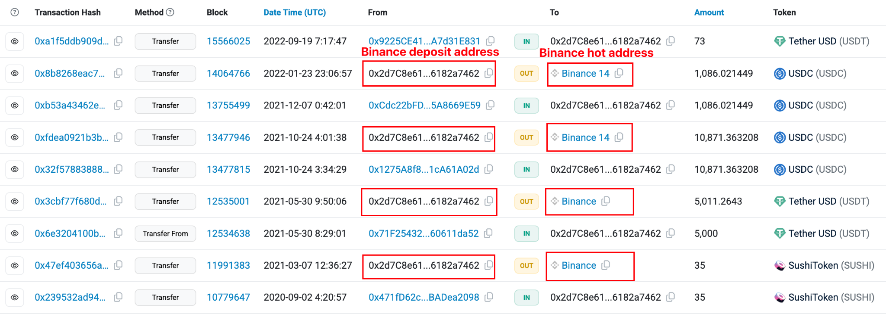

* Hot Wallet Address: Active exchange addresses for daily transactions, frequently interacting with multiple addresses.

* Cold Wallet Address: Long-term storage for large sums, with few transactions but large amounts.

* Regular Address: A wallet address controlled by an individual, without obvious labels.

* Contract Address: A deployed smart contract address that cannot initiate transactions itself; represents code on the blockchain capable of receiving assets, distributing funds, and executing logic (e.g., staking, lending, or trading).

* Multi-Signature Address: Requires multiple private keys for authorization, commonly used by teams or institutions for asset custody.

* Burn Address: An address without a known private key, used to destroy or pseudo-destroy assets, e.g., the all-zero address (0x0000000000000000000000000000000000000000).

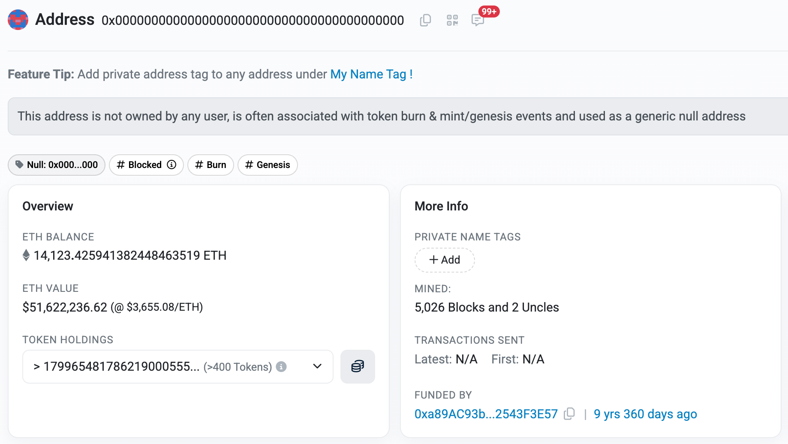

**Transaction Structure and Elements**

* Block Height: The position of a block in the blockchain, used to determine transaction order.

* Transaction Hash: The unique identifier (ID) for each transaction, enabling tracking of transfers or contract calls—like a transaction’s fingerprint.

* Gas: The “fuel” cost of blockchain operations. Gas analysis can reveal transaction timing, priority, and even the source of fee funding.

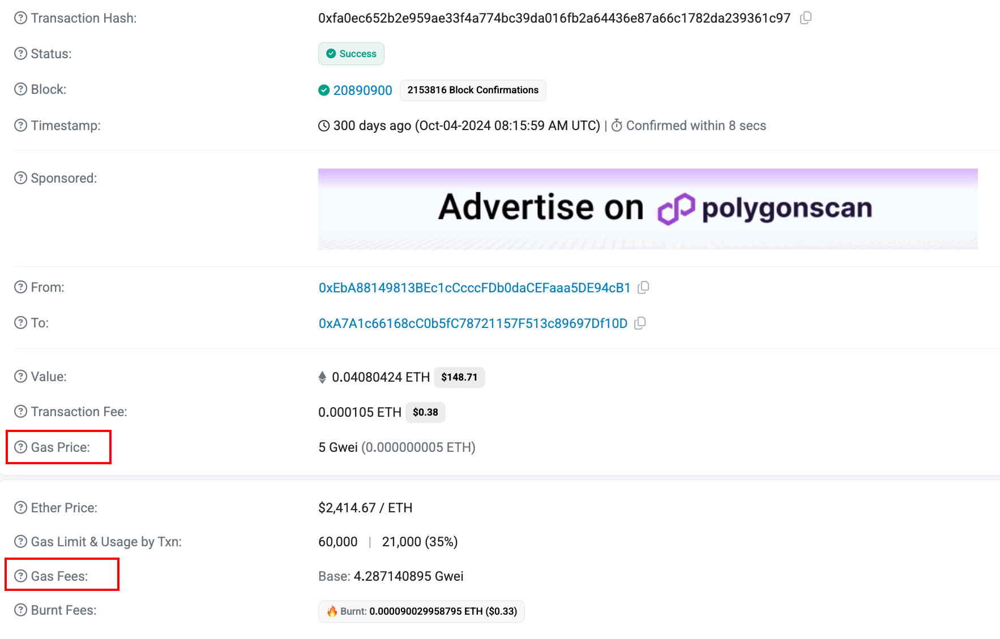

* Mixing: Using mixer protocols or services (e.g., Tornado Cash, Wasabi) to obfuscate transaction sources and destinations.

* Swap: Token exchanges on DEXs (e.g., Uniswap, PancakeSwap), which may change asset form in the process.

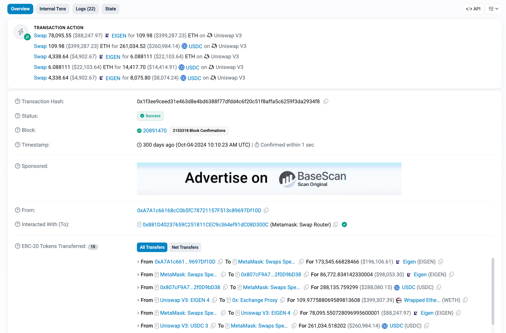

* Cross-Chain: Asset transfers between different blockchains, often involving bridge contracts; frequently used for laundering and dispersing funds.

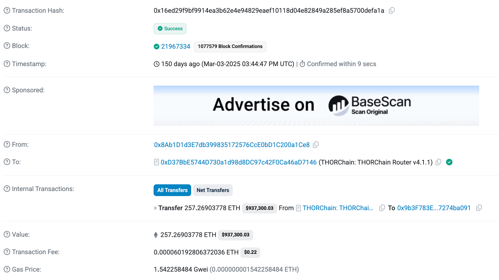

* Input Data: Parameters included when calling a smart contract, decodable to reveal swap paths, recipients, etc., often viewable in blockchain explorers.

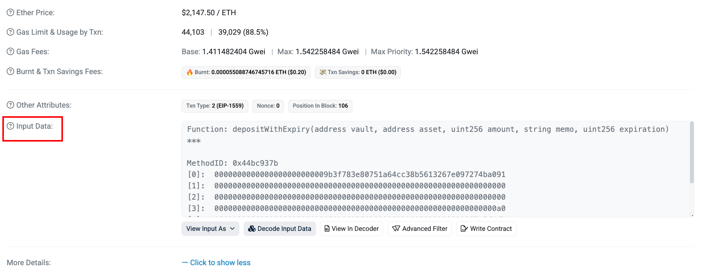

* Event Logs: Records of key operations during contract execution, useful for identifying token transfers, swaps, deposits, and withdrawals.

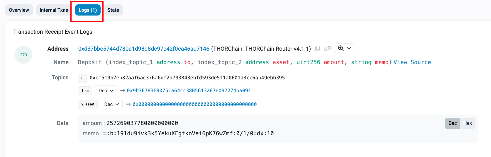

**Platform Type**

* Centralized Exchanges (CEX): Platforms where users deposit assets into platform-controlled accounts, allowing for asset freezes and fiat on/off-ramps, but with identifiable addresses linked to user identities (e.g., Binance, OKX).  
* Decentralized Exchanges (DEX): On-chain platforms where users hold their own private keys and trade via smart contracts. No identity checks, making them popular for illicit swaps; assets can be traced but not frozen (e.g., Uniswap, Curve).  
* Bridges: Cross-chain asset transfer protocols, often used by attackers to evade tracing or launder funds (e.g., THORChain, Wormhole).  
* Nested Platforms: Third-party services that store assets in large CEX wallets (e.g., Binance), requiring secondary path resolution to determine actual ownership.

**UTXO and Change**

In the Bitcoin network, the source and destination of every transaction are based on the UTXO (Unspent Transaction Output) model. You can think of it as a “change” system—you cannot directly modify an account balance; instead, you must “spend” an entire note and receive the remainder as change. This model differs from account-based blockchains like Ethereum.

For example, suppose you want to pay 0.6 BTC, and your wallet contains a single UTXO worth 1 BTC. You cannot “cut out” just 0.6 BTC from that 1 BTC; you must use the entire 1 BTC as the transaction input: 0.6 BTC is sent to the recipient, and the remaining 0.4 BTC (minus transaction fees) is returned to you. However, it is not sent back to your original address—it is returned to a newly generated address in your wallet, called the change address. Typically, wallets automatically generate a new change address for each transaction to enhance privacy and avoid address reuse. In some wallet configurations, however, the change may be sent to an existing address in your wallet.

The core logic of this system is that a UTXO must be fully consumed, and any unspent portion is turned into a new UTXO via the change mechanism for future use. This ongoing process of “spending old UTXOs and producing new UTXOs” is the foundation of how Bitcoin and similar blockchains (e.g., Litecoin, Dogecoin) operate. In contrast, account-based chains like Ethereum allow partial spending of an account balance, where each transaction directly updates the account state without the “bill-splitting” and change-handling process of the UTXO model.

Because each transaction must fully consume its input UTXOs and generate new outputs, the UTXO model naturally produces multiple output addresses—one being the recipient address, and another being the change address. From an on-chain data perspective, these two addresses are treated equally in the transaction, with no explicit indicator of which one is change and which one is the actual recipient. This presents certain challenges for blockchain analysis.

Understanding these concepts helps us more quickly assess address behavior, risk exposure paths, and potential laundering activities during investigations. Next, we will use a blockchain explorer to examine a real transaction and demonstrate how to locate and interpret public data to improve tracing efficiency.

### (3) Blockchain Explorers

Once you have mastered the basic concepts, the first stop in on-chain tracing is usually the blockchain explorer. Whether you are checking transaction records, viewing an address balance, or verifying the details of a smart contract call, you will inevitably rely on an explorer. Each blockchain has its own dedicated explorer, but the operation logic is generally similar—once you learn how to use one, you can easily adapt to others. Common blockchain explorers include:

| Chain | Explorer |
| :---: | :---: |
| Bitcoin | [https://www.blockchain.com/explorer](https://www.blockchain.com/explorer), [https://mempool.space](https://mempool.space) |
| Ethereum | [https://etherscan.io](https://etherscan.io) |
| TRON | [https://tronscan.org](https://tronscan.org) |
| BNB Chain | [https://bscscan.com](https://bscscan.com) |
| Polygon | [https://polygonscan.com](https://polygonscan.com) |
| Solana | [https://solscan.io/](https://solscan.io/) |
| Avalanche | [https://snowtrace.io/](https://snowtrace.io/) |
| Optimism | [https://optimistic.etherscan.io](https://optimistic.etherscan.io) |
| Arbitrum | [https://arbiscan.io](https://arbiscan.io) |
| Aggregated | [https://www.oklink.com/](https://www.oklink.com/) |

Let’s take Etherscan as an example. When you have a suspicious address, the first step is to enter it into the search bar. On the address details page, you can view its balance, token holdings, and transaction history. Etherscan and other explorers often tag addresses and contracts—for example, marking exchange addresses, bridge contracts, known hacker wallets, or project wallets—helping you quickly identify the counterparty’s background. By clicking on any transaction, you can view detailed information such as the transaction hash, sender and recipient addresses, transfer amount, timestamp, block height, gas fees, and even the specific contract function called.

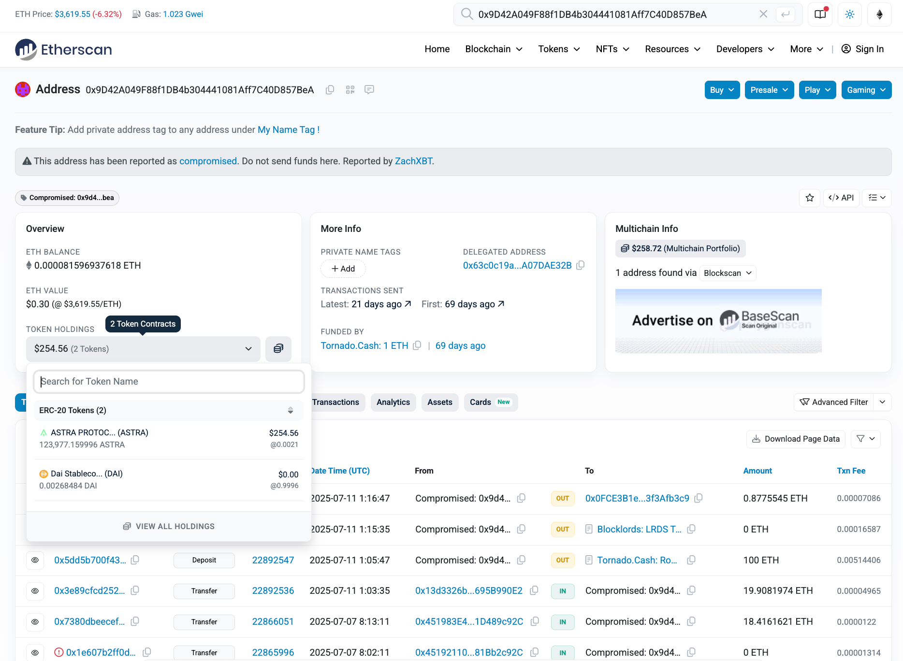

Going further, the Token Transfers tab displays the token transfer records involving this address. For example, a USDT transfer record will show the amount, sender, recipient, token contract address, and symbol (such as USDT, DAI, USDC). This allows you to trace each transaction to see where the funds came from and where they went. Many scams use “airdrop scams” to create false impressions—for instance, you might receive a token that is neither verified nor valuable, indicating it could be a fake. By checking the Token page and contract code on the explorer, you can verify whether a token is a legitimate asset or an imitation.  

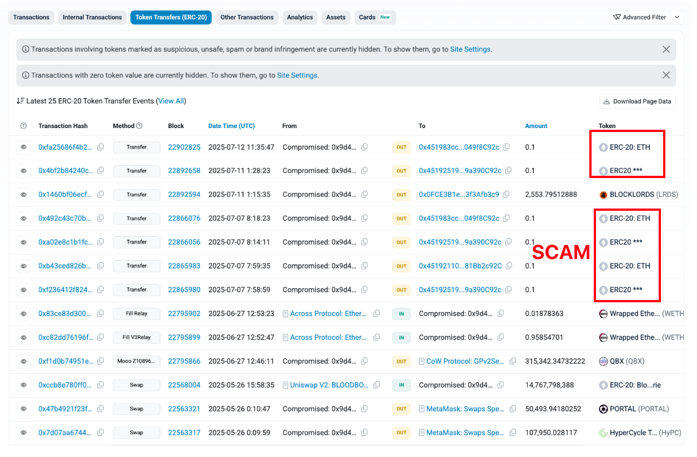

Blockchain explorers can also analyze contract calls. When an address interacts with a smart contract (such as executing a DEX swap, borrowing funds, or minting an NFT), the system will display the contract function name (such as swapExactTokensForTokens or borrow). These details often help you determine the real purpose of the address. If the Input Data is encoded, you can try decoding it to better understand the exact action taken. For advanced users, you can go to the contract’s source code page to check whether it is open source and assess its functionality and security. The Event Logs section is also crucial, recording contract-triggered events and parameter details, such as how many tokens were received by an address and through which function they were sent.

In addition to viewing static data, it is equally important to observe the timing and flow of funds. For example, does the attacker frequently perform batch transfers? Is there evidence of wash trading or other abnormal activity? While the interfaces of different blockchain explorers may vary, the underlying logic is nearly identical. Becoming familiar with several platforms will significantly improve your cross-chain tracking capabilities.

Blockchain explorers are the most basic and commonly used portals for on-chain intelligence, but they serve merely as a “window for reading data” and have their limitations. Therefore, in the next section, we will introduce some additional tools.

## 2\. Tracing Tools

In real-world applications, we often face highly complex scenarios such as multi-chain asset transfers, fund mixing, and contract interaction analysis. Blockchain explorers, due to their dispersed data and less intuitive presentation, are not well suited for identifying and tracing complex fund flows. As a result, more users and professionals are turning to specialized asset tracing tools to achieve more efficient and systematic on-chain security management. Among these tools, [MistTrack](https://misttrack.io/), an on-chain analysis and anti-money laundering tracing platform developed by SlowMist, is the one we use most and recommend the most. If a blockchain explorer is the “magnifying glass” for on-chain data, then MistTrack is more like an “on-chain intelligence analysis desk” — it not only summarizes data but also helps you interpret it.

### (1) Introduction to MistTrack

MistTrack provides multiple functions, covering transaction monitoring, risk assessment, address labeling, and transaction behavior analysis, aiming to help users more efficiently identify illicit transactions, trace fund flows, enhance compliance capabilities, and build a full lifecycle security protection system for digital assets. Since its launch in 2022, MistTrack has been widely adopted in the blockchain security industry, serving over 100,000 users — tens of thousands of them paid customers — and playing a critical role in multiple major on-chain security incidents worldwide. It has gradually become an indispensable compliance and risk control tool in the global crypto industry.

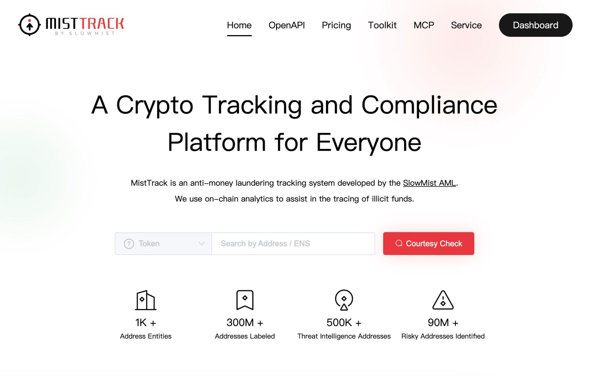

s of now, MistTrack has accumulated over 300 million address labels, 1,000+ on-chain entities, 500,000+ threat intelligence data points, and 90 million+ risky addresses. The system supports tracking on 18 mainstream public blockchains and hundreds of different tokens, covering a wide range of asset types and on-chain ecosystems. MistTrack also supports cross-chain tracing, currently compatible with 15 mainstream cross-chain bridge protocols and tools including Chainflip, AllbridgeCore, and LIFI, with continuous expansion underway. Backed by this massive and ever-updating data foundation, MistTrack provides users with strong technical support to tackle complex and evolving on-chain security threats.

Core functions of MistTrack include:

* AML Risk Score: MistTrack calculates an AML risk score for each address based on its associated entity, historical transaction activity, and data from SlowMist’s malicious wallet address database. If the address belongs to a high-risk entity (such as a mixing service) or has interacted with known risky entities, it will be flagged as a risky address. Using verified datasets of ransomware, theft, phishing, and other illicit activities, MistTrack marks involved addresses accordingly. Users can analyze each wallet address like a professional compliance officer, determining whether it is linked to illicit funds. By clicking the “Risk Report” button, users can instantly generate a risk analysis report for the address.  
* Address Labels: MistTrack can identify the entity behind an address (e.g., Coinbase or Binance), locate on-chain and off-chain tags such as ENS, MEV Bots, DeFi Whales, and detect which wallet app (e.g., imToken, MetaMask) the address uses. With the address labeling feature, users can better understand the background of an address.  
* Counterparty Analysis / Transaction Action Analysis: MistTrack provides the information that matters most to users. Unlike standard blockchain explorers, which can be complex and unintuitive, MistTrack evaluates all historical transactions of an address and summarizes its behavior in an easy-to-understand way, helping users interpret activity patterns.  
* Address Profile Analysis: Collects all historical data for a target address and summarizes its traces, including platforms used, related incidents, and related information, helping users build a profile of the target address.  
* Favorites / Monitoring: Users can save specific wallet addresses in their private favorites list and gather all needed information in one place. They can also add whale and KOL addresses to monitor their on-chain activities in real time, track their latest transactions, and gain investment insights.  
* Investigation Graphs: MistTrack visualizes all incoming and outgoing transaction relationships of a queried address in dynamic, interactive graphs. Users can filter and sort data directly on the chart to monitor selected information easily. MistTrack supports flexible tracing, analysis, and record-keeping, and its sharing feature enables collaborative case work with colleagues.

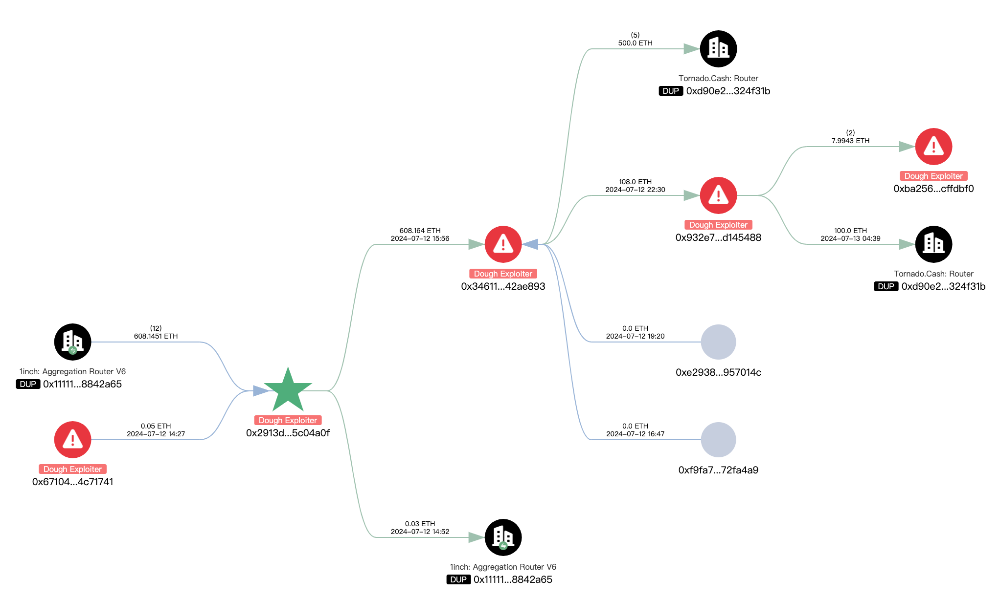

At the same time, to facilitate more efficient address analysis, we have developed the MistTrack OpenAPI for seamless integration into third-party applications.

* OpenAPI interface service: By calling the OpenAPI, MistTrack will return the label list for a given address, an address overview, risk score, detailed risk information list, transaction investigation results, transaction behavior analysis results, address profile analysis results, and counterparty analysis results.

### (2) MistTrack in Use

The following is the tracking process of the Cork Protocol attack on May 28, 2025\. The attacker’s address is [0xea6f30e360192bae715599e15e2f765b49e4da98](https://etherscan.io/address/0xea6f30e360192bae715599e15e2f765b49e4da98).

First, using tools such as Etherscan and DeBank, we can initially determine that the attacker gained 3,761.878 wstETH. At the same time, the wstETH was converted into 4,527 ETH through 8 transactions.

At this point, we input the attacker’s address into MistTrack and initiate a query.

The [results](https://light.misttrack.io/address/ETH/0xea6f30e360192bae715599e15e2f765b49e4da98) show that the address has a risk score of 100 (high risk), has transactions on both the Ethereum and Base chains, with its first transaction on May 20 and the most recent one on June 30\. In total, it has received 4,531.977 ETH, currently holds a balance of 0 ETH, and has interacted with both DeFi platforms and exchanges.  
   
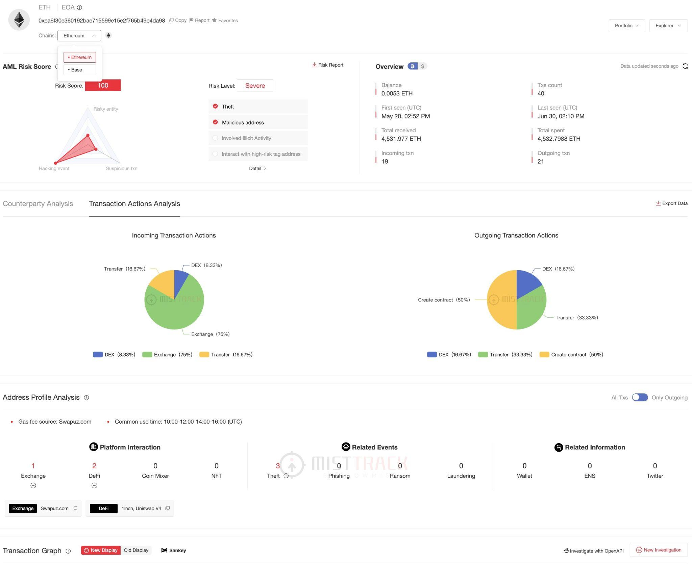

Next, we focus on the fund transfer graph.

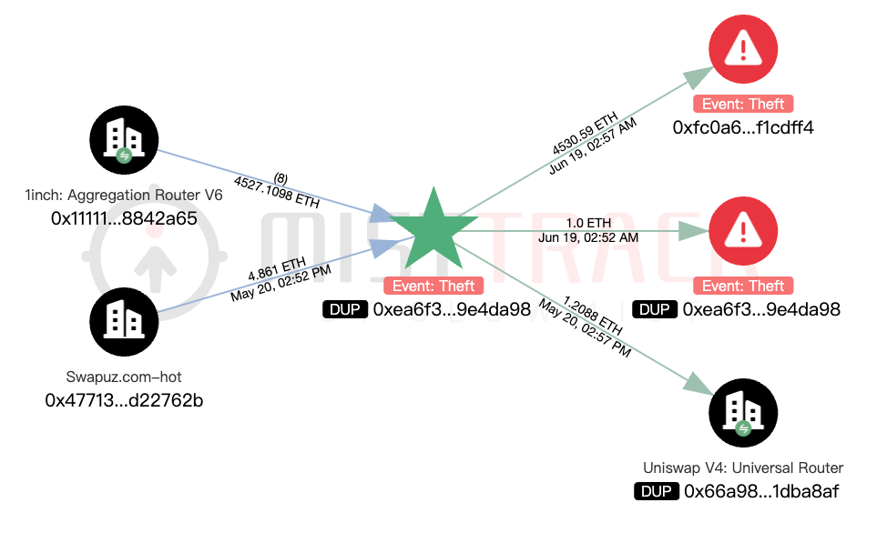
Starting with the left side (incoming funds), from bottom to top:

* The first entry shows 4.861 ETH transferred from Swapuz.com, which—based on the timeline—appears to be the initial source of funds for the attacker.  
* The second entry consists of a total of eight transactions. By clicking on the arrow line, we can see the details of each.

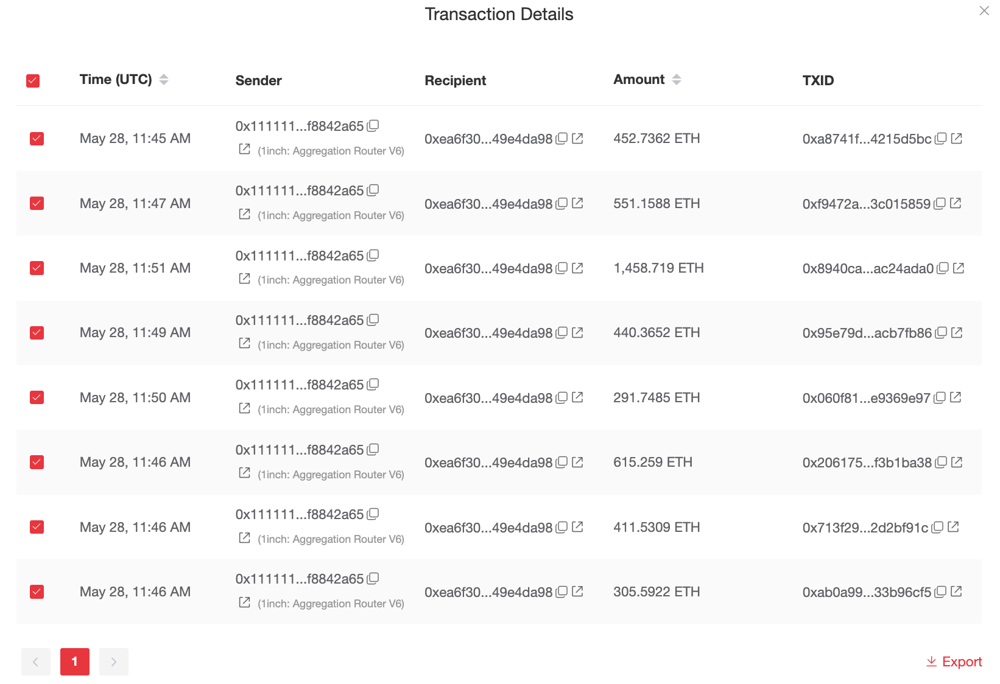

Randomly checking the last transaction ([0xab0a99...b96cf5](https://etherscan.io/tx/0xab0a997f307ff45d9fcbfd2672f108d49546b86104eb06146bf90c3433b96cf5)), we find that it involves the attacker swapping 253.9267 wstETH for 305.5922 ETH. Checking the remaining seven transactions confirms they all involve swapping wstETH for ETH, consistent with the earlier finding that the attacker converted wstETH to 4,527 ETH through eight transactions.

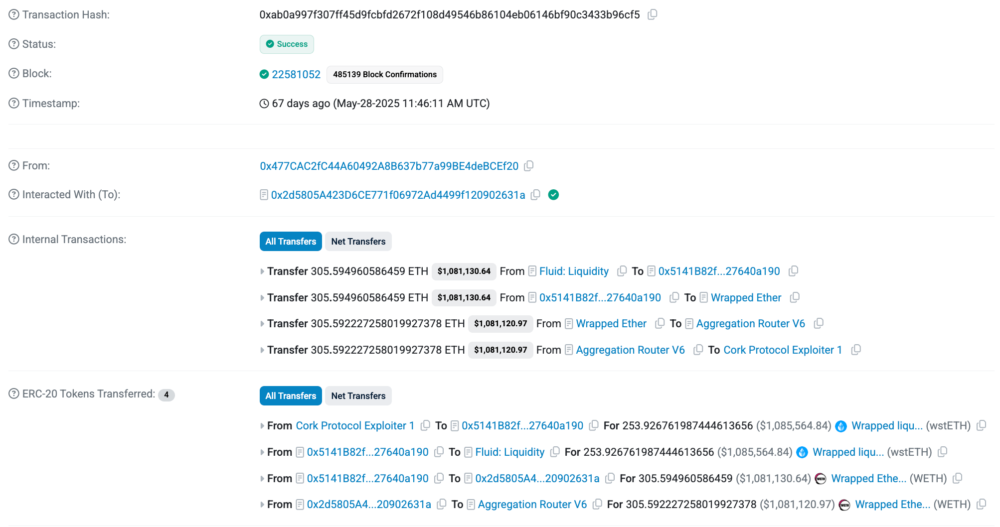

Now looking at the right side (outgoing funds), from bottom to top:

The first entry shows 1.2088 ETH interacting with Uniswap. By right-clicking on Uniswap and selecting “DEX Parsing,” we can quickly determine that this transaction swapped 1.2028 ETH for 1 wstETH.

The second entry shows the attacker transferring 1 ETH to their own address. Reviewing the [transaction](https://etherscan.io/tx/0x92a53d817e9a626292270d93259b10cba05a1e55bd0651ca7ef57b63b7294cf0) details reveals an on-chain message: “sherlock missed it. ct \> ds. uniswap hook is not problem.” It is rumored that during the discussion of the issue, the Sherlock team, which audited the Cork Protocol, reportedly suspected the issue was caused by the Uniswap hook. The attacker intentionally left an on-chain message to clarify that the Uniswap hook had nothing to do with the issue.

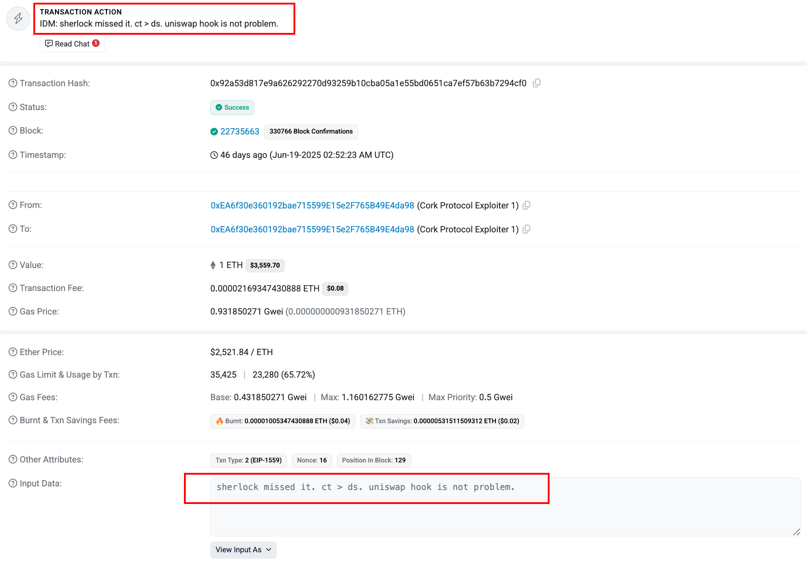

The third entry shows the attacker transferring most of the funds—4,530.59 ETH—to a new address (0xfc0a6de0abd0985e7a910f8874c3abf23f1cdff4). Double-clicking this address reveals that it then split the ETH into two new addresses. Further expansion shows that 10 ETH was sent to juicebox.money, while the remaining 4,520.2 ETH was deposited into the mixing service Tornado Cash (an analysis of Tornado Cash will be provided later).

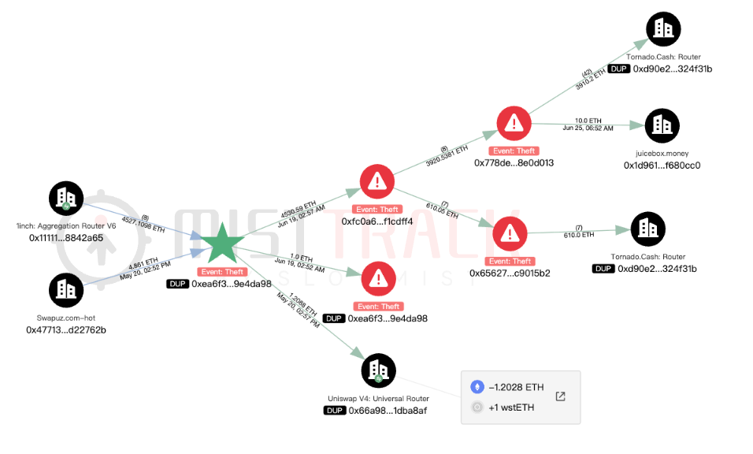

### (3) Community Tools

Well-known cryptocurrency investigator [ZachXBT](https://t.me/investigations) has publicly shared his commonly used tools for on-chain analysis and open-source intelligence (OSINT) investigations:

* Cielo \- Wallet tracking (EVM, Bitcoin, Solana, TRON, etc.)   
* TRM \- Create graphs for addresses/transactions  
* MetaSuites \- Chrome extension that adds additional data on block explorers 
* OSINT Industries \- email/username/phone lookups  
* LeakPeek \- db lookups 
* Snusbase \- db lookups  
* Intelx \- db lookups  
* Spur \- IP lookups  
* Cavalier (Hudson Rock) \- Infostealer lookups  
* Impersonator \- Chrome extension to spoof login to dApps  
* MetaSleuth \- Similiar to TRM but intended for retail users
* Arkham \- Multichain block explorer, entity labels, create graphs, alerts
* Obsidian \- Create flow charts / diagrams
* Wayback Machine \- archive web pages   
* Archive Today \- archive web pages   
* Etherscan / Solscan \- block explorer for EVM / Solana  
* Blockchair \- bitcoin block explorer  
* Range \- CCTP bridge explorer  
* Pulsy \- bridge explorer aggregator  
* Socketscan \- EVM bridge explorer 
* Dune \- Analytics platform to query blockchain data
* Mugetsu \- X/Twitter username history & meme coin lookups  
* TelegramDB Search Bot \- Basic Telegram OSINT
* Discord\[.\]ID \- Basic Discord account info
* CryptoTaxCalculator \- Track PNL for an address 

In the next section, we will explore common fund movement patterns, laying the groundwork for behavioral analysis in tracing paths.

## 3\. Common Fund Movement Patterns

In cryptocurrency asset tracking, understanding the “transfer playbook” of attackers or scammers is a crucial step in determining transaction paths. Although fund movements on-chain may appear to be a series of simple address-to-address transfers, they often follow certain patterns or “behavior templates.” This section summarizes several common fund movement methods to help you quickly identify “non-standard” behavior in practical investigations.

### (1) Peel Chain

A Peel Chain refers to a laundering technique in which large amounts of cryptocurrency are split into a long series of small transactions. This pattern is common in blockchain analysis. It typically starts from a “dirty” address linked to illicit activity. For example, Address A sends funds to Addresses B and C, with the transfer to B being very small while the transfer to C contains most of the value. C then sends a small amount to D and a large amount to E, and so on, until numerous addresses receive tiny amounts of cryptocurrency.

### (2) One-to-Many Distribution

After receiving a large sum, an attacker may transfer the funds from the main wallet to dozens or even hundreds of intermediary addresses. For example, a single transaction worth 100,000 USDT might be split into 50 transfers of roughly 2,000 USDT each, with each address further splitting and sending out funds. This creates a complex “fan-shaped transfer structure” intended to confuse investigators, obscure transaction paths, dilute the original source of funds, delay investigative response time, and avoid having the entire sum frozen at once. On blockchain visualization tools, this appears as a large central address radiating multiple layers of outward fund flows—a classic early-stage laundering pattern.

### (3) Multi-Hop Transfers

Attackers often move funds through rapid, multi-hop transfers, where each address is used only once before quickly sending funds onward, and most do not interact with any on-chain dApps. This intermediary structure, by increasing path length and nesting, disrupts behavior-model detection and delays risk-control responses—especially when executed intensively in the first few minutes after an incident, in order to sever the trail before monitoring systems react.

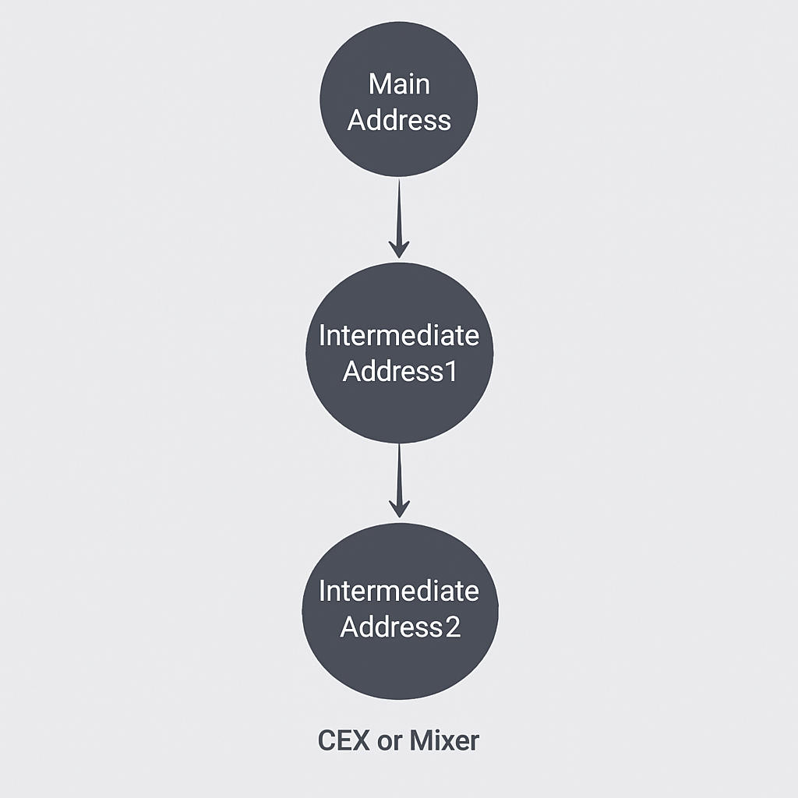

### (4) Mixer Usage

Mixers are a classic tool for attackers to break on-chain traceability. The principle is to pool funds with those of other users, process them together, and output assets that cannot be directly matched to their original inputs. Common protocols include Tornado Cash and Wasabi. Mixer transactions often follow standardized patterns, such as uniform deposit sizes, specific waiting times, and synchronized withdrawals. If an address exhibits such characteristics, it is reasonable to suspect laundering activity. Mixers typically obscure paths by using uniform entry points, delayed outputs, and fragmented withdrawals, making “fund in” and “fund out” relationships visually unlinked. When combined with privacy coins (such as XMR) or other anonymity protocols, tracking becomes significantly more difficult.

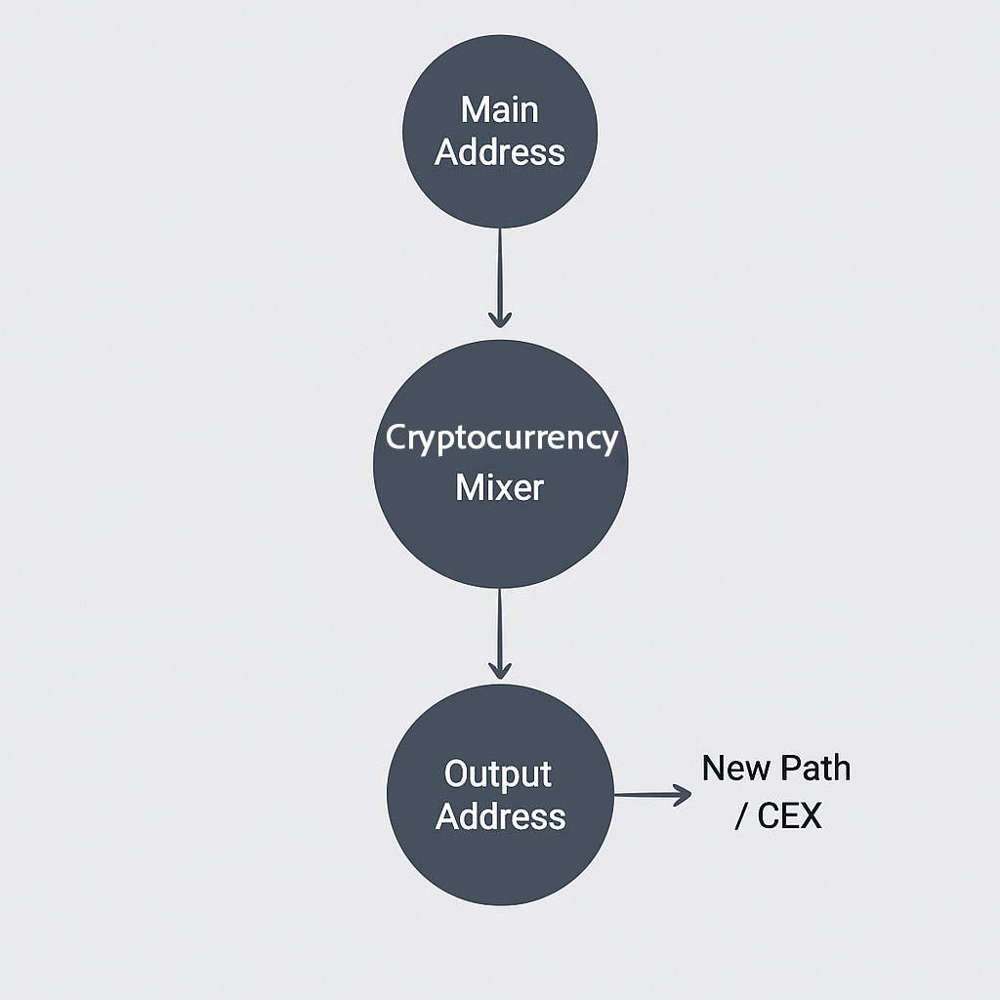

### (5) Cross-Chain Bridge Hops

To evade monitoring and tracing on a given blockchain, attackers may use cross-chain bridges to transfer assets to another network before continuing the movement. Common bridges include THORChain, LayerZero, and Across, with target chains often being networks with weaker investigative coverage (such as TRON). These cross-chain transfers often occur shortly after the attack, and the process may involve asset token changes, path interruptions, and reconstruction of destination addresses, further increasing the difficulty of tracing.

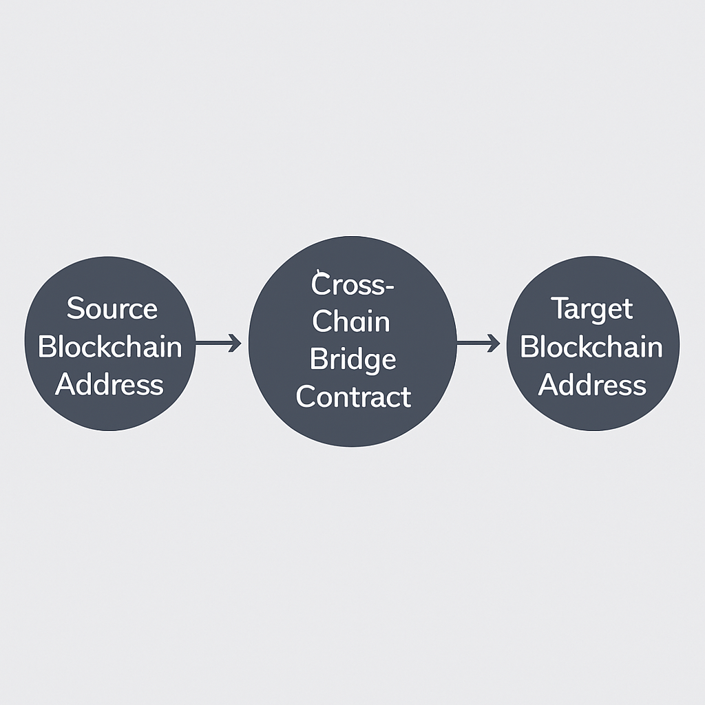

### (6) Many-to-One Consolidation

In Ponzi schemes or rug-pull events, attackers often consolidate victim assets into one or a few “core wallets” within a short time, and then use those addresses to execute cross-chain transfers, mixer deposits, or withdrawals. This behavior often occurs when early signs of collapse emerge, representing an emergency asset transfer. In transaction paths, this produces clear consolidation peaks.

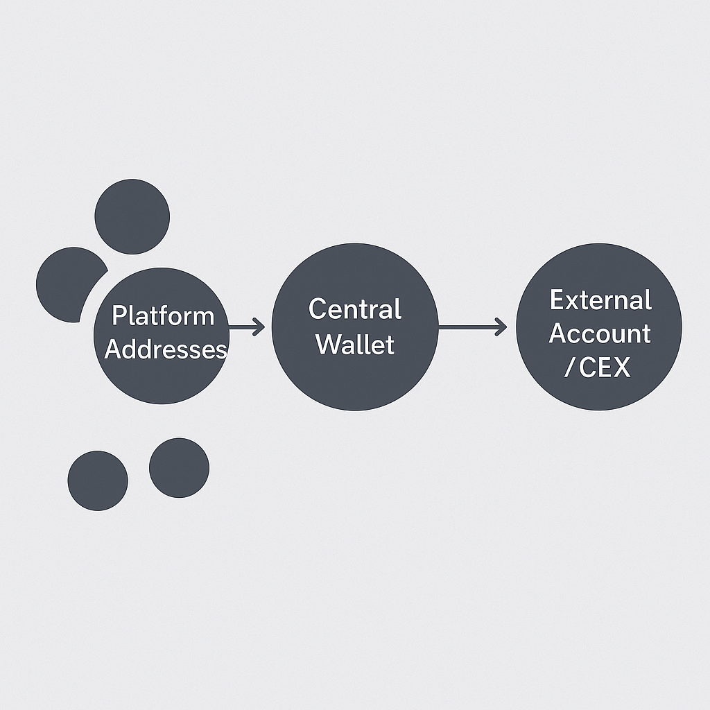

### (7) P2P / OTC

After obscuring the origin of illicit assets via mixers, cross-chain bridges, or fragmented transfers, attackers may turn to P2P platforms, OTC brokers, or offshore non-KYC exchanges to perform “off-chain” operations—converting cryptocurrency into fiat currency or privacy coins. For example, Huione Guarantee, a Southeast Asia–centered escrow platform, is frequently used for this purpose. This process often relies on off-chain deals and identity-masking methods, further breaking the link between on-chain funds and real-world identities.

P2P platforms allow direct user-to-user trades between cryptocurrency and fiat. Examples include Paxful, Bitquick, and LocalBitcoins (now defunct). Attackers can match with other users and accept bank transfers, Alipay/WeChat Pay, PayPal, or even gift cards as payment, using rented accounts or fake identity documents to evade controls. Such off-chain payments often lack robust identity verification, making post-transaction tracing extremely difficult.

OTC (Over-The-Counter) trading involves large off-chain cryptocurrency transactions via intermediaries, often conducted over Telegram, Discord, or similar platforms. Many OTC brokers do not check the source of funds or require KYC from either party, providing attackers with an “anonymous, fast, unregulated” cash-out channel. Some OTC intermediaries maintain laundering networks, payment account resources, or even their own gray-market platforms, offering “one-stop cash-out” services.

If immediate off-ramping is not possible, illicit funds may be routed into small exchanges in loosely regulated jurisdictions—such as certain Caribbean, African, or Eastern European platforms—with weak KYC/AML policies, completing the final conversion. Eventually, the funds may be withdrawn via third-party payment processors, underground banking systems, e-commerce accounts, or converted into privacy coins like Monero or Zcash for long-term hiding, making on-chain tracing and law enforcement action significantly more difficult.

While these patterns are common, it’s important to note that attackers continuously adapt their techniques. A single fund path may combine multiple strategies—for example, “splitting \+ cross-chain \+ mixing \+ reconsolidation”—which is the non-linear complexity seen in most real-world cases. Understanding fund movement patterns is therefore not just about memorizing playbooks, but about recognizing the intent behind the transaction structure: Is it to evade detection? To cash out? To launder and reuse assets? Only by answering such questions can tracing efforts get closer to the truth.

Next, we will move to the practical aspect: what to do immediately if you or your friend become a victim.

## 4\. What to Do If You Get Hacked

The [Blockchain Dark Forest Selfguard Handbook](https://darkhandbook.io/) notes that “being hacked is a matter of when, not if.” With scams and attacks becoming increasingly rampant, individual users, project teams, and community operators can hardly stay unaffected. So, when assets are actually stolen, what should you do?

### (1) Prioritize Loss Prevention

Once you notice abnormal asset movement, “loss prevention” should always be the top priority, generally in two stages:

**Stage 1: Emergency Loss Prevention**

* If the attack is ongoing (e.g., the hacker is still transferring funds), immediately move remaining assets to a secure wallet, or attempt “front-running” transactions to minimize losses. 
* Check if you hold assets that support freezing functions (e.g., USDT, USDC) and, if applicable, contact the issuer to request freezing.  
* If stolen funds have entered a centralized exchange (CEX), quickly collect transaction hashes, timestamps, and addresses, and submit a freeze request to the platform. Note that most exchanges will not freeze an address immediately based on individual complaints.  
* Users with technical capability can also track the hacker’s path using on-chain analysis tools (e.g., MistTrack) to identify fund flows.  
* If your wallet assets cannot be transferred, it may be due to malicious multisig or replaced/limited signing permissions. Use blockchain explorers or security tools to verify whether permissions now belong to unknown addresses. For more on malicious multisig risks, refer to the relevant [resources](https://slowmist.medium.com/beginners-guide-to-web3-security-risk-of-wallet-being-maliciously-multi-signed-fb5a9269ed87).

**Stage 2: Prevent Further Damage**

* Check associated wallets and mnemonic phrases for additional risks.  
* Review token approvals and revoke suspicious ones using tools like [Revoke.cash](https://revoke.cash/).  
* Change all related account passwords and enable multi-factor authentication (MFA) to prevent further cross-platform intrusion.  
* Block potential re-entry points that hackers could exploit, including browser extensions, desktop wallets, and GitHub projects.  
* Be aware of “fake customer service” or “asset recovery” scams post-theft, and do not trust unsolicited contacts.

### (2) Preserve the Scene

A common instinct is to panic, reinstall systems, or delete files, which may destroy crucial evidence. What you need is:

* Calmly disconnect from the Internet, keep the computer powered on, and preserve the original environment. Do not shut down or delete any files immediately—maintain the scene as it is for professionals to collect evidence.  
* Record and retain all relevant evidence. For example, if the phishing occurred via Telegram, email, or a website, save the Telegram group chat, usernames, email IP addresses, links, and the original email content.  
* If the case involves the promotion of a fraudulent platform, retain original materials such as screenshots of KOL posts, content from the official website, and any local documents.

### (3) Conduct Preliminary Analysis

Even if you are not an expert in blockchain analysis, you can still make basic judgments using blockchain explorers and some simple tools:

* Input your address into a blockchain explorer to observe fund flows.  
* Use MistTrack to trace on-chain paths and identify if assets were mixed, bridged, or moved into centralized exchanges.  
* Check address profiling on MistTrack to see if it is flagged as high-risk or associated with scams.  
* Export reports via MistTrack to get an overview of fund flows even as a non-professional.  
* Submit hacker addresses to platforms like MistTrack to help prevent others from being scammed.

### (4) Contact Professional Agencies

For large amounts or complex cases, it’s advisable to contact professional security firms promptly:

* Conduct on-chain analysis and full path tracing, and profile the hacker.  
* Assess whether assets can still be frozen and coordinate emergency freezes with exchanges (where possible).  
* Provide “on-chain messaging” services to communicate with hackers or apply pressure (e.g., leaving messages on Etherscan).  
* Generate tracking reports for investigative or reporting purposes.

On-chain messages have repeatedly succeeded in prompting hackers to return assets. Reference implementations exist on:

* [Ethereum](https://slowmist.medium.com/navigating-on-chain-communication-after-a-crypto-hack-74a4fd8b1791)  
* [Bitcoin](https://slowmist.medium.com/slowmist-emergency-response-guide-for-stolen-funds-on-chain-messaging-btc-edition-13daa24c988b)

### (5) File a Police Report and Seek Legal Assistance Early

Even if you can track hacker addresses and fund flows precisely, judicial enforcement is ultimately needed for freezing and recovery:

* File a report with local authorities.  
* Prepare detailed materials and reports, including transaction records, chat screenshots, timelines, and loss amounts.  
* If cross-border funds involve overseas exchanges, contact law firms to prepare international assistance documentation.  
* Multiple victims can consider collective reporting to increase chances of successful case registration and cooperation.

### (6) Ongoing Follow-up and Profiling

According to “Roca’s Law” (“where there is intrusion, traces will remain”), hackers often leave clues both on-chain and off-chain. Continuously building a “hacker profile” can aid subsequent investigations:

* On-chain clues: transaction paths, receiving addresses, mixing behavior, cross-chain bridges.  
* Off-chain clues: email registrations, Telegram IDs, IP addresses, device fingerprints.  
* Social links: connections to known scammers or rug-pull groups.

### (7) Tokens Eligible for Freezing

Some tokens with official freezing mechanisms include:

* USDT (issuer: Tether)  
* USDC (issuer: Circle)  
* MERL (issuer: Merlin Chain)  
* BUSD (issuer: Paxos)  
* TUSD (issuer: TrustToken)  
* PAX (issuer: Paxos)  
* GUSD (issuer: Gemini)  
  …

These tokens are typically issued centrally, with smart contracts containing “blacklist” or freeze functionalities. These powers are generally used to comply with legal requirements, combat fraud, money laundering, or other illegal activities. If your stolen assets include these tokens, request a freeze as soon as possible before they flow into non-regulated platforms or mixing protocols. Early response, evidence preservation, and analysis greatly increase the chance of intercepting funds and recovering losses.

The next section will dive deeper into tracing — identifying mixing activity, cross-chain paths, complex laundering networks, and reviewing multiple case studies.

## 5\. Cross-chain Bridge Tracking Analysis

### (1) Introduction to Bridges

With the growth of the multi-chain ecosystem, the demand to move assets from one blockchain to another has increased. Cross-chain bridges have emerged as critical infrastructure, connecting assets and data across different chains. Their core function is to allow users to lock assets on one chain and obtain equivalent assets on another chain in the form of Wrapped Tokens, or directly release native assets. Attackers frequently exploit bridges to perform “on-chain jumps,” evading tracking tools and analysis on the source chain.

Major Types of Bridges:

**Decentralized Verification Bridges**

* Characteristics: Do not rely on centralized entities. They typically use light clients or zero-knowledge proofs to validate the state of the target chain. Security aligns with the target chain, providing strong resistance to attacks.  
* Representative Projects: LayerZero, zkBridge  
* Risks: High complexity, high verification costs, and performance requirements.

**Relayer / Observer Bridges**

* Characteristics: A set of third-party nodes observes on-chain events and relays data to the target chain. Lighter than fully decentralized bridges, but trust assumptions are required.  
* Representative Projects: Wormhole, deBridge, Axelar  
* Risks: Security depends on the number and honesty of relayer nodes; malicious activity by a small number of nodes is possible.

**Multisig / Custodial Bridges**

* Characteristics: Users lock assets in a source-chain smart contract, and the corresponding assets are minted on the target chain after approval by a set of multisig addresses or custodians. Simple structure and flexible deployment.  
* Representative Projects: Multichain, Binance Bridge  
* Risks: Significant trust dependency; if multisig keys are leaked, all assets can be stolen. Many past bridge hacks (e.g., Ronin, Harmony) fall into this category.

**Liquidity Pool Bridges**

* Characteristics: Do not lock real assets but rely on on-chain liquidity pools on both sides for swaps, similar to AMM DEXs. Cross-chain behavior is effectively an “exchange” rather than true asset transfer.  
* Representative Projects: Hop Protocol, THORChain  
* Risks: Dependent on liquidity size; pool depletion may cause slippage or failed swaps. AMM price volatility can trigger arbitrage or losses.

**Native Bridges**

* Characteristics: Maintained directly by the base blockchain or its core development team, common between an L1 and its L2/sidechains. Security is tied to the protocol layer, usually the most reliable.  
* Representative Projects: Arbitrum Bridge, Polygon PoS Bridge, Near Rainbow Bridge  
* Risks: Technical issues or failed upgrades may temporarily disable the bridge. Typically slower, not suitable for high-frequency trading.

Traditional on-chain tracking assumes a transparent single-chain logic: one address sends to another, and subsequent outflows can be traced. Once cross-chain activity occurs, there is no direct record linking the “outflow” on the source chain to the “inflow” on the target chain. Even if it is known that funds were “moved across chains,” it is difficult to determine where they landed, who received them, or how they are being used.

Additionally, many cross-chain protocols are not fully open-source on-chain. Transaction records may reside in Layer 2 logs, Rollup events, or non-standard contract calls. Cross-chain transfers are therefore not simple “transactions” but rather “burn-and-mint” or “lock-and-release” operations. On the blockchain, this creates a visible “gap” in fund flow: funds no longer continue on the source chain but “appear” on another chain. Attackers exploit this opacity to create obfuscated transfer paths, forming complex combinations such as “cross-chain \+ dispersal \+ mixing.”

### (2) Bridge Analysis

In crypto asset tracking, “cross-chain” activity has become a standard tactic for fund laundering. However, bridges are not entirely “black boxes.” We can still track cross-chain movements using the following methods:

#### Method 1: Bridge Explorer

The simplest and most direct approach is to check whether the bridge provides an Explorer. For example, in the Bybit hack case, the attacker’s intermediary address [0x8ab1d1d3e7db399835172576cce0bd1c200a1ce8](https://etherscan.io/address/0x8ab1d1d3e7db399835172576cce0bd1c200a1ce8) sent the received funds through THORChain, which ultimately flowed to a BTC address.

By inputting the cross-chain transaction [hash](https://thorchain.net/tx/0x16ed29f9bf9914ea3b62e4e94829eaef10118d04e82849a285ef8a5700defa1a) in THORChain’s Explorer, you can clearly see the token type, amount, and receiving address after the bridge transaction.

Common Bridge Explorers:

| Chain | Bridge | Explorer |
| :---: | :---: | :---: |
| Solana | Wormhole | [https://wormholescan.io](https://wormholescan.io) |
| Solana | Mayan | [https://explorer.mayan.finance](https://explorer.mayan.finance) |
| EVM | Symbiosis | [https://explorer.symbiosis.finance/transactions](https://explorer.symbiosis.finance/transactions) |
| EVM | Synapse | [https://explorer.synapseprotocol.com](https://explorer.synapseprotocol.com) |
| EVM / BTC | Chainflip | [https://scan.chainflip.io/](https://scan.chainflip.io/) |
| EVM | Socket | [https://www.socketscan.io/](https://www.socketscan.io/) |
| EVM / TRON | Bridgers / SwftSwap | [https://explorer.bridgers.xyz/](https://explorer.bridgers.xyz/), [https://explorer.allchainbridge.com/](https://explorer.allchainbridge.com/) |
| EVM | Rango | [https://explorer.rango.exchange](https://explorer.rango.exchange) |
| MultiChain | THORChain | [https://viewblock.io/thorchain/](https://viewblock.io/thorchain/) |
| EVM | PolyNetwork | [https://explorer.poly.network](https://explorer.poly.network) |
| EVM | Wanchain | [https://www.wanscan.org](https://www.wanscan.org) |
| EVM / Solana | LI.FI | [https://scan.li.fi](https://scan.li.fi) |
| EVM / Solana | deBridge | [https://app.debridge.finance/explorer](https://app.debridge.finance/explorer) |
| EVM | Stargate | [https://layerzeroscan.com](https://layerzeroscan.com) |
| EVM | Layerswap | [https://layerswap.io/explorer](https://layerswap.io/explorer) |
|  | Circle CCTP Bridge | [https://usdc.range.org/usdc](https://usdc.range.org/usdc) |
|  | CowSwap | [https://explorer.cow.fi](https://explorer.cow.fi) |

#### Method 2: Blockchain Explorer Analysis

If the bridge does not provide an Explorer, you can use standard blockchain explorers to track cross-chain transfers. For instance, the BSC address [0x572b4482878B62276F3B0Db27A0A90A013a4ad5b](https://bscscan.com/address/0x572b4482878B62276F3B0Db27A0A90A013a4ad5b) sent 100 BNB through Bitget Swap across three cross-chain transactions.  

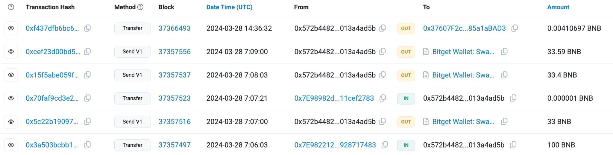

Since Bitget Swap lacks an Explorer, blockchain explorers can help trace the transactions. 

Take the earliest cross-chain transaction [0x5c22b1...7e3a64](https://bscscan.com/tx/0x5c22b190974ef24bbba6ff51aa0bf8cd7325e210870151b139f129daa57e3a64) as an example. Using a blockchain explorer (such as BscScan), click Decode Input Data to view and obtain the parsed information:

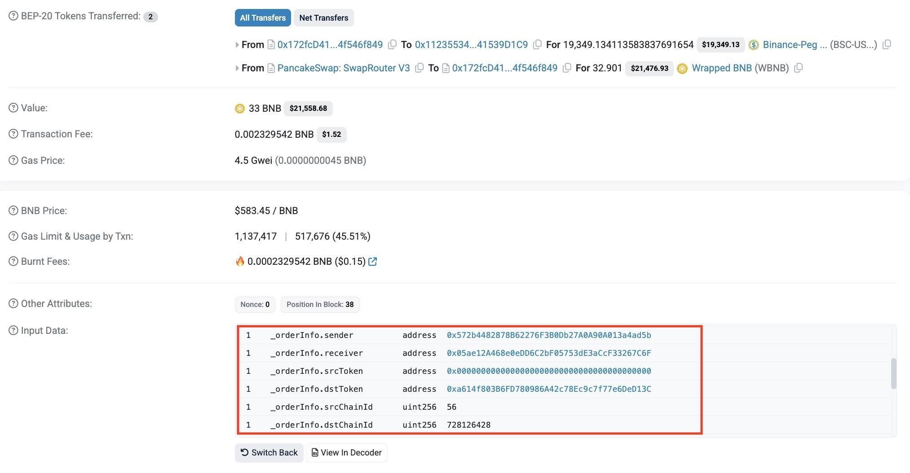

Key points to note:

* receiver: The receiving address after the cross-chain transfer.  
* dstChainId: The destination chain of the cross-chain transaction.

For example, the dstChainId in this transaction is 728126428, representing the TRON chain, meaning a cross-chain transaction from BSC to TRON. Note that the receiver (0x05ae12A468e0eDD6C2bF05753dE3aCcF33267C6F) is an EVM address and needs to be converted to a TRON address using a [tool](https://tronscan.org/#/tools/code-converter/tron-ethereum-address):

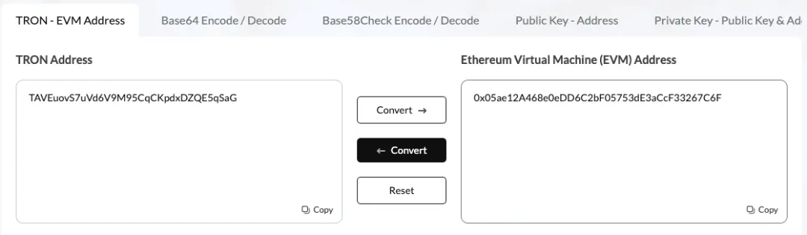

The converted TRON address is TAVEuovS7uVd6V9M95CqCKpdxDZQE5qSaG, which is the receiving address after cross-chain.

In addition, you can also check via Logs. For example, take the latest cross-chain transaction by timestamp, [0xcef23d...67fdb6](https://bscscan.com/tx/0xcef23d00bd54df6e4935946c8b9d7b486e72a19ffa2bdf2794c3a9830d67fdb6):

Click Logs and find the last event record \- BKBridge:

Similarly, using the same method, we find that the cross-chain destination address is the TRON address TAVEuovS7uVd6V9M95CqCKpdxDZQE5qSaG.

#### Method 3: MistTrack Cross-chain Parsing

For more efficient parsing of multiple cross-chain activities, you can use MistTrack’s cross-chain transaction parsing feature. For example, take the ETH address [0x4e398288d0b7514fcc1a109f4687cffa80d01a94](https://etherscan.io/address/0x4e398288d0b7514fcc1a109f4687cffa80d01a94). This address received 85,245.5199 USDC and performed two cross-chain transfers via Across Protocol.

In the MistTrack Standard Plan, right-click on Across Protocol: Ethereum Pool and select Cross-chain Parsing to quickly obtain the post-swap assets and the receiving addresses across chains for the two transactions.

Example:   
36,742.5199 USDC-ERC20  
→ 36,738.6996 USDC-Base  
→ Base address 0xc0Ff58cf15E4F07f8210Cc44b43bE7121d6788bb；

48,503 USDC-ERC20  
→ 48,497.9 USDC-Base  
→ Base address 0xc0Ff58cf15E4F07f8210Cc44b43bE7121d6788bb。

By clicking on a parsed address, you can directly access its detail page to further analyze the fund flows after the cross-chain transaction. For example, from the chart below, you can see that the cross-chain address used deBridge for another cross-chain transfer. The method for further analysis is similar.

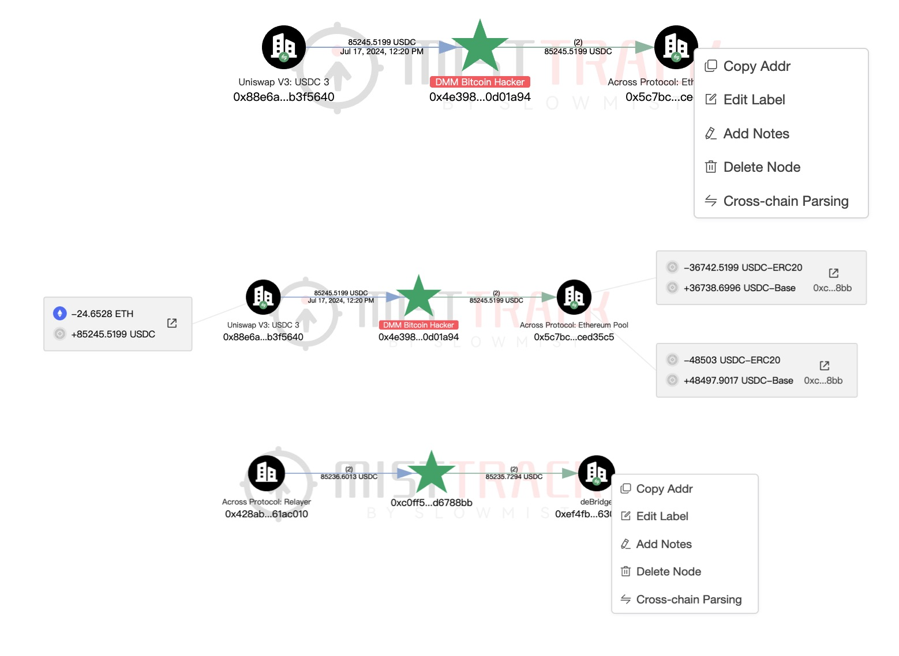

In addition, as shown in the figure above, the source of the address 0x4e398288d0b7514fcc1a109f4687cffa80d01a94 is Uniswap. We can use a similar method: right-click on “Uniswap V3: USDC 3” and select “DEX Parsing” to quickly obtain the post-swap details of this transaction.

In summary, the three methods described above can be used in combination, which is sufficient to cover the analysis of most cross-chain bridges.

## 6\. Privacy Tool Tracking Analysis

### (1) Introduction to Mixers

In numerous on-chain security incidents, it is common to see stolen assets quickly funneled into a special type of tool—mixers. These tools are originally designed to enhance transaction privacy. Essentially, they pool assets from multiple users, deduct a small service fee, and then return equivalent assets from the pool to each user, breaking the direct mapping between transaction inputs and outputs and thereby achieving transaction privacy. In recent years, mixers have been widely misused to obscure the source of illicit assets, making them one of the most challenging nodes in on-chain asset tracking.

**Smart Contract Mixers**

* Characteristics: Fully operate on the blockchain and implement “mixing” via contract logic. Users send funds to the mixer and receive a “cryptographic note” proving their deposit. The system waits for multiple users to participate, then randomly splits and reassembles outputs. Users can redeem the note at any time to withdraw funds to a new address. These mixers run on-chain and are transparent in operation, but due to strong encryption and anonymity mechanisms, tracking fund flows is extremely difficult.  
* Representative projects:  
  Tornado Cash: Based on zk-SNARK zero-knowledge proofs, sanctioned by the U.S. OFAC.  
  zkSend / Railgun: New privacy protocols combining zero-knowledge encryption with contract control.

**Centralized Mixers**

* Characteristics: Operate on centralized servers. Users send funds to the platform, which manually or automatically mixes and sends the assets to new user addresses. These mixers rely on the operator’s reputation and carry risks such as exit scams, regulatory issues, or non-compliance.  
* Representative projects:  
  Helix: Formerly Bestmixer.io, now shut down.  
  ChipMixer: Seized by German authorities.  
  Sinbad Mixer: Successor to Blender.io, sanctioned by OFAC.

**Collaborative Mixing Protocols (CoinJoin)**

* Characteristics: Multiple participants collaboratively initiate a single transaction, mixing inputs and outputs to obscure transaction relationships. Users typically repeat this process multiple times. Commonly used in the Bitcoin ecosystem, often integrated into privacy wallets.  
* Representative projects:  
  Wasabi Wallet: Uses the WabiSabi protocol.  
  Samourai Wallet: Works with the Whirlpool module.  
  JoinMarket: An open mixing protocol allowing users to set participation roles.

**Privacy Coins**

* Characteristics: Not a mixing “service,” but cryptocurrencies designed to conceal transaction details and ensure user anonymity.  
* Representative projects:  
  Monero (XMR): Uses ring signatures, RingCT, and stealth addresses to mix sender inputs with others, providing anonymity for both sender and receiver. It is currently the largest and most widely used privacy coin, often appearing in darknet markets and banned in multiple countries.  
  Zcash (ZEC): Uses zk-SNARK zero-knowledge proofs to validate transactions without revealing information about the sender, receiver, or amount.  
  Dash (DASH): Uses PrivateSend technology to mix transactions with others, thereby obfuscating the source of funds.

### (2) Mixer Analysis

These tools typically make asset “destination invisible” through technical mechanisms: users send funds into a “pool” that contains assets from other users, and then withdraw “equivalent” but not identical funds from the pool, breaking direct transaction links. The transfer records lack on-chain logical connections, creating analysis gaps. However, mixers are not truly “endpoints.” Through a series of technical and analytical methods, we can still gradually deconstruct their operational characteristics, establish “possible paths,” and create conditions for subsequent tracking and attribution.

* Mixer Entry Address Identification: Mixer contract addresses, such as those of Tornado Cash, are publicly accessible. Seeing assets enter these addresses allows for a preliminary determination of mixer usage, or known mixer contracts can be identified using MistTrack.  
* Fixed Amount Features: Some mixers only support fixed amounts (e.g., Tornado Cash’s 0.1 / 1 / 10 / 100 ETH), and transaction amounts themselves can serve as clues.  
* Analyzing Withdrawal Target Behavior: Although mixers scramble direct paths, the behavior of new addresses after withdrawals can still be analyzed (e.g., using a newly created wallet for a single transaction, remaining dormant for a long period, or funds quickly moving into CEXs, using the same DEX or Bridge, etc.). Behavior patterns can be used to infer whether addresses belong to the same entity.  
* Time Correlation Analysis: Multiple addresses depositing or withdrawing from a mixer at the same time may belong to the same group. Time, paths, and beneficiaries can be combined to form address clusters.

First, when observing on-chain mixer behavior, it is important to identify the fund-splitting pattern. For example, Tornado Cash allows deposits in fixed amounts (0.1, 1, 10, 100 ETH), and attackers often split funds according to these standard amounts, then withdraw them in bulk to new addresses. This amount-alignment behavior is highly abnormal on-chain and can serve as a core clue for focusing on suspicious paths.

Second, time-series analysis is crucial. Although mixers scramble the direct mapping between funds and addresses, most attackers, constrained by time costs, will still attempt to launder assets shortly after an attack. Analyzing deposit-withdrawal behavior within specific time windows and constructing behavior graphs to identify obvious temporal correlations is an important method for building address behavior chains.

Furthermore, some attackers adopt multi-hop mixing or combined obfuscation paths to increase laundering stealth—splitting funds into multiple mixers (even cross-chain) and then withdrawing, using multiple new wallet addresses to recombine funds. Although this “layered laundering” strategy seems thorough, it leaves key traces in the behavior chain, such as:

* Withdrawal addresses quickly aggregating funds again after withdrawal;  
* Short-term bursts of transfers or repeated Gas usage patterns between certain addresses;  
* A large number of newly created addresses interacting densely with an old address, forming abnormal concentrated paths.

#### Case 1: Tornado Cash Analysis

(1) Background  
A project was hacked, and the stolen funds were transferred to Tornado Cash. The project team approached the MistTrack team for assistance. The MistTrack team conducted a withdrawal analysis of Tornado Cash and helped the project team recapture the stolen funds that had been obfuscated by Tornado Cash.

Key roles of MistTrack in this case:

* Establishing mutual trust with the project;  
* Tracking stolen funds;  
* Analyzing hacker traces;  
* Tornado Cash withdrawal analysis;  
* Monitoring stolen funds;  
* Supporting law enforcement intervention when necessary.

Next, we will detail the MistTrack team's specific work and analysis process in this case.

(2) Stolen Funds Tracking  
Upon receiving the assistance request, MistTrack immediately began investigation. Analysis showed that the hacker transferred 2,450 ETH into Tornado Cash in batches of 5 x 10 ETH \+ 24 x 100 ETH.

MistTrack then conducted further analysis of the hacker’s addresses along the workflow:

* Fee source tracing  
* Tool usage  
* Hacker operation timeline  
* Hacker profile  
* Pre-attack traces

During fund exchange and transfer, the hacker used multiple tools such as Uniswap and 1inch, and also transferred 199 ETH to FixedFloat, which became relevant for subsequent Tornado Cash withdrawal analysis.

(3) Tornado Cash Withdrawal Analysis  
Based on preliminary findings, MistTrack identified the key breakthrough point in Tornado Cash withdrawals and conducted in-depth analysis. Using the 100 ETH withdrawal as an example, the team [filtered](https://dune.com/misttrack/Tornado-withdraw-analysis) addresses meeting Tornado Cash withdrawal characteristics.

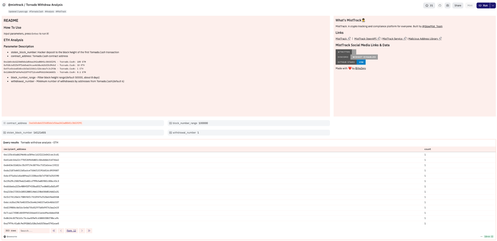

Withdrawal addresses were classified according to:

* Interaction with the same service  
* Withdrawal behavior  
* Withdrawal amount distribution

The first suspicious address (0x40F…952) was identified. This address transferred ETH withdrawn from Tornado Cash to address 0x8a1…Ca7, which then split ETH into three transfers to FixedFloat.

Of course, this could be a coincidence, and we need to continue to verify it. Further analysis revealed three more addresses with similar characteristics:

* A → B → Multiple FixedFloat addresses  
* A → Multiple FixedFloat addresses

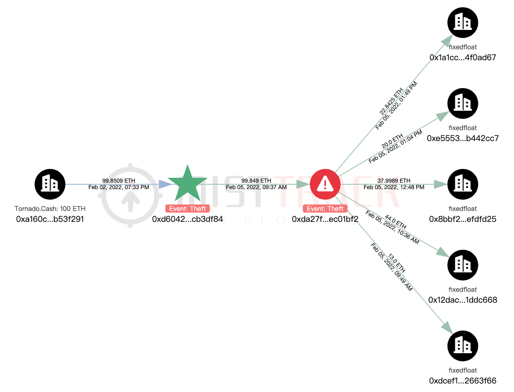

In total, 24 addresses matching these characteristics were identified, confirming the hypothesis.

#### Case 2: Wasabi Coinjoin Analysis

(1) Background   
A whale’s wallet private key was leaked and the funds were stolen, with the stolen assets moved into Wasabi CoinJoin. The affected user sought assistance from the MistTrack team. MistTrack conducted withdrawal analysis on the stolen funds mixed into Wasabi CoinJoin, successfully tracking and recovering the flow of the funds. Subsequently, the hacker attempted cross-chain transfers. MistTrack identified historical traces of the hacker’s addresses moving funds to exchanges and assisted law enforcement in contacting the exchanges to request evidence and apply risk controls on the relevant accounts. Later, as the hacker further transferred stolen funds to exchange-related accounts, part of the stolen funds was successfully frozen.

Key steps by MistTrack:

* Establish trust: Establish a good trust relationship with the stolen user, which is the basis for analysis and tracking;  
* Tracking stolen funds: Tracking the flow of stolen funds through professional technology;  
* Analyze hacker behavior: Conduct in-depth analysis of hacker behavior patterns to understand their operations and predict their possible next moves;  
* Wasabi Coinjoin Withdrawal Analysis: Utilize analytical tools to study stolen funds mixed into Wasabi Coinjoin;  
* Cross-chain tracing: When hackers conduct cross-chain transactions to try to transfer funds, track the flow of funds;  
* Law enforcement involvement: If necessary, ask law enforcement to intervene and provide support.

Next, we will detail the MistTrack team's specific work and analysis process in this case.

(2) Stolen Funds Tracking  
Upon request, MistTrack rapidly investigated and found most funds had been moved into Wasabi CoinJoin.

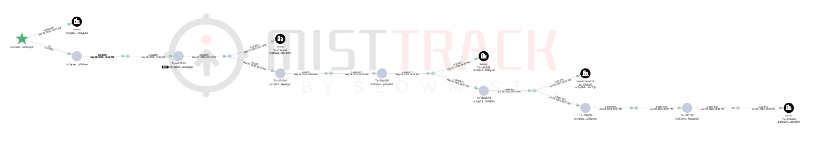

(3) Wasabi Coinjoin Withdrawal Analysis  
The critical breakthrough was analyzing Wasabi CoinJoin withdrawals. MistTrack studied input and output addresses and analyzed intersections across multiple transactions.

Withdrawal addresses were examined for:

* Address usage frequency  
* Input amounts  
* Withdrawal amounts  
* Post-withdrawal transaction behavior

After a series of detailed analyses, the team successfully identified several suspicious withdrawal addresses. We then compiled and compared the withdrawal amounts from these addresses and found that these amounts were largely consistent with the funds transferred to Wasabi Coinjoin by the hackers. We discovered a correlation between different Wasabi Coinjoin withdrawal transactions, and the withdrawal addresses showed a clustering relationship. Therefore, we can confirm that these addresses are the hackers' withdrawal addresses.

Here’s a bird’s-eye view of the hacker’s Coinjoin transaction:

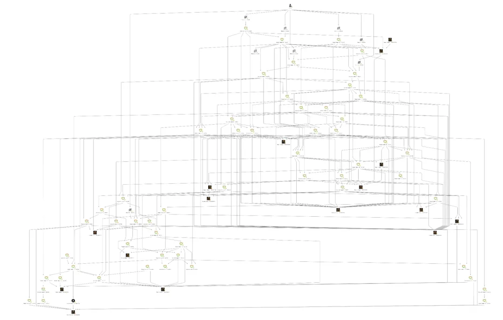

(4) Cross-Chain Tracking  
After identifying Wasabi CoinJoin withdrawal addresses, MistTrack further tracked stolen funds. The hacker used renBTC for cross-chain operations. Analysis revealed Ethereum renBTC withdrawal addresses, which were then exchanged for ETH and dispersed across multiple exchanges.

(5) Hacker Trace Analysis  
Based on on-chain traces, MistTrack profiled the hacker:

* Highly knowledgeable in crypto laundering techniques, proficient in automation and darknet tools.

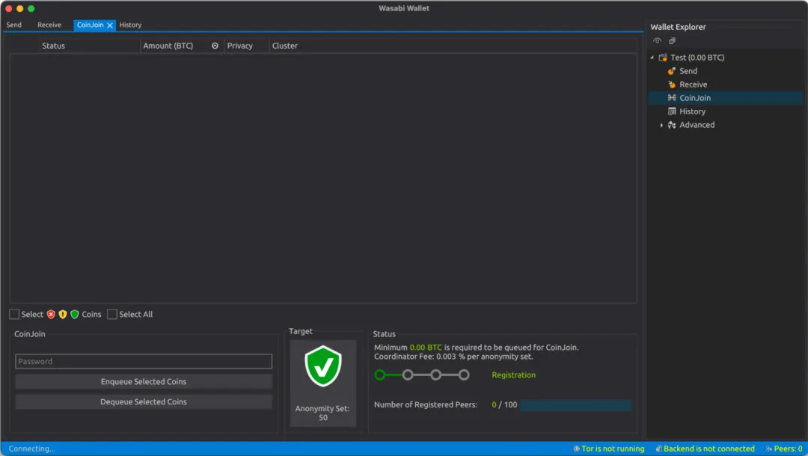

* Additional transactions: Ethereum renBTC withdrawal addresses showed deposits and withdrawals from exchanges.

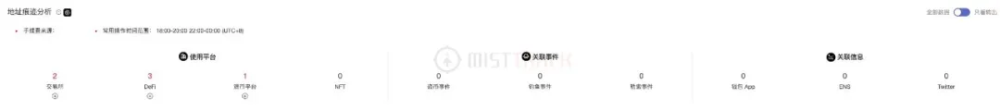

(6) Outcome  
After analyzing the hacker's exchange history, the MistTrack team immediately shared this information with the affected users and assisted law enforcement agencies in contacting the exchange to request evidence. The exchange then implemented risk control measures for potentially implicated accounts. Ultimately, as the hacker attempted to transfer further stolen funds to exchange-related accounts, the close collaboration between the MistTrack team, law enforcement agencies, and the exchange successfully froze a portion of the stolen funds.

It's important to note that once funds enter a mixer, the original path is unlikely to be fully reconstructed, creating a natural blind spot in on-chain tracing. However, external clues can be used for lateral verification: for example, behavioral patterns before mixing and a consistent destination after mixing; leveraging on-chain fixed-amount characteristics to trace mixing behavior; analyzing inflow and outflow paths within a time window; developing outflow address profiles and behavioral clustering models; linking post-mixing paths with exchange deposits; and leveraging open-source intelligence to supplement on-chain deficiencies and establish attribution. In judicial investigations, mixing behavior can serve as a clue to the motive behind intentional concealment of funds, enhancing the nature of the case (e.g., fraud vs. money laundering). Furthermore, open-source intelligence (OSINT) can be combined to further uncover clues of manipulation behind the mixer's path. For example, an attacker may have used an ENS domain name for a withdrawal address, uploaded NFTs, or even connected to social applications (such as Lens Protocol). Using this non-financial data, researchers can attempt to link technical paths to real-world identities. Mixers are inherently a direct challenge to on-chain tracing capabilities. However, as long as we understand its operating logic and identify its common usage patterns, we can still provide valuable upstream and downstream clues for the overall case analysis.

Mixers aren't unbreakable; they simply increase the difficulty of analysis. The real challenge lies in attackers' flexible tool combinations and strategy switching. Rather than reproducing each attack path, investigators should build a behavioral signature library to identify potential mixing motives and path structures, thereby taking proactive action at the strategic level.

## 7\. NFT Tracking Analysis

NFTs (Non-Fungible Tokens), as a new form of crypto assets, do not typically have the high liquidity of mainstream tokens, but due to their uniqueness, collectible value, and emotional premium, they have become new targets for attackers. Many phishing attacks, rug pull projects, and account theft cases revolve around NFTs, making understanding how to track them an essential part of on-chain analysis.

Unlike standard ERC20 assets, NFTs are usually issued under ERC721 or ERC1155 standards, with unique Token IDs and ownership addresses. Their ownership transfers are fully transparent, but tracking them poses challenges. The uniqueness of NFTs means each transfer may represent a change in value, and NFT contracts often use complex functions (such as Multicall) to obscure critical actions. Additionally, NFT trading records are fragmented across multiple platforms, price data can be manipulated, and contracts are frequently updated, all of which increase tracking difficulty.

In tracking, the process typically starts by identifying the NFT’s contract address and Token ID. Tools such as NFTScan or NFTGo can be used to query the full history from minting to the present. During this process, NFTs may be sold at high prices or moved to other addresses controlled by the attacker before sale. The focus should be on the assets received from the sale rather than continuing to track the NFT itself.

Case Study: A user clicked the first search result when searching for Aave on Google and visited a phishing site at app.avaea\[.\]eu\[.\]com/dashboard. On this page, the user was induced to sign a malicious transaction, resulting in the theft of their Uniswap V3 LP Position NFT, causing a direct loss of approximately $1.23 million (491,239 USDe \+ 744,997 USDT). Based on information provided by the victim, the following key transactions were identified:

* Victim Signs Authorization Transaction

Transaction Hash:  
[https://etherscan.io/tx/0x0109234b59ed2a905c36ced841aee4309200530c7cb5b65e2679e4e1ecb35fbd](https://etherscan.io/tx/0x0109234b59ed2a905c36ced841aee4309200530c7cb5b65e2679e4e1ecb35fbd)  
Operation: The victim’s address (0x400…A4b) signed a malicious Multicall transaction in 0x010923…b35fbd, which appeared legitimate on the surface but included a “setApprovalForAll” authorization to the phishing contract address 0x000002BDD8102702350afEd10dc918Aa6D300000, granting control of their LP NFT to the phishing contract.

* Attacker Transfers NFT

Transaction Hash:  
[https://etherscan.io/tx/0xf81db5307fd1d71fce993f1d1c42f04b6240868c8fc06f1abdd58c648aa873ba](https://etherscan.io/tx/0xf81db5307fd1d71fce993f1d1c42f04b6240868c8fc06f1abdd58c648aa873ba)  
Operation: The attacker, in transaction 0xf81db5...a873ba, called the batchTransferERC721 method to move the victim’s LP NFT to a wallet controlled by the attacker. This transfer succeeded because the victim had granted authorization in the previous step.

* Attacker Withdraws Fees

Transaction Hash:  
[https://etherscan.io/tx/0xdebd0333041ded9d351a439a1262681189159e56f17c2e864579edddfdd06bbf](https://etherscan.io/tx/0xdebd0333041ded9d351a439a1262681189159e56f17c2e864579edddfdd06bbf)  
Operation: Controlling the NFT, the attacker called the Collect function in transaction 0xdebd03...d06bbf, withdrawing accrued fees from the LP NFT, totaling approximately 96,034.86 USDe \+ 24,726.36 USDT.

* Attacker Extracts Profit Assets

Transaction Hash:  
[https://etherscan.io/tx/0x219b4d06d072e83dde2d6507deed64cb43bad0bae3dcbe50dba9bfe35824bc67](https://etherscan.io/tx/0x219b4d06d072e83dde2d6507deed64cb43bad0bae3dcbe50dba9bfe35824bc67)  
Operation: In transaction 0x219b4d...24bc67, the attacker again called Multicall to extract all underlying assets: 491,239 USDe \+ 744,997 USDT. At this point, all assets associated with the NFT (principal \+ earnings) had been transferred to the attacker’s address.

Once the NFT has been converted into standard assets, tracking can continue as with regular tokens. In this case, the attacker exchanged the obtained USDe and USDT for 355 ETH via Uniswap.

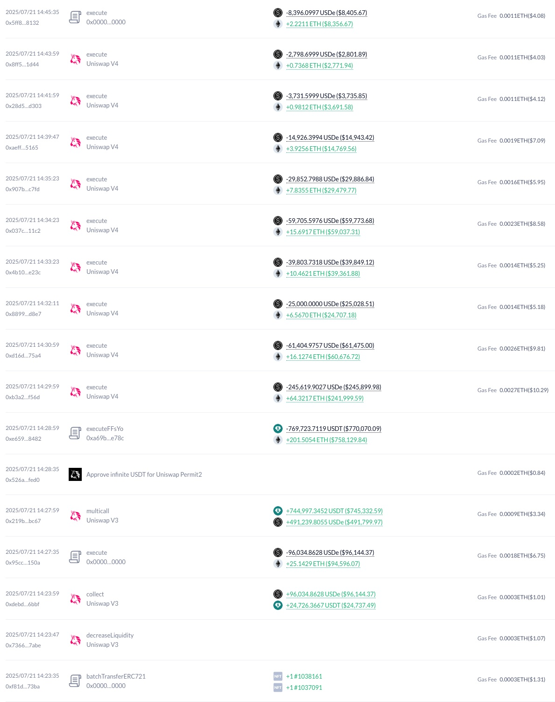

Using MistTrack with a start time filter set to the theft date of July 21 and filtering transactions above 50 ETH to exclude small phishing transactions, the transfer results showed that the involved ETH was ultimately moved to Uniswap and CowSwap for token swaps. The intermediate addresses were flagged by MistTrack as Vanilla Drainer, indicating that the behind-the-scenes operator was the phishing group Vanilla Drainer.  

The complexity of non-standard assets requires investigators to adopt a multi-dimensional perspective. Beyond the on-chain flow of the NFT itself, it is necessary to consider the context of authorization transactions, address labeling, and the inflow and outflow paths of extracted funds to accurately determine the identity of operators and the profit chain behind NFT movements.

## 8\. Address Behavior Analysis

Addresses are the most basic unit in on-chain asset tracking. However, a single address often does not represent the real operator. Treating an address merely as a “receiving account” or “transfer node” can overlook underlying control relationships, behavioral patterns, and potential risk characteristics. Address behavior analysis is therefore a key step in transforming fund flows into operator profiles, constructing a “behavioral fingerprint” through each transaction, contract interaction, cross-chain transfer, or mixer attempt, which helps infer operational habits, preferences, and even potential identity.

### (1) Active Behavior Feature Identification

Identifying the basic behavioral features of an address is the starting point of analysis. For example, an address that has been dormant for a long time but suddenly transfers a large amount of assets, or one that makes frequent small transfers in a short period, may indicate unconventional usage, potentially for money laundering, fund routing, or scripted operations:

* Dormant Activation: An address remains inactive for a long period and suddenly performs a large transfer, common in exit or cash-out scenarios.  
* High-Frequency Transfers: Multiple transfers in a short time, often for dispersing funds or laundering.  
* Fixed Amounts: Many transfers of similar amounts (e.g., 0.9999 ETH), possibly indicating automated scripts or mixer usage.  
* Short Lifespan: Newly created addresses quickly receive and transfer funds, typical of temporary wallets.

### (2) Address Clustering Analysis

Attackers rarely use a single address. Behavior clustering involves grouping addresses likely controlled by the same entity. Patterns such as consistent activity time, use of specific platforms, repeated transactions in the same stablecoin, or recurring cross-chain paths can form a distinct on-chain “fingerprint.” Multiple addresses showing similar habits, counterparties, and transaction rhythms can help establish these fingerprints and identify actors:

* Input Clustering: In a transaction, if multiple addresses contribute inputs (e.g., BTC UTXO model), they may be controlled by the same operator.  
* Behavioral Synchrony: Addresses that receive funds from the same source around the same time and react similarly (cross-chain transfers, DEX trades) may be controlled by one operator.  
* Shared Services: Multiple addresses interacting with the same contract (e.g., Ponzi schemes, black/grey market tokens) and showing similar paths can be grouped as a behavioral cluster.  
* Transaction Parameter Similarity: Repeated patterns in gas limits, slippage, or fee preferences can be used as clustering features.  
* Address Naming Patterns: Some groups create addresses following identifiable naming schemes, e.g., in the Nobitex attack, Gonjeshke Darande used addresses with provocative keywords and repeated structures. (TKFuckiRGCTerroristsNoBiTEXy2r7mNX, 0xffFFfFFffFFffFfFffFFfFfFfFFFFfFfFFFFDead, 1FuckiRGCTerroristsNoBiTEXXXaAovLX)

### (3) Risk Behavior Profiling

Determining if an address is “risky” requires analyzing its overall behavior, not just its interactions:

* Rapid Outflow: Funds are transferred out immediately after receipt, typical for routing or temporary receiving addresses.  
* Frequent Mixer Usage: Repeated interactions with Tornado Cash, Railgun, Wasabi, or proxies calling these protocols.  
* Cross-Chain Activity: Frequent movement across L2s or non-mainstream chains.  
* Suspicious Interactions: Calling failed contract functions, interacting with scam or “airdrop” tokens, or overlapping with known malicious addresses.  
* Scripted Operations: Deploying phishing contracts or automatically extracting authorized assets, typical in rug pulls or phishing drainers.

### (4) Address Labels and Off-Chain Identity

While blockchain addresses do not directly correspond to real identities, cross-analysis with off-chain data can gradually reconstruct likely operator profiles. Platforms like MistTrack use extensive address label databases and fund flow analysis, combined with external sources, to build a multi-dimensional identity assessment:

* CEX Interaction Identification: By analyzing interactions with centralized exchanges (CEXs) and combining with KYC or risk logs, addresses can be linked to real-world accounts.  
* Label Propagation: Tracing relationships with high-risk addresses (e.g., hacker or OFAC-sanctioned addresses) helps identify associated clusters.  
* Social Behavior Cross-Verification: Activities on GitHub, Reddit, Twitter, etc., can be time-correlated with on-chain actions for preliminary association.  
* Data Leak Comparison: Leaked emails, phone numbers, or mnemonics can be fuzzily matched with transaction histories to support identity inference.

Attackers often use various anonymity tools off-chain to further hide identity:

* Anonymous Network Tools: Attackers often use tools such as VPNs, the Tor network, and proxy servers to hide their true IP addresses and login locations. Some of these tools are subject to law enforcement investigation.  
* Privacy Messaging and Email Services: Use end-to-end encrypted email services such as ProtonMail and Tutanota, as well as anonymous chat tools such as Signal, Telegram, and Session, which are widely used for account registration, communication coordination, over-the-counter transactions, and even sharing stolen data.  
* Anonymous Infrastructure: Attackers may rent VPSs or "bulletproof hosting" services that support cryptocurrency payments and lack real-name verification to set up phishing sites, deploy malicious smart contracts, or automated money laundering scripts. These service providers typically do not retain customer logs, further increasing the difficulty of locating attackers.  
* Fake Identity Generation: When passing initial Know Your Customer (KYC) checks on some lightly regulated platforms, attackers may use batches of fake identities to register and maintain accounts. These identities often have templated formats, and methods such as device fingerprinting and IP analysis can gradually identify common characteristics.

While these anonymous services don't leave direct on-chain traces themselves, the indirect traces they leave within the attack chain still hold valuable traceability. By combining platform-side login records, operation logs, KYC data, social account activity, and on-chain transfer times, frequency, and tools used, professional researchers can build their own hacker information databases and compare them with anonymous email addresses, VPN accounts, and other information within the database. This provides a powerful off-chain path for identity association and behavior tracing when on-chain tracing is blocked.

### (5) AI Tools and Analysis

Modern on-chain analytics platforms are advancing automation and intelligence in behavioral profiling. [MistTrack MCP](https://mcp.so/server/misttrackmcp/slowmist), for example, allows natural language API calls through clients like Claude or Cursor to generate address profiles, risk scores, and transaction graphs, improving efficiency and accessibility.

Users can request analysis via MCP-enabled AI tools, e.g., “Please track the fund flow between this address and exchanges, with a depth of 2: \[ETH\_ADDRESS\].” The AI will call MistTrack APIs and return detailed, readable results.

MistTrack MCP currently supports 10+ on-chain analytics tools covering risk identification, address profiling, and transaction graph construction. 

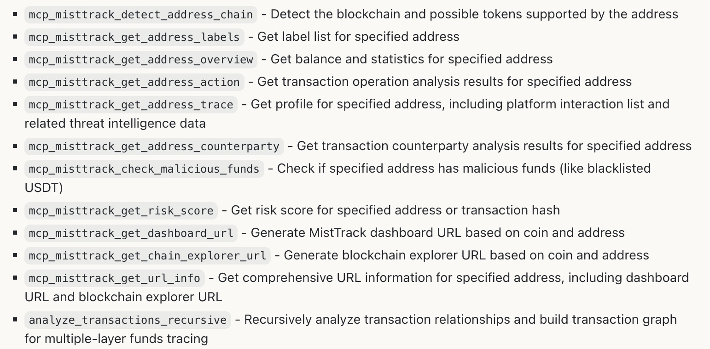

AI integration is expected to increase speed, accuracy, and transform profiles from static labels to dynamic behavior sequences.

Building on-chain identity profiles does not necessarily mean real-world identification. The core goal is to infer organizational control, fund cycles, or structural links with high-risk entities. This method is crucial in addressing complex fraud, layered laundering, and advanced scenarios.

Through continuous analysis of transfers, contract interactions, and cross-chain activity, fragmented wallet addresses can be linked into coherent entity profiles. Just like detectives scrutinize subtle crime scene clues, on-chain analysts must track the logic behind each transfer, authorization, and cross-chain movement to find connections across cases, ultimately building behavioral networks and identity webs. These profiles support tracing paths, reconstructing network structures, and providing reliable evidence for exchanges, project teams, or law enforcement to freeze assets and issue risk warnings.

## 9\. Case Studies

In on-chain tracking practice, different types of fund flow paths exhibit distinct behavioral characteristics. This section presents selected cases to provide readers with reference perspectives for observing on-chain behavior.

**Case 1: Peel Chain Tracking**

On August 3, 2016, the well-known cryptocurrency exchange Bitfinex announced a hack that resulted in the theft of approximately 119,755 BTC. At that time, this amounted to roughly $60 million, or about $4.5 billion in total value based on contemporary pricing. MistTrack analysis showed that the stolen assets were initially dispersed across 2,072 wallet addresses, which were labeled as follows:

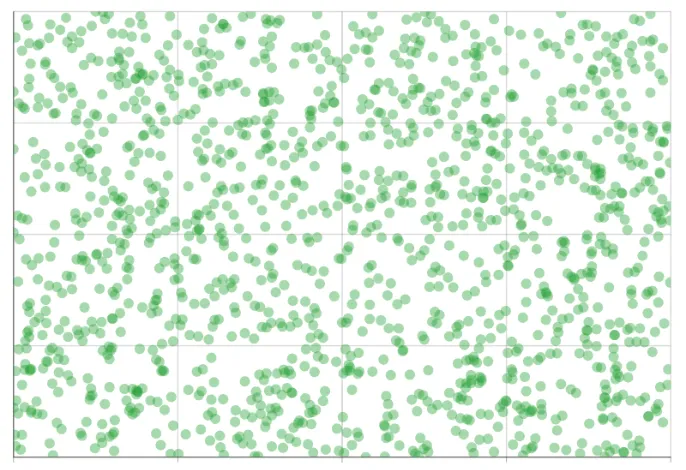

Starting January 2017, the hacker began intensive fund transfers. Analyzing the 2,072 addresses revealed that most funds were moved using a peel chain method. MistTrack tracked approximately 30.6781 BTC from a Bitfinex platform address to the hacker address [19Xs96FQJ5mMbb7Xf7NXMDeHbsHqY1HBDM](https://light.misttrack.io/address/BTC/19Xs96FQJ5mMbb7Xf7NXMDeHbsHqY1HBDM), and then via two straight transfers to 3CA1UDYQy47Z46HKCVqRV8b1XVduocWAcW.

Examining 3CA1UDYQy47Z46HKCVqRV8b1XVduocWAcW’s flow:

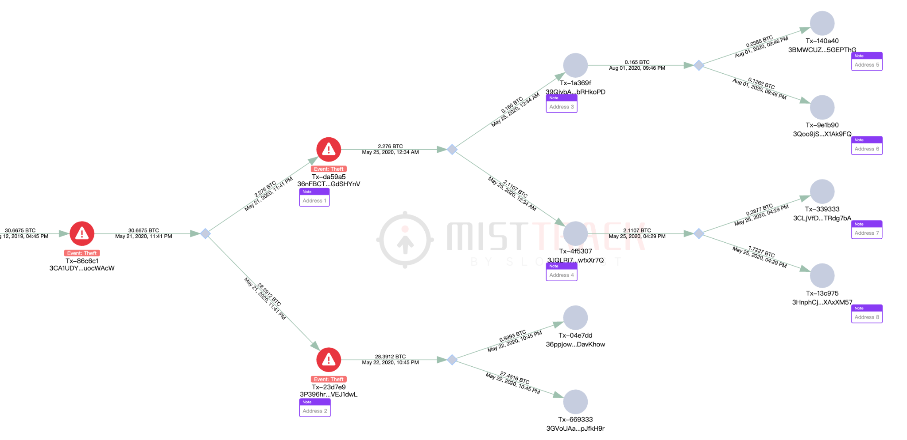

* 30.6675 BTC was split into 2.27 BTC and 28.39 BTC and sent to addresses 1 and 2\.  
* Address 1 further split 2.27 BTC into 0.16 BTC and 2.11 BTC to addresses 3 and 4\.  
* Address 3 repeated the splitting with 0.16 BTC into addresses 5 and 6, and so on.

For a more intuitive presentation, we've captured a portion of the fund flow.

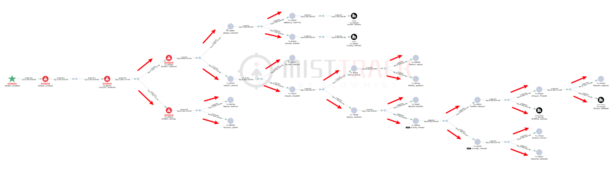

As can be seen in the image above, funds were transferred to two addresses, which were then each transferred to two other addresses. The amounts gradually decreased, and the addresses appeared in increasing numbers, until some funds were eventually transferred out through Wasabi CoinJoin mixers or to the Hydra Market darknet market. Of course, this is only a small portion of the funds, but it's clear that the hackers were very patient in evading tracking. Let's take another hacker address, [1BprR3VRh8AsJVXFR8uNzzZJnyMhF1gyQE](https://light.misttrack.io/address/BTC/1BprR3VRh8AsJVXFR8uNzzZJnyMhF1gyQE), as an example. According to MistTrack, this hacker address stole 271.22 BTC.

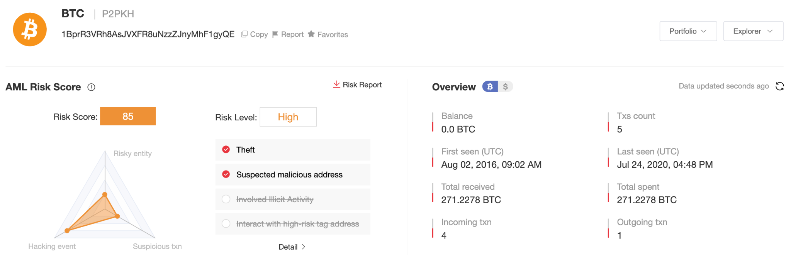

We then tracked the large transfer addresses:

Although the transfer of small amounts of funds is omitted, we can still clearly see the characteristics of the Peel Chain technique:

* Generally starts with a single "dirty" address;  
* Usually continuously split into two addresses;  
* Split into large and small amounts;  
* Funds are parked or mixed or enter exchanges/darknet platforms.

**Case 2: TRON Network Tracking**

A victim who imported their private key into a fake wallet app lost 5,326,747 USDT (over 5.3 million USD). Using the MistTrack anti-money laundering (AML) tracking system, we first analyzed the hacker’s initial address: [TDs3USWcG5ua4jkGNMGgNZrXrPgw8UMMCt](https://light.misttrack.io/address/USDT-TRC20/TDs3USWcG5ua4jkGNMGgNZrXrPgw8UMMCt).

From the analysis, the hacker’s transactions were mostly Transfers and Swaps. By examining the timing of these transactions, we can also infer the hacker’s active time periods. The stolen USDT was then moved to six addresses and exchanged using SunSwap.

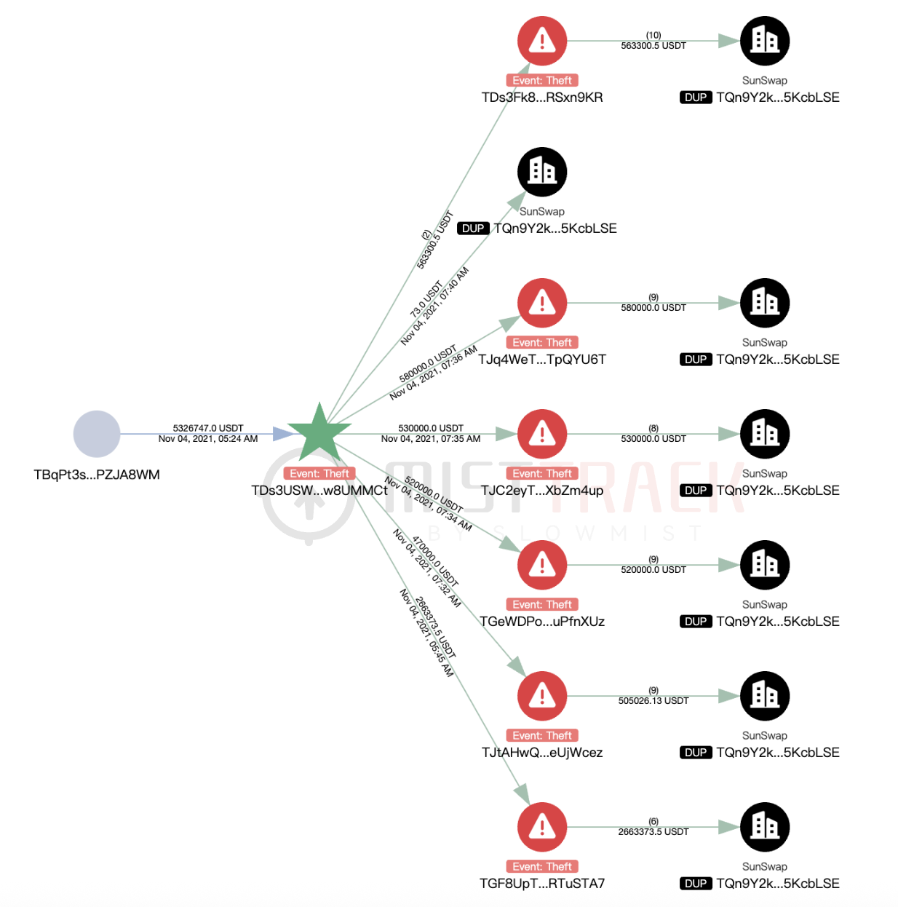

For example, the initial hacker address TDs3USWcG5ua4jkGNMGgNZrXrPgw8UMMCt [swapped](https://tronscan.org/#/transaction/54c40fa344f5c301c292b0d9f104886735347efd466d762ba7dc7137725125e5) 73 USDT for 684.76 TRX.

Looking at one of the six addresses, TGF8UpTomNGpAu7PFVsUPoBj1A3RTuSTA7, it swapped a total of 2,663,373.5 USDT into TRX via six [transactions](https://tronscan.org/#/address/TGF8UpTomNGpAu7PFVsUPoBj1A3RTuSTA7/transfers) and sent them to the same address TUeS...mF7g.

The other five addresses followed the same pattern.

Tracking the new six addresses (leftmost and rightmost in the flow), for instance TAny2TfsvxeFHi5BCsU2RQzexWTk7c7Fe7, the hacker transferred 75 TRX to TQ8mpZ7RnDmz7nhmVNPK3dFdhjYaXdcCv7, leaving 57.41 TRX untransferred. 

The remaining 5,064,327.5852 TRX was swapped back into 526,850.6057 USDT via SunSwap and moved to TJa6MdQVDH3bvMCYiJpSPy9PTJF6uxk5Zq. That address then sent the USDT to the same large address TQ8mpZ7RnDmz7nhmVNPK3dFdhjYaXdcCv7, which further distributed funds to two new addresses.

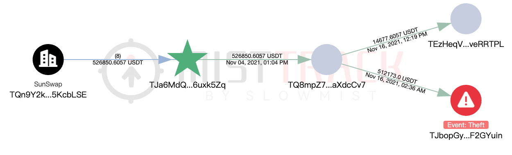

A shallow tracking of these two new addresses revealed “large addresses” (high balances \+ numerous transactions) eventually moving funds to multiple exchange addresses or addresses flagged as “Theft” by MistTrack — a pattern consistent with professional money laundering networks.

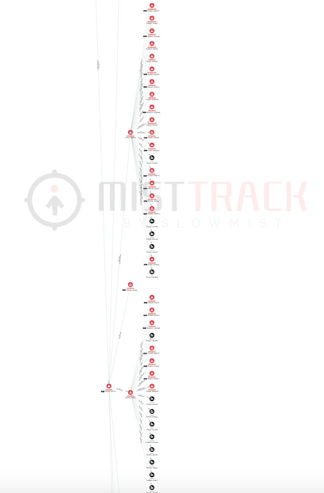

Interestingly, while five of the six addresses followed the same laundering method, the last address TUeSPLXfF5TZH7YTUR2CeShqc1UCRkmF7g slightly altered its method. Instead of consolidating TRX into USDT and sending to one address, it split into 17 transactions, sending funds to different addresses. Here are the five largest transactions as an example:

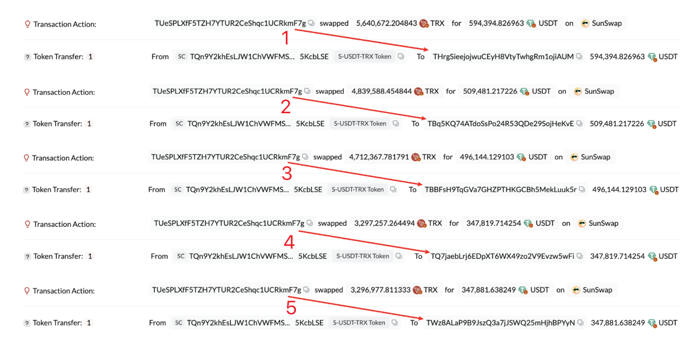

For example, the first recipient THrgSieejojwuCEyH8VtyTwhgRm1ojiAUM swapped USDT back to TRX twice, both times sending to TXQutVZPSXbrwb1TxgFn4BNdkv5gZaAoZm, resembling earlier patterns.

That address then swapped TRX back into USDT to TECs2MpZN9HZH5noGzGTF8LBLhxZt5g41q via SunSwap, ultimately moving USDT to the “large address.” Other addresses followed similar patterns.

In summary, the hackers repeatedly exchanged the stolen USDT back and forth to evade tracking. Despite the hackers' best efforts, we can still trace the hacker accounts through the exchange addresses involved, which we will not elaborate on here.

It's worth noting that, compared to these exchange-based money laundering schemes, some Ponzi schemes employ more crude methods. For example, typical Ponzi scheme platforms like Xinkangjia DGCX display a unique deposit address for each user on their user interface, but in reality, all addresses are managed by the platform. Once a user deposits, the funds first enter an intermediate address, undergo one or two simple transfers, and are then aggregated into the platform's "fund pool" address. From there, they are transferred to external, suspicious addresses through a series of frequently switching intermediate wallets. This type of absconding scheme is characterized by its uncomplicated structure, deliberately simplifying the process to quickly liquidate assets.

Phishing scenarios are somewhat different. Most phishing websites disguise themselves as official DApp or wallet authorization pages to trick users into authorizing transactions. Funds don't flow out through user transfers, but rather through the phishing contract itself. A common path follows: the user authorizes an ERC20 contract, the phishing contract initiates operations like "transferFrom" to transfer funds to the attacker's wallet, the attacker rapidly withdraws the funds through multiple forwarding addresses, and the funds are laundered using a mixer or cross-chain bridge. When tracking this path, it's important to identify the authorization contract's permission boundaries, the transaction caller's address, and the subsequent flow of funds.

Attack paths in the DeFi context are even more complex, often combining smart contract vulnerabilities and flash loans to achieve arbitrage or manipulate market prices. For example, a project suffered a flash loan attack, where the attacker constructed multiple on-chain interactions, completing a series of on-chain operations—including borrowing, price manipulation, asset arbitrage, and liquidation arbitrage—in a very short period of time. Once the attack was complete, the assets were quickly transferred to a wallet controlled by the attacker, then converted to a mainstream stablecoin via a decentralized exchange (DEX) before ultimately being transferred across chains or to an exchange. These cases involve dense on-chain activity and complex contract calls, requiring the use of graphical tracking tools and attention to technical details such as contract vulnerabilities underlying the attack logic.

Regardless of the scenario, reviewing transactions isn't just about looking at transfer charts; it's about identifying key nodes: At what point does control transfer? When do suspicious authorizations or contract interactions occur? Is there any involvement from a centralized platform? These insights not only influence the depth of the tracing process but also the likelihood of subsequent freezing and further investigations involving law enforcement agencies.

## 10\. Recommendations for Asset Freezing and Recovery

When on-chain tracking confirms that a portion of stolen or fraudulent funds has entered centralized exchanges (CEXs), asset freezing and recovery become the next critical steps. However, in practice, this process is far more complex than it might appear, involving multiple factors such as legal procedures, the willingness of exchanges to cooperate, and cross-border enforcement mechanisms.

The first step is to identify inflows to exchanges. Using tools like MistTrack or blockchain explorers, analysts examine whether suspicious funds have ultimately entered CEX addresses, typically relying on address labeling. Major exchanges such as Binance and Coinbase usually have distinctive deposit addresses, and their fund aggregation patterns tend to follow predictable behaviors. Analysts must consider upstream and downstream fund flows to avoid false positives from funds temporarily held in intermediary or OTC addresses.

If inflows to a CEX are confirmed, the next step is to initiate a freeze request. Most top-tier exchanges have security/compliance departments that handle freeze requests, but these usually must be submitted by a compliant entity, such as law enforcement with a case filing receipt and investigation letter, or a law firm submitting legal documentation on behalf of a client. Individual victims rarely have direct access to the exchange. It is recommended to prepare early, including evidence of the incident (transaction records, communication screenshots, details of affected amounts and addresses), on-chain tracking paths (annotated tracking diagrams), and proof of police reports. Cooperation with professional security firms (e.g., SlowMist) and law firms (e.g., JunHe, WINTAO, DENTONS, Man Kun, etc.) can facilitate communication with exchanges and increase the likelihood of a successful freeze.

It is important to emphasize that even if an exchange assists with freezing, this is only a temporary measure. Whether frozen assets can ultimately be recovered depends on subsequent legal processes, such as civil judgments, criminal investigations, or asset restitution procedures. These processes involve complex issues such as jurisdiction, asset identification, and compensation allocation. Therefore, “recovery” is not a direct extension of on-chain analysis but the result of coordinated action among legal, technical, and platform entities.

At the international level, freezing is even more challenging. On one hand, different countries/regions have vastly different legal interpretations regarding crypto assets; on the other hand, many funds eventually enter gray-market platforms that are either unregulated or uncooperative. Some exchanges operate in jurisdictions with lenient regulations and may not comply with freeze requests even if they hold the assets.

Therefore, we repeatedly emphasize: the role of on-chain tracking is to provide visibility, determine asset destinations, and assist in subsequent actions, but it cannot replace legal freezes nor guarantee fund recoverability. The key to freezing and recovery lies in early identification of fund paths, possession of a complete evidence chain, and obtaining support from professional institutions and law enforcement.

SlowMist Case Experience: Freezing ≠ the endpoint; collaboration is key. In 2024, with strong support from InMist intelligence network partners, SlowMist assisted clients, partners, and publicly disclosed hack incidents in freezing over USD 112 million in funds. In 2025, SlowMist supported attorney Xiao Sa’s team in successfully advancing the unfreezing process of an overseas freeze case, recovering approximately RMB 10 million in USDT for the client. In this case, the critical factor was the collaboration between the legal team and the security company, providing on-chain path analysis, comprehensive evidence chains, and multiple rounds of communication with foreign law enforcement agencies, ultimately facilitating asset restitution.

On-chain tracking is the foundation for identifying problems and clarifying direction, but true asset recovery requires a complete closed-loop of on-chain data analysis, offline legal procedures, and coordinated platform mechanisms. On-chain visibility ≠ controllability, much less recoverability; compliance-driven collaboration is the key. Recognizing this is a consensus every tracker must internalize.

# Conclusion

Throughout the tracking process, we have come to deeply understand that on-chain security is never a one-off task but a long-term and ongoing tug-of-war. Attackers continuously evolve their methods, from early simple on-chain transfers to today’s multi-chain strategies leveraging mixers, flash loans, cross-chain bridges, automated arbitrage contracts, and even AI tools to disguise fund flows. The more sophisticated the adversary, the more complex the technology, experience, and tools required. True security depends on having enough analysts, researchers, media, and judicial personnel who continuously monitor, learn, and are willing to delve into cases to reconstruct complex paths and bridge the gap to the truth.

More importantly, we firmly believe that tracking is not merely for judicial service but also to raise public awareness — every exposure of fund flows undermines fraudsters’ trust networks. Every readable and reusable case analysis serves as a shield for the community against the next scam. Too often, victims lose not only technically but also due to information asymmetry. A clear, practical, and accessible tracking handbook may be the first step in addressing this asymmetry.

These contents represent the accumulated insights of the SlowMist team, based on years of on-chain tracking, practical experience, cross-chain monitoring, and case reconstruction. If this handbook helps even a single user avoid being scammed, guides a victim toward a solution, or accelerates the preparation of a case report, its value is fulfilled.

# Disclaimer

This handbook is intended for informational and educational purposes only, aimed at helping readers understand basic concepts, common techniques, and response strategies for crypto asset tracking. It does not constitute legal, investment, or enforcement advice. Tools, platforms, and protocols mentioned are provided solely for case analysis and technical illustration and are not endorsements or recommendations. All examples, scenarios, addresses, and behavioral analyses are based on publicly available information or simulations and are not targeted at any individual or organization, nor do they imply judgment or stance by the authors.

The crypto asset field is highly risky, and on-chain activity is complex and dynamic; tracking and analysis carry technical barriers and uncertainties. In practice, readers should exercise judgment based on their circumstances and seek professional legal, security, or compliance support as necessary. The authors of this handbook assume no responsibility for any direct or indirect losses resulting from the use of or reliance on the content herein.
